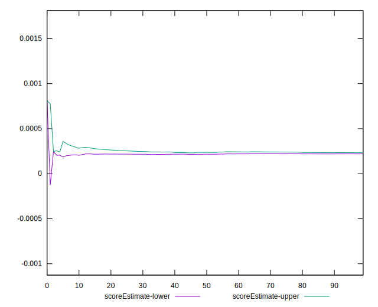
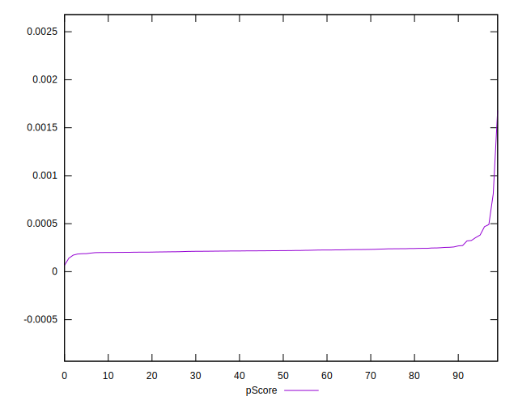

# //largest-contentful-paint/samples/pages

[→ Parent](../..)


## Raw


```yaml
p90min: 13459.048149999999
p90max: 14770.895
p90range: 1311.8468500000017
p90mean: 14478.9576962766
p90median: 14524.873825000002
p90stdev: 199.0544057130517
p90skewness: -2.516439016736599
p90eccentricity: 1
p90discretization: 1
outlandishness: 0.9961593073582748
confidence: 171.94787844463872
p90confidence: 80.47962688062869

```


## Score


```yaml
p90min: 0
p90max: 0
p90range: 0
p90mean: 0
p90median: 0
p90stdev: 0
p90skewness: .nan
p90eccentricity: .nan
p90discretization: 94
outlandishness: .nan
confidence: 0
p90confidence: 0

```


## Raw Estimate


## Score Estimate


## P Score


```yaml
p90min: 0.0001840296934957908
p90max: 0.00046914048880314363
p90range: 0.00028511079530735284
p90mean: 0.00022877892732654515
p90median: 0.00021889105480502047
p90stdev: 0.00003973212357114015
p90skewness: 3.511723731779507
p90eccentricity: 1
p90discretization: 1
outlandishness: 1.1813517269978586
confidence: 0.00006389125459648044
p90confidence: 0.000016064082926101882

```


## Score Difference


```yaml
p90min: 0
p90max: 0
p90range: 0
p90mean: 0
p90median: 0
p90stdev: 0
p90skewness: .nan
p90eccentricity: .nan
p90discretization: 94
outlandishness: .nan
confidence: 0
p90confidence: 0

```


## P Score Difference


```yaml
p90min: 0.0001840296934957908
p90max: 0.00046914048880314363
p90range: 0.00028511079530735284
p90mean: 0.00022877892732654515
p90median: 0.00021889105480502047
p90stdev: 0.00003973212357114015
p90skewness: 3.511723731779507
p90eccentricity: 1
p90discretization: 1
outlandishness: 1.1813517269978586
confidence: 0.00006389125459648044
p90confidence: 0.000016064082926101882

```

