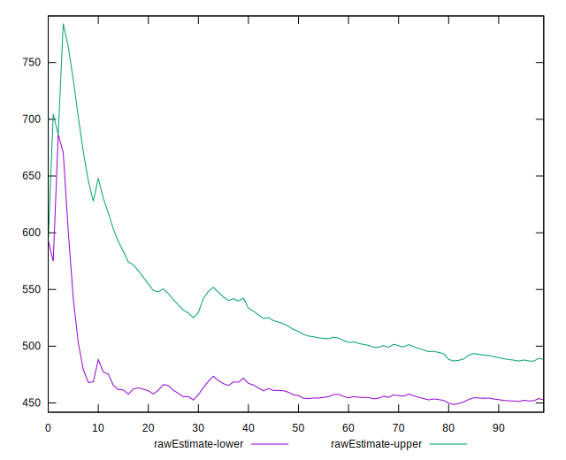

# //mainthread-work-breakdown/samples/pages+cached+noadtech+nomedia+nocss

[→ Parent](../..)


## Raw


```yaml
p90min: 364.22399999999993
p90max: 728.8720000000003
p90range: 364.64800000000037
p90mean: 470.4811914893619
p90median: 445.1739999999999
p90stdev: 87.87192345503058
p90skewness: 1.1064649179211588
p90eccentricity: 1.0000000000000002
p90discretization: 1
outlandishness: 1.0284830628170651
confidence: 41.1062929342705
p90confidence: 35.5274709324373

```


## Score


```yaml
p90min: 1
p90max: 1
p90range: 0
p90mean: 1
p90median: 1
p90stdev: 0
p90skewness: .nan
p90eccentricity: .nan
p90discretization: 94
outlandishness: 1
confidence: 0
p90confidence: 0

```


## Raw Estimate


## Score Estimate


## P Score


```yaml
p90min: 0.9992805067928733
p90max: 0.9999963548365427
p90range: 0.0007158480436694203
p90mean: 0.9999275479161457
p90median: 0.9999801694569543
p90stdev: 0.00012870612213581136
p90skewness: -2.875493205413418
p90eccentricity: 1.0000000000000002
p90discretization: 1.010752688172043
outlandishness: 0.9999241717096788
confidence: 0.00010815157522609937
p90confidence: 0.000052037133514516076

```


## Score Difference


```yaml
p90min: 0
p90max: 0
p90range: 0
p90mean: 0
p90median: 0
p90stdev: 0
p90skewness: .nan
p90eccentricity: .nan
p90discretization: 94
outlandishness: .nan
confidence: 0
p90confidence: 0

```


## P Score Difference


```yaml
p90min: -0.0007194932071267202
p90max: -0.000003645163457299816
p90range: 0.0007158480436694203
p90mean: -0.00007245208385445828
p90median: -0.00001983054304560694
p90stdev: 0.0001287061221358114
p90skewness: -2.8754932054126163
p90eccentricity: 0.9999999999999999
p90discretization: 1.010752688172043
outlandishness: 2.3203563285247
confidence: 0.00010815157522609935
p90confidence: 0.00005203713351451609

```

