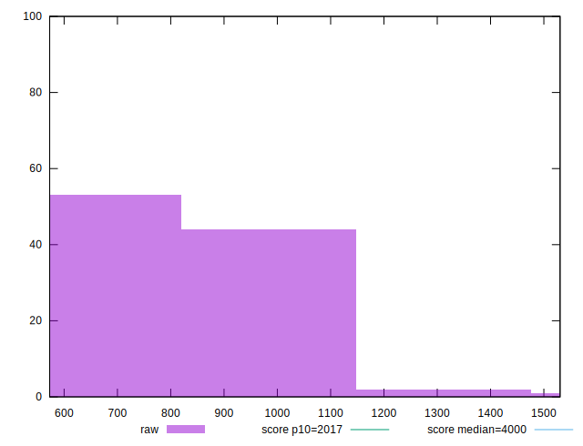

# //mainthread-work-breakdown/samples/pages+cached+noadtech+nomedia

[→ Parent](../..)


## Raw


```yaml
p90min: 590.1240000000006
p90max: 1120.3600000000008
p90range: 530.2360000000002
p90mean: 817.3869361702135
p90median: 810.614000000001
p90stdev: 133.29727851675997
p90skewness: 0.260873971614769
p90eccentricity: 0.9999999999999997
p90discretization: 1
outlandishness: 1.023810783815334
confidence: 65.94979485517509
p90confidence: 53.89338256947047

```


## Score


```yaml
p90min: 0.99
p90max: 1
p90range: 0.010000000000000009
p90mean: 0.9990425531914894
p90median: 1
p90stdev: 0.0029424078055190067
p90skewness: -2.7477857990363366
p90eccentricity: 1.0000000000000007
p90discretization: 47
outlandishness: 0.9987140756831757
confidence: 0.0020533838417582514
p90confidence: 0.0011896440145122205

```


## Raw Estimate


## Score Estimate


## P Score


```yaml
p90min: 0.9913920692077349
p90max: 0.9998294671633643
p90range: 0.008437397955629367
p90mean: 0.997951634837262
p90median: 0.9985948690823544
p90stdev: 0.0018956807611739599
p90skewness: -1.376220420077383
p90eccentricity: 0.9999999999999996
p90discretization: 1
outlandishness: 0.9987772315235843
confidence: 0.001770507709426135
p90confidence: 0.000766442118161382

```


## Score Difference


```yaml
p90min: 0
p90max: 0
p90range: 0
p90mean: 0
p90median: 0
p90stdev: 0
p90skewness: .nan
p90eccentricity: .nan
p90discretization: 94
outlandishness: .nan
confidence: 0
p90confidence: 0

```


## P Score Difference


```yaml
p90min: -0.004431631592877183
p90max: 0.004689379404287264
p90range: 0.009121010997164447
p90mean: -0.0011246493214209124
p90median: -0.0010993235027800252
p90stdev: 0.0017005549475516287
p90skewness: 0.9074521327713911
p90eccentricity: 0.9999999999999996
p90discretization: 1
outlandishness: 0.8861315372004238
confidence: 0.0007975322858669445
p90confidence: 0.0006875508591668838

```

