# //mainthread-work-breakdown/samples/pages+cached+noadtech

[→ Parent](../..)


## Raw


```yaml
p90min: 606.4760000000011
p90max: 1328.112000000001
p90range: 721.6359999999999
p90mean: 864.9325106382988
p90median: 852.6580000000009
p90stdev: 190.19426162248493
p90skewness: 0.558593826878782
p90eccentricity: 1.0000000000000002
p90discretization: 1
outlandishness: 1.0410878693595549
confidence: 94.20720328982543
p90confidence: 76.8973846892886

```

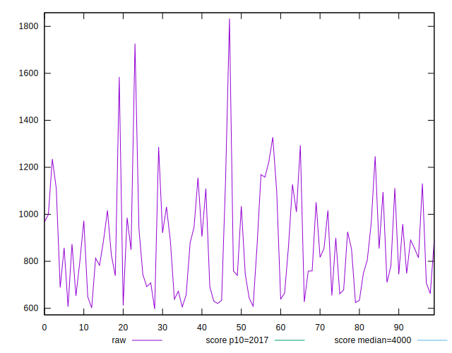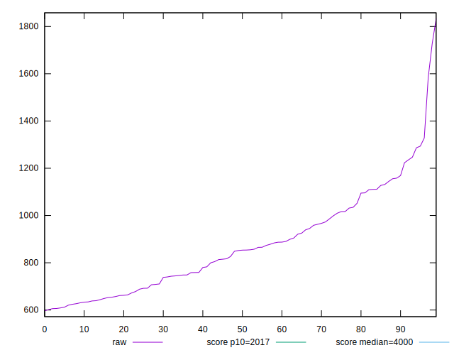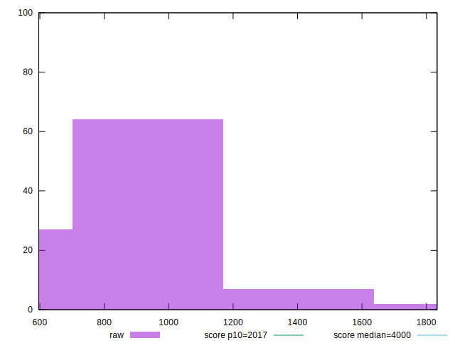
## Score


```yaml
p90min: 0.98
p90max: 1
p90range: 0.020000000000000018
p90mean: 0.9973404255319147
p90median: 1
p90stdev: 0.005089733495279023
p90skewness: -1.759121415286897
p90eccentricity: 0.9999999999999974
p90discretization: 31.333333333333332
outlandishness: 0.9969133189165514
confidence: 0.004191940985913712
p90confidence: 0.002057828618033123

```

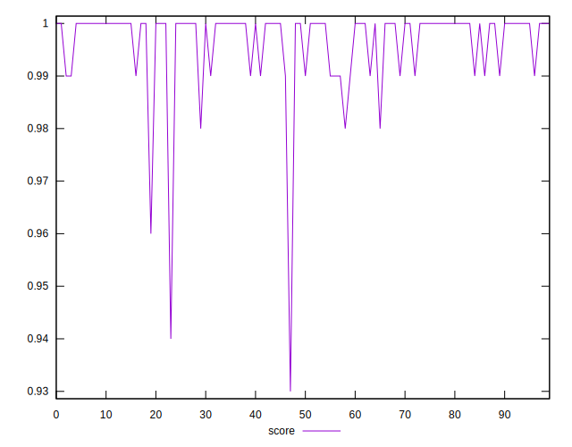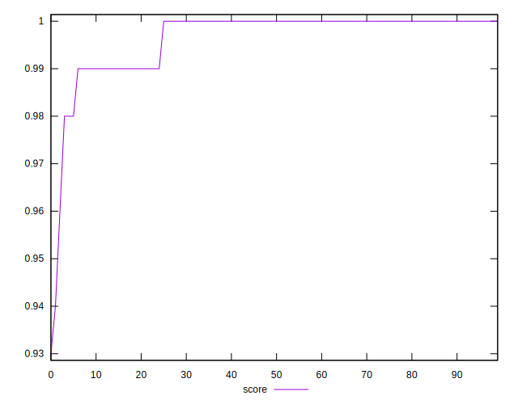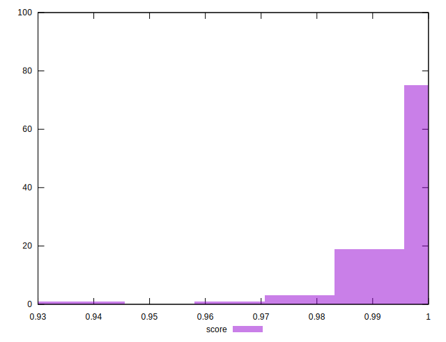
## Raw Estimate

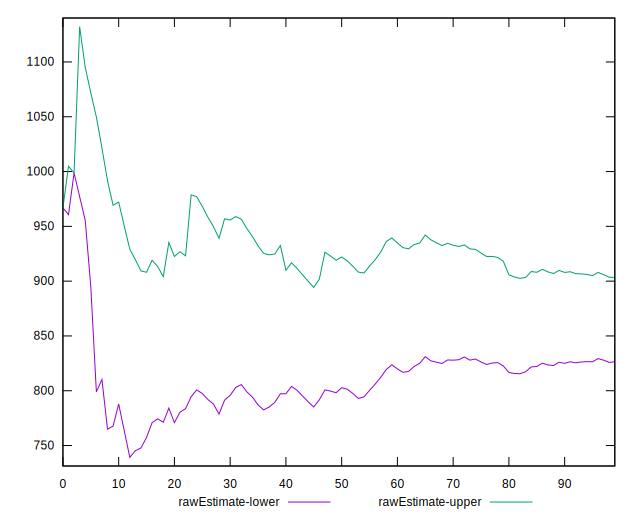
## Score Estimate

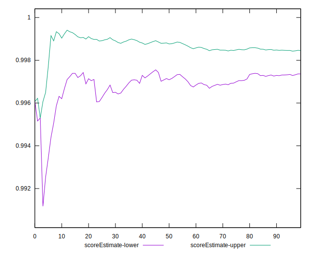
## P Score


```yaml
p90min: 0.980475331438263
p90max: 0.9997928282423401
p90range: 0.019317496804077017
p90mean: 0.9965049948936541
p90median: 0.998092843129968
p90stdev: 0.004276848388456799
p90skewness: -1.8308761106320282
p90eccentricity: 1
p90discretization: 1
outlandishness: 0.9969684887572612
confidence: 0.004043244073492628
p90confidence: 0.0017291712850817478

```

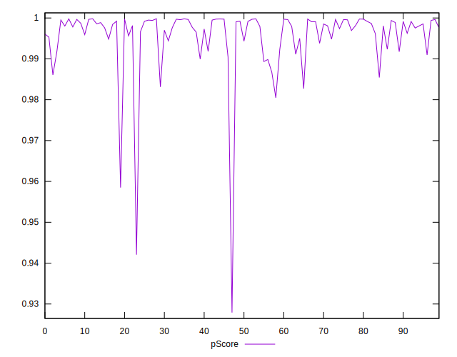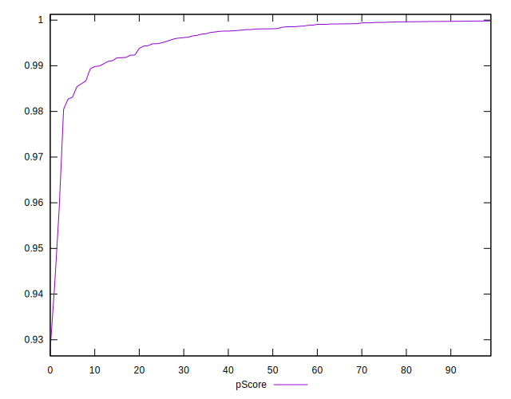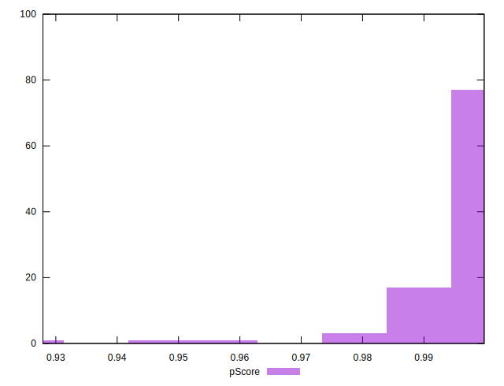
## Score Difference


```yaml
p90min: 0
p90max: 0
p90range: 0
p90mean: 0
p90median: 0
p90stdev: 0
p90skewness: .nan
p90eccentricity: .nan
p90discretization: 94
outlandishness: .inf
confidence: 4.330179641073934e-18
p90confidence: 0

```

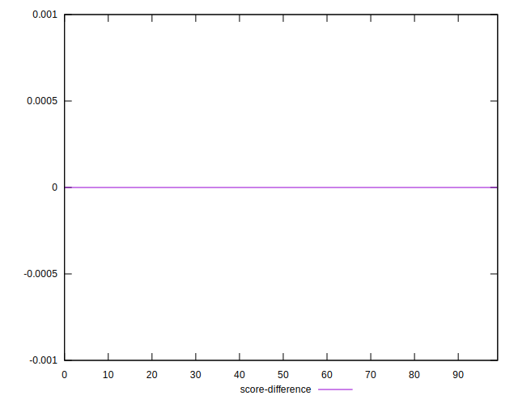
## P Score Difference


```yaml
p90min: -0.004369858923078063
p90max: 0.004314581422790731
p90range: 0.008684440345868794
p90mean: -0.0008559036403261734
p90median: -0.0007186356625064061
p90stdev: 0.0016874639621947908
p90skewness: 0.4765724678655842
p90eccentricity: 0.9999999999999996
p90discretization: 1
outlandishness: 0.8881310707867509
confidence: 0.0007891032210780853
p90confidence: 0.0006822580468161899

```

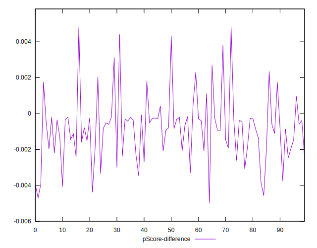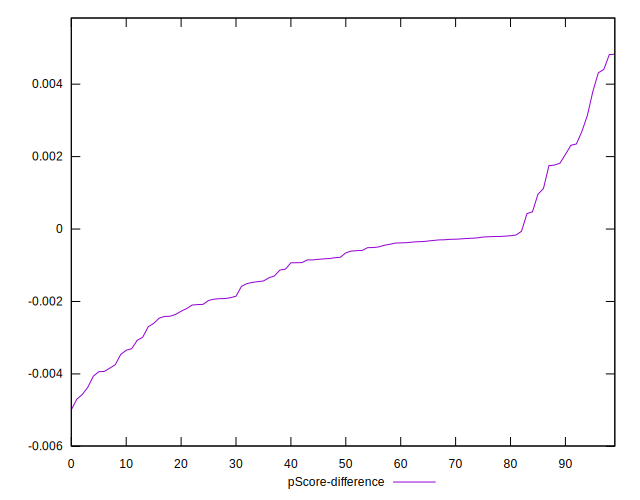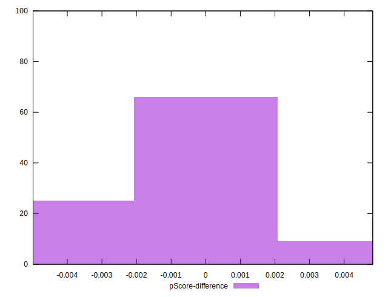