# //mainthread-work-breakdown/samples/pages+cached

[→ Parent](../..)


## Raw


```yaml
p90min: 1584.9600000000005
p90max: 3030.9000000000015
p90range: 1445.940000000001
p90mean: 2116.4487234042535
p90median: 2043.4480000000012
p90stdev: 365.5885123428971
p90skewness: 0.5453019973423865
p90eccentricity: 1.0000000000000002
p90discretization: 1
outlandishness: 1.014551632896174
confidence: 162.09938426617865
p90confidence: 147.81098142391576

```

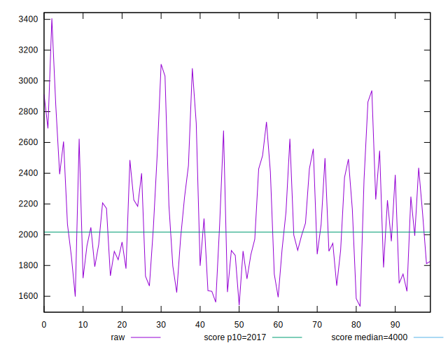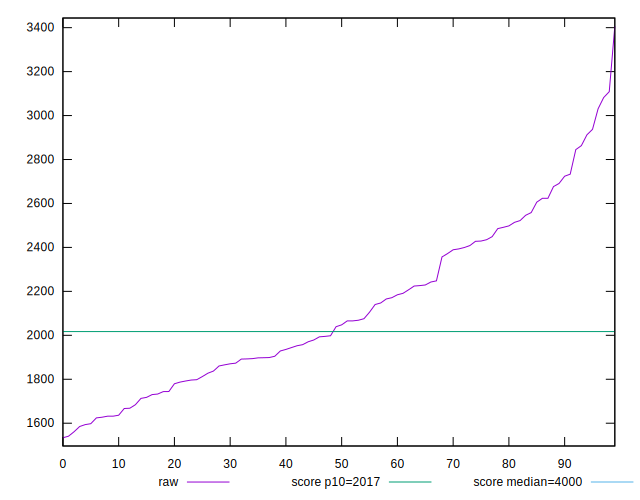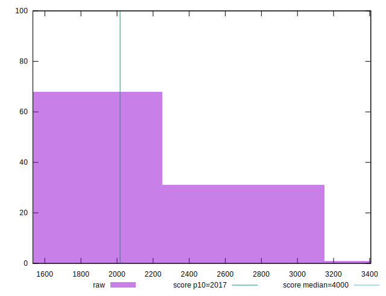
## Score


```yaml
p90min: 0.7
p90max: 0.96
p90range: 0.26
p90mean: 0.876489361702128
p90median: 0.895
p90stdev: 0.06485183517160088
p90skewness: -0.8138982936404469
p90eccentricity: 1.0000000000000002
p90discretization: 4.086956521739131
outlandishness: 0.9911448273460302
confidence: 0.029174483616984024
p90confidence: 0.026220225965047566

```

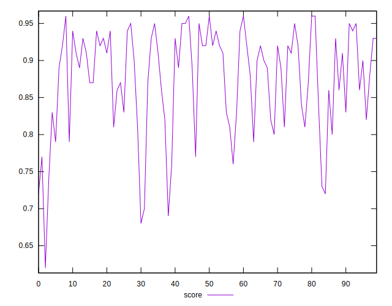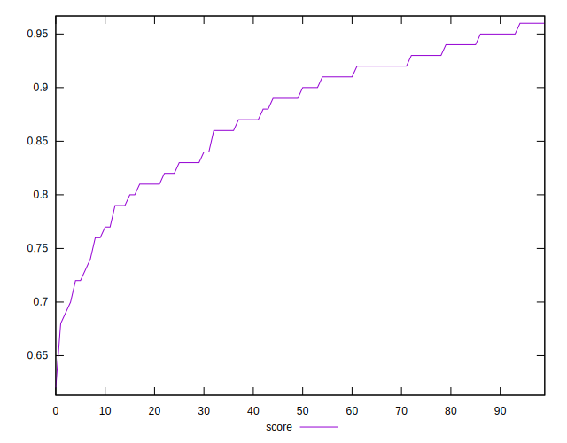
## Raw Estimate

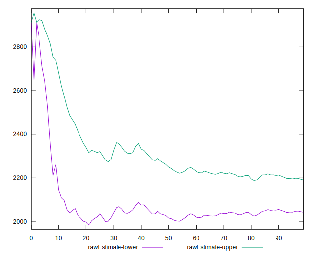
## Score Estimate

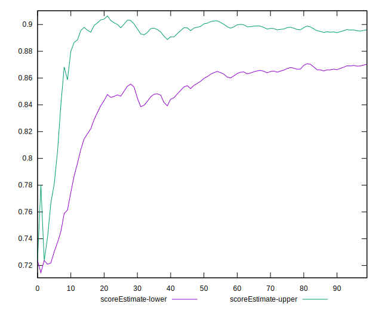
## P Score


```yaml
p90min: 0.6982196580153286
p90max: 0.9584290380907101
p90range: 0.2602093800753815
p90mean: 0.8771195275802566
p90median: 0.8956525061425293
p90stdev: 0.06500510649908406
p90skewness: -0.8129053273622714
p90eccentricity: 1.0000000000000004
p90discretization: 1
outlandishness: 0.9911618429840687
confidence: 0.029307003527674683
p90confidence: 0.026282195049344682

```

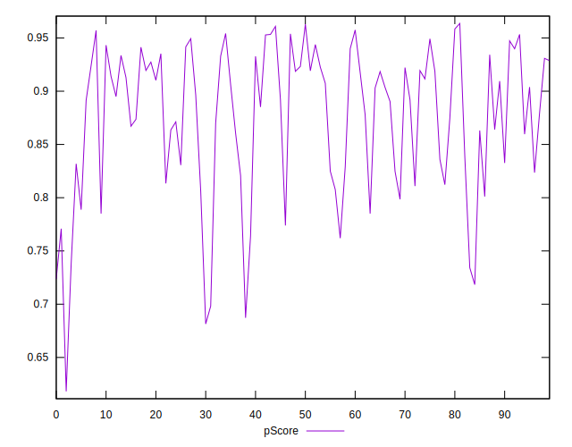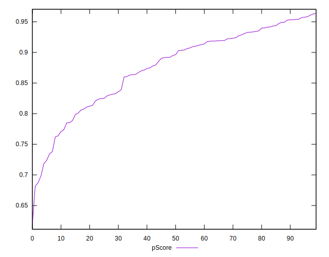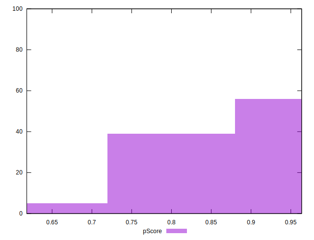
## Score Difference


```yaml
p90min: 0
p90max: 1.1102230246251565e-16
p90range: 1.1102230246251565e-16
p90mean: 2.598394312952494e-17
p90median: 0
p90stdev: 4.700672178249124e-17
p90skewness: 1.2562972690740166
p90eccentricity: 1.0000000000000016
p90discretization: 47
outlandishness: 1.1410123966942147
confidence: 1.8844688044630887e-17
p90confidence: 1.900527354008907e-17

```

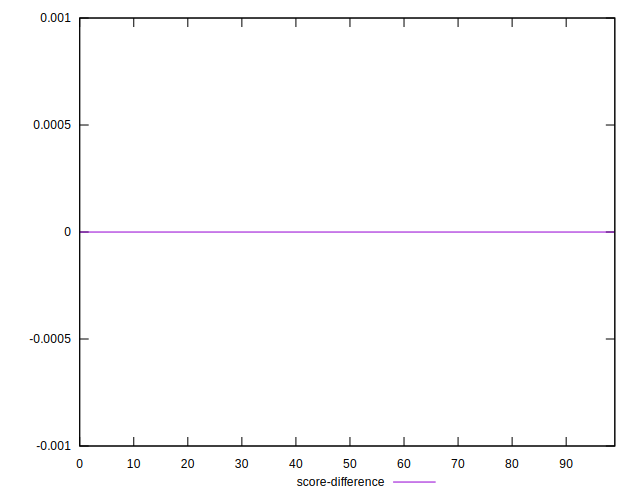
## P Score Difference


```yaml
p90min: -0.004808501058043868
p90max: 0.004285528312083509
p90range: 0.009094029370127377
p90mean: 0.0006801190333155279
p90median: 0.0008909973512031821
p90stdev: 0.0025335104063385315
p90skewness: -0.2808779079310242
p90eccentricity: 0.9999999999999999
p90discretization: 1
outlandishness: 0.8713510045663739
confidence: 0.001072558505022185
p90confidence: 0.001024322830082157

```

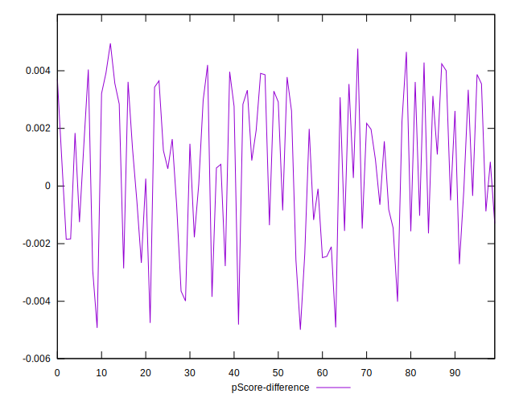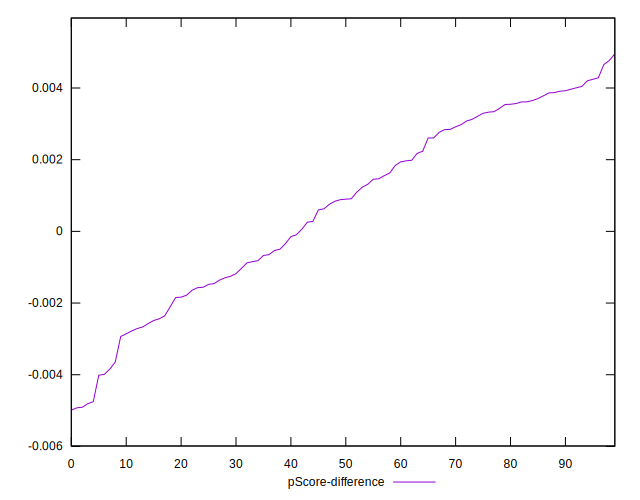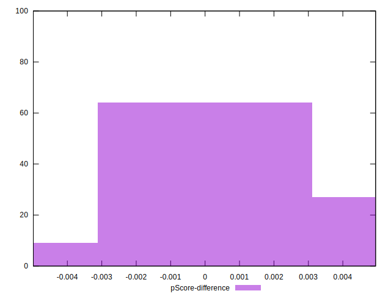