# //mainthread-work-breakdown/samples/pages

[→ Parent](../..)


## Raw


```yaml
p90min: 1657.8400000000024
p90max: 3021.4599999999905
p90range: 1363.619999999988
p90mean: 2196.725063829786
p90median: 2171.1799999999976
p90stdev: 339.40689078583773
p90skewness: 0.34455404792777616
p90eccentricity: 1.0000000000000004
p90discretization: 1
outlandishness: 1.0060693080426018
confidence: 148.50375247345818
p90confidence: 137.22549788993433

```

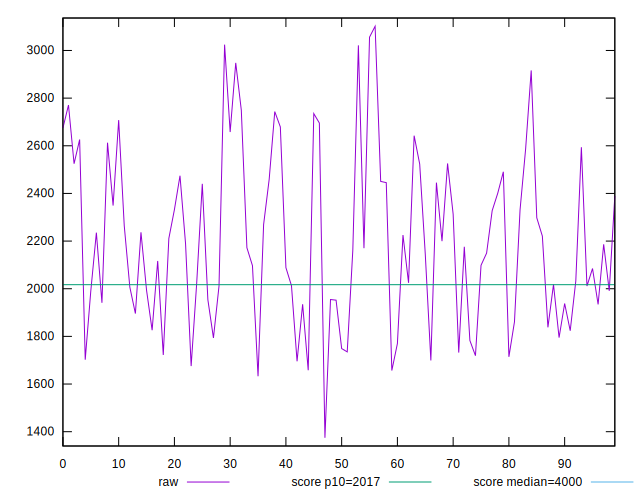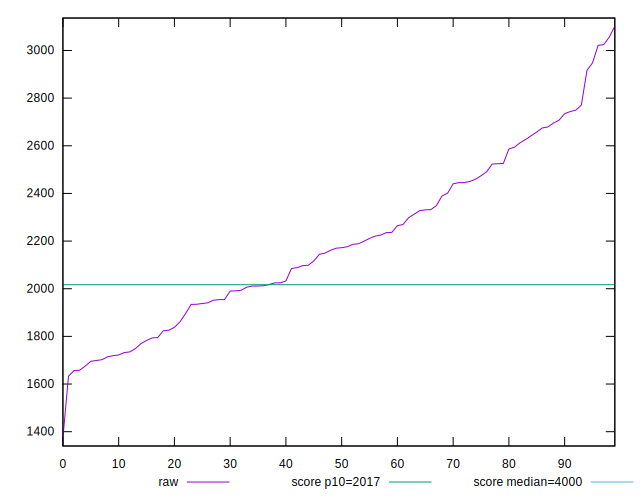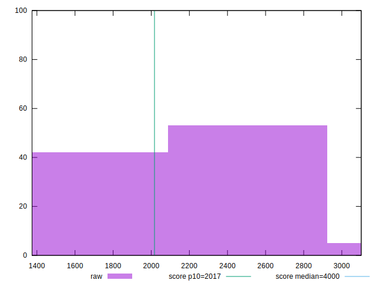
## Score


```yaml
p90min: 0.7
p90max: 0.95
p90range: 0.25
p90mean: 0.8637234042553197
p90median: 0.87
p90stdev: 0.061712856734098646
p90skewness: -0.5851061178707386
p90eccentricity: 1.0000000000000002
p90discretization: 4.2727272727272725
outlandishness: 0.9946272631240421
confidence: 0.02706181545852462
p90confidence: 0.024951106537464084

```

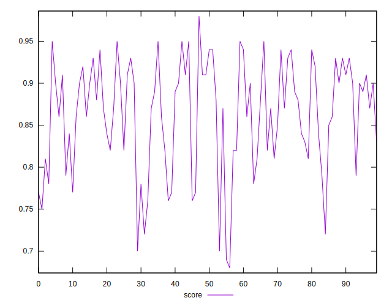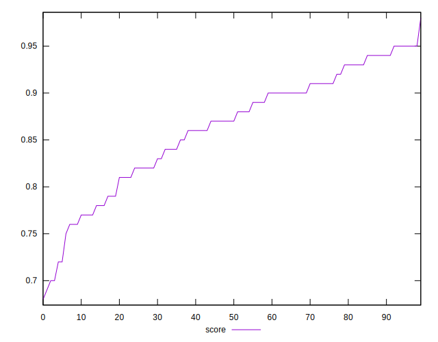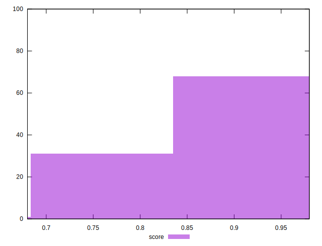
## Raw Estimate

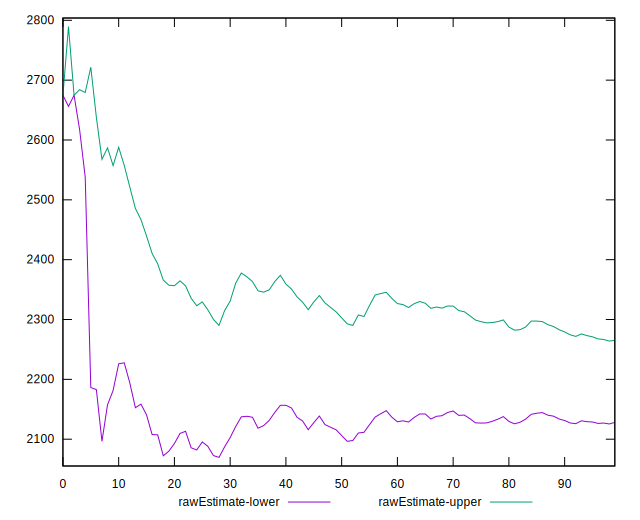
## Score Estimate

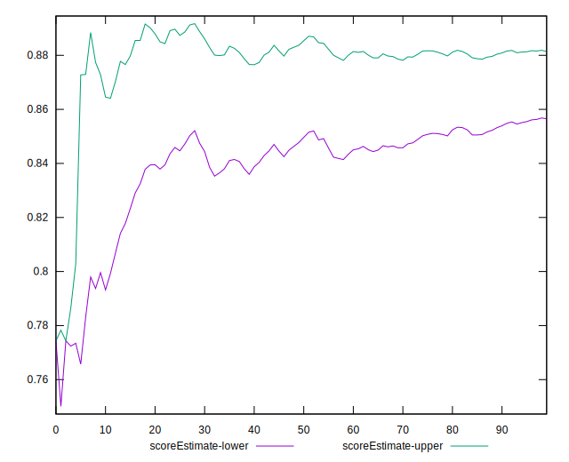
## P Score


```yaml
p90min: 0.7002521011688293
p90max: 0.9503844473766628
p90range: 0.25013234620783353
p90mean: 0.8640941041278044
p90median: 0.8736216539680626
p90stdev: 0.061685488658300446
p90skewness: -0.5908716046078812
p90eccentricity: 0.9999999999999996
p90discretization: 1
outlandishness: 0.9947261962651529
confidence: 0.027003651563372963
p90confidence: 0.024940041358972855

```

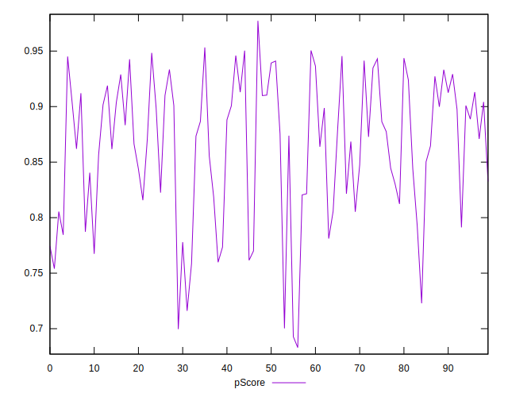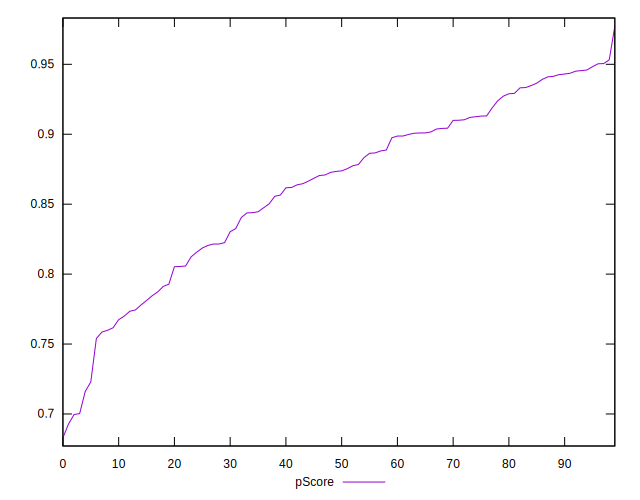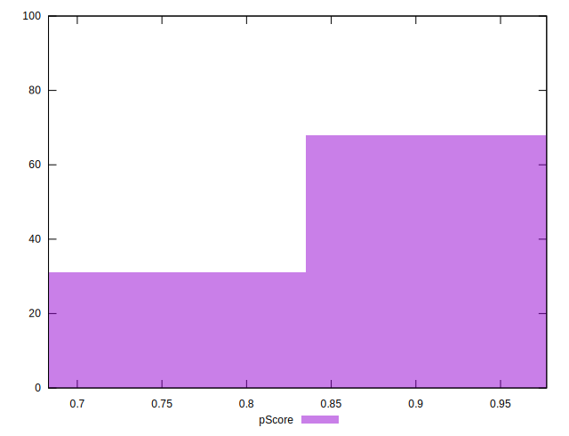
## Score Difference


```yaml
p90min: 0
p90max: 1.1102230246251565e-16
p90range: 1.1102230246251565e-16
p90mean: 2.598394312952494e-17
p90median: 0
p90stdev: 4.7006721782491246e-17
p90skewness: 1.2562972690740164
p90eccentricity: 1.0000000000000004
p90discretization: 47
outlandishness: 1.1410123966942147
confidence: 1.8844688044630887e-17
p90confidence: 1.900527354008907e-17

```

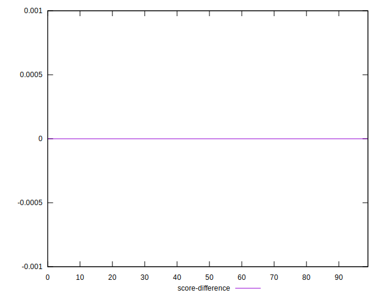
## P Score Difference


```yaml
p90min: -0.0045288268808379994
p90max: 0.0045112577534280884
p90range: 0.009040084634266088
p90mean: 0.00044192061897201774
p90median: 0.0005026175633311425
p90stdev: 0.0026054887929659806
p90skewness: -0.28375448224003613
p90eccentricity: 1
p90discretization: 1
outlandishness: 0.8715396746491894
confidence: 0.0010895088378672264
p90confidence: 0.0010534243899220199

```

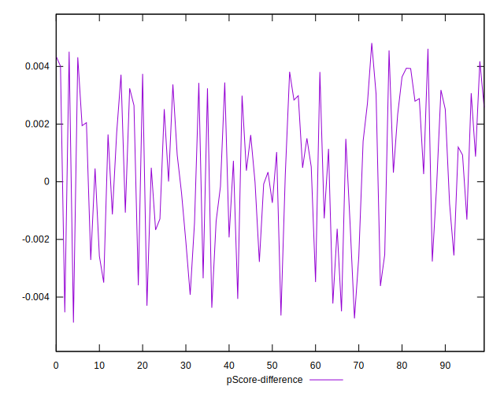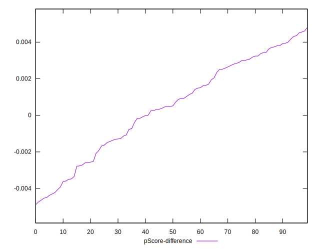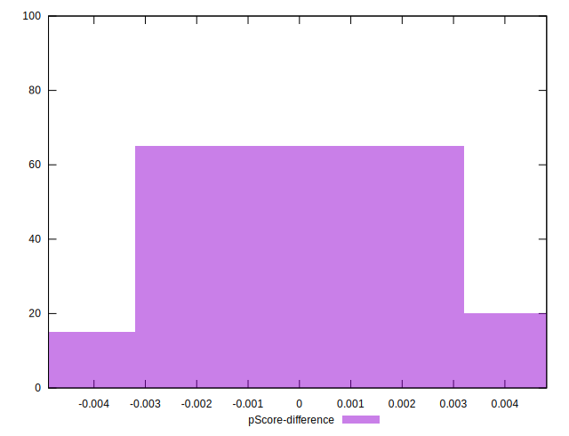