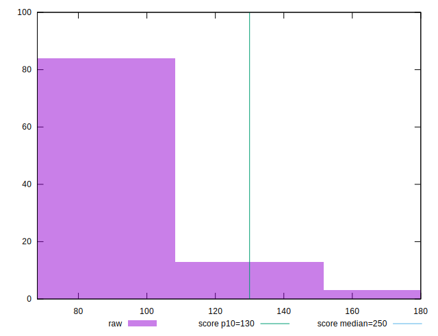
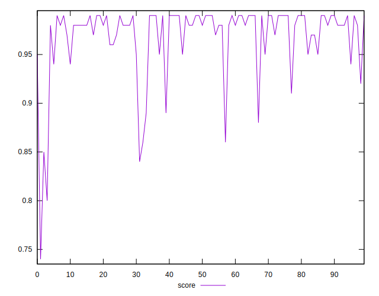
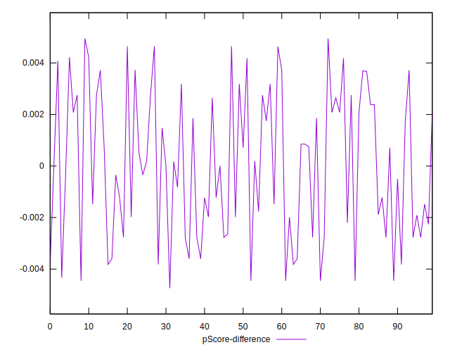

# //max-potential-fid/samples/pages+cached+noadtech+nomedia+nocss

[→ Parent](../..)


## Raw


```yaml
p90min: 70
p90max: 146
p90range: 76
p90mean: 90.08510638297872
p90median: 84
p90stdev: 17.598754534309958
p90skewness: 1.5852050806389506
p90eccentricity: 1.0000000000000007
p90discretization: 2.186046511627907
outlandishness: 1.036173974253903
confidence: 8.553261270698286
p90confidence: 7.115347150501026

```


## Score


```yaml
p90min: 0.85
p90max: 0.99
p90range: 0.14
p90mean: 0.9714893617021273
p90median: 0.98
p90stdev: 0.03100986276903331
p90skewness: -2.3782096271361497
p90eccentricity: 1.000000000000001
p90discretization: 7.833333333333333
outlandishness: 0.9901644705270761
confidence: 0.017060065142741925
p90confidence: 0.012537588285631514

```


## Raw Estimate


## Score Estimate


## P Score


```yaml
p90min: 0.8540758457107169
p90max: 0.9936973680837036
p90range: 0.13962152237298664
p90mean: 0.9714814781126331
p90median: 0.9837182073683034
p90stdev: 0.030687395673040376
p90skewness: -2.3882857440835745
p90eccentricity: 0.9999999999999999
p90discretization: 2.186046511627907
outlandishness: 0.9902486522649722
confidence: 0.01712334116246217
p90confidence: 0.012407211711077306

```


## Score Difference


```yaml
p90min: 0
p90max: 1.1102230246251565e-16
p90range: 1.1102230246251565e-16
p90mean: 8.267618268485208e-18
p90median: 0
p90stdev: 2.914680950318569e-17
p90skewness: 3.241763593892423
p90eccentricity: 0.9999999999999979
p90discretization: 47
outlandishness: 1.8032653061224493
confidence: 1.3055982858434588e-17
p90confidence: 1.1784337780288283e-17

```


## P Score Difference


```yaml
p90min: -0.004457294252225408
p90max: 0.004648231415178894
p90range: 0.009105525667404302
p90mean: 0.000025863560745636176
p90median: 0.00007546164006616563
p90stdev: 0.002763437021468231
p90skewness: 0.027012024814111264
p90eccentricity: 1
p90discretization: 2.0434782608695654
outlandishness: 1.6524983513063027
confidence: 0.0011432970309565617
p90confidence: 0.0011172843906629324

```

