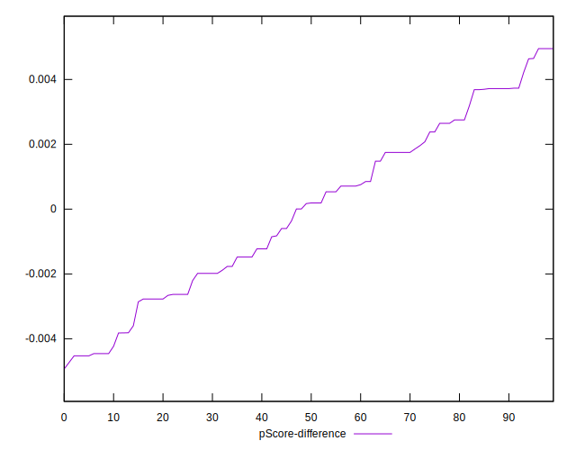

# //max-potential-fid/samples/pages+cached+noadtech+nomedia

[→ Parent](../..)


## Raw


```yaml
p90min: 66
p90max: 141
p90range: 75
p90mean: 89.82978723404256
p90median: 86
p90stdev: 15.719372989682913
p90skewness: 1.2709998285575108
p90eccentricity: 1.0000000000000002
p90discretization: 2.1363636363636362
outlandishness: 1.0368516332250304
confidence: 8.31827834166141
p90confidence: 6.355494963677478

```


## Score


```yaml
p90min: 0.87
p90max: 1
p90range: 0.13
p90mean: 0.9727659574468084
p90median: 0.98
p90stdev: 0.025027825167080207
p90skewness: -2.2003553733239327
p90eccentricity: 1.0000000000000002
p90discretization: 7.230769230769231
outlandishness: 0.9898160871377292
confidence: 0.017243940908567807
p90confidence: 0.01011899246271319

```


## Raw Estimate


## Score Estimate


## P Score


```yaml
p90min: 0.8691468684976471
p90max: 0.9954734645055221
p90range: 0.126326596007875
p90mean: 0.9729371742127755
p90median: 0.9817497961668427
p90stdev: 0.025132752160059994
p90skewness: -2.279564282169037
p90eccentricity: 1.0000000000000002
p90discretization: 2.1363636363636362
outlandishness: 0.9893946070321032
confidence: 0.017277653425426278
p90confidence: 0.010161415463673502

```


## Score Difference


```yaml
p90min: 0
p90max: 1.1102230246251565e-16
p90range: 1.1102230246251565e-16
p90mean: 4.724353296277262e-18
p90median: 0
p90stdev: 2.240957533134066e-17
p90skewness: 4.532597979574667
p90eccentricity: 0.9999999999999984
p90discretization: 47
outlandishness: 2.706025000000001
confidence: 1.1103983576888554e-17
p90confidence: 9.060408659427041e-18

```


## P Score Difference


```yaml
p90min: -0.004526535494477901
p90max: 0.004951707034809072
p90range: 0.009478242529286973
p90mean: -0.00004515159437109349
p90median: 0.00018069604872572587
p90stdev: 0.0026784710198930993
p90skewness: 0.006190131552637169
p90eccentricity: 1.000000000000001
p90discretization: 2.088888888888889
outlandishness: 0.6275477386585656
confidence: 0.0011191901026786754
p90confidence: 0.0010829318121313982

```

