# //max-potential-fid/samples/pages+cached+noadtech

[→ Parent](../..)


## Raw


```yaml
p90min: 69
p90max: 216.00000000000023
p90range: 147.00000000000023
p90mean: 99.8563829787234
p90median: 86
p90stdev: 35.083761651197094
p90skewness: 1.7059832534732775
p90eccentricity: 1.0000000000000007
p90discretization: 1.709090909090909
outlandishness: 1.1384513742521756
confidence: 22.50141251247072
p90confidence: 14.184705116889141

```

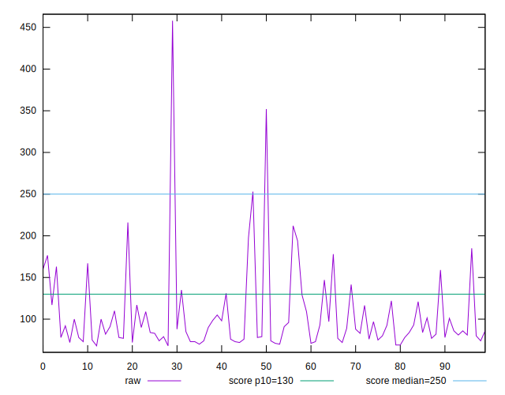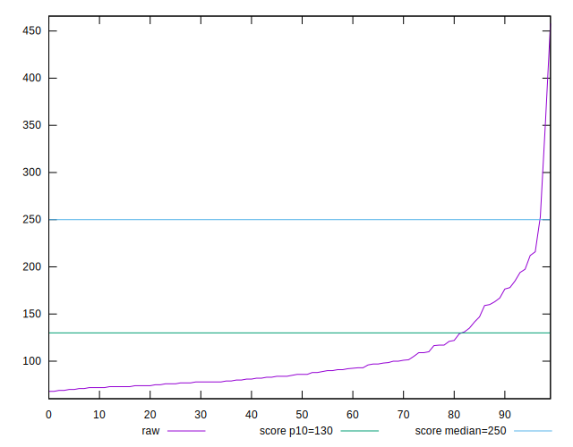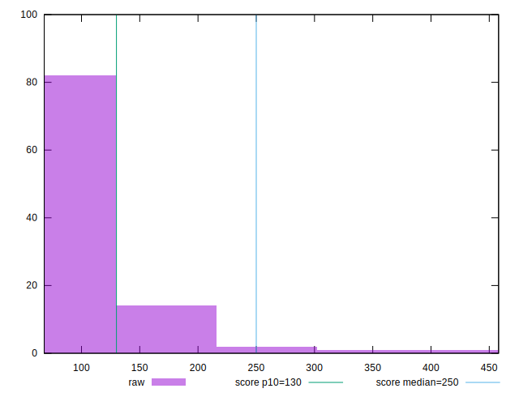
## Score


```yaml
p90min: 0.61
p90max: 0.99
p90range: 0.38
p90mean: 0.9440425531914889
p90median: 0.98
p90stdev: 0.08541910630029322
p90skewness: -2.3412833245651465
p90eccentricity: 0.9999999999999976
p90discretization: 4.7
outlandishness: 0.961517927117171
confidence: 0.05578776428513241
p90confidence: 0.034535773166630326

```

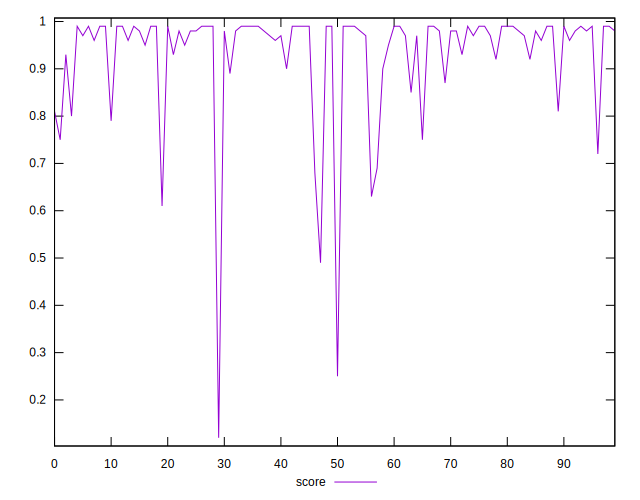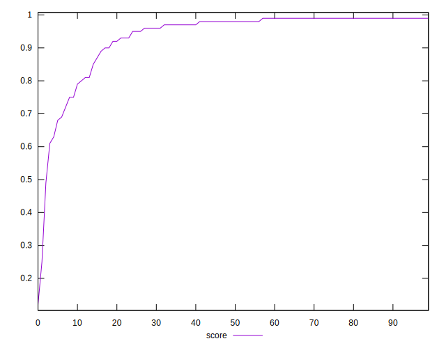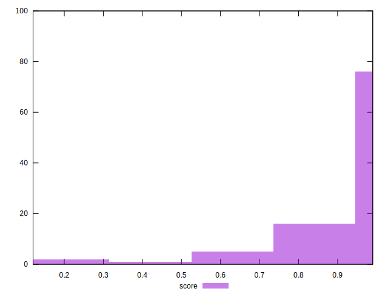
## Raw Estimate

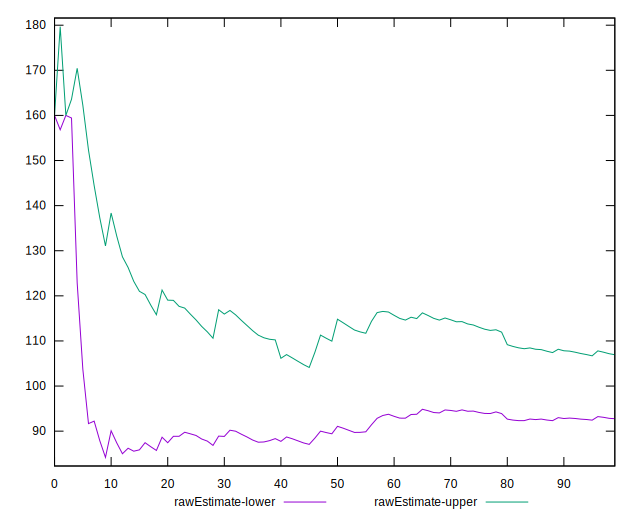
## Score Estimate

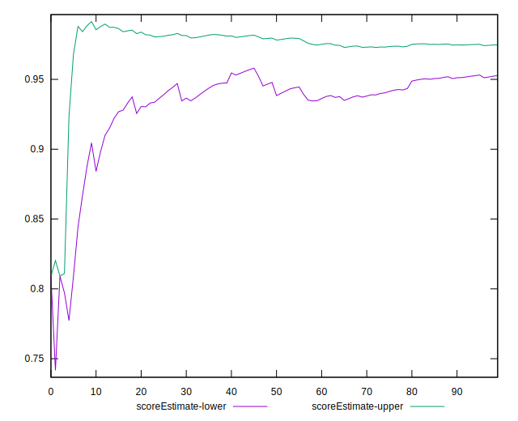
## P Score


```yaml
p90min: 0.6127467694547377
p90max: 0.994180911427837
p90range: 0.3814341419730993
p90mean: 0.9443612893389759
p90median: 0.9817497961668427
p90stdev: 0.08572136371183324
p90skewness: -2.3321939269292873
p90eccentricity: 0.9999999999999996
p90discretization: 1.709090909090909
outlandishness: 0.9617630171177491
confidence: 0.05591372198134797
p90confidence: 0.034657978769744247

```

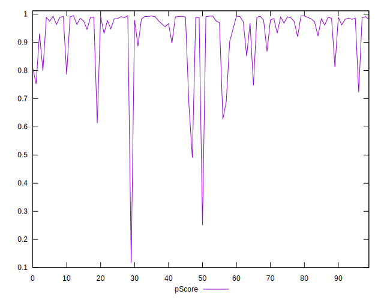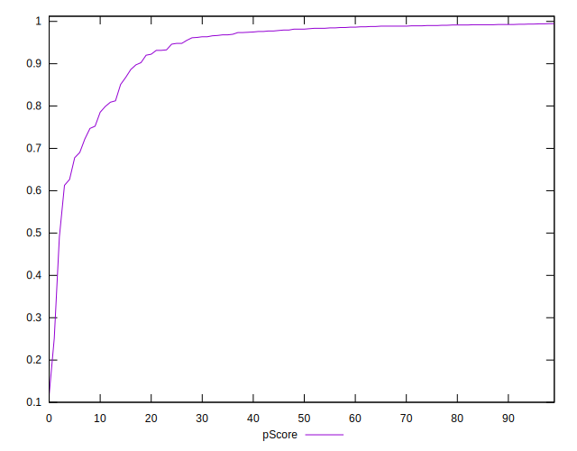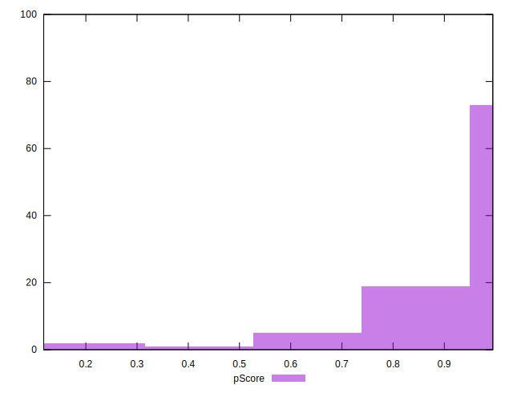
## Score Difference


```yaml
p90min: 0
p90max: 1.1102230246251565e-16
p90range: 1.1102230246251565e-16
p90mean: 1.1810883240693154e-18
p90median: 0
p90stdev: 1.139000331521095e-17
p90skewness: 9.539955591519899
p90eccentricity: 1.0000000000000013
p90discretization: 47
outlandishness: 14.137600000000003
confidence: 8.528132291650275e-18
p90confidence: 4.605088813249998e-18

```

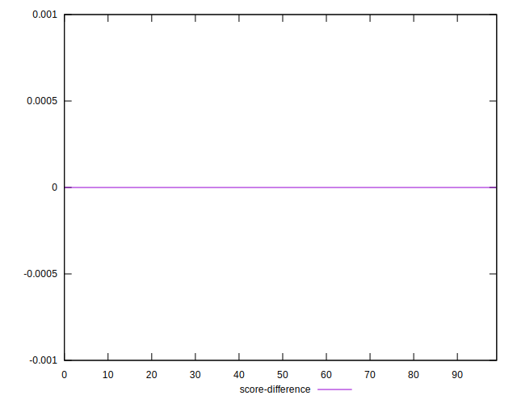
## P Score Difference


```yaml
p90min: -0.004457294252225408
p90max: 0.0046375893622611075
p90range: 0.009094883614486515
p90mean: 0.00045082316424957286
p90median: 0.0008507430743767141
p90stdev: 0.002512498047867273
p90skewness: -0.19098457417105022
p90eccentricity: 1.0000000000000004
p90discretization: 1.709090909090909
outlandishness: 0.912107125504133
confidence: 0.0010540709821700062
p90confidence: 0.0010158273297510229

```

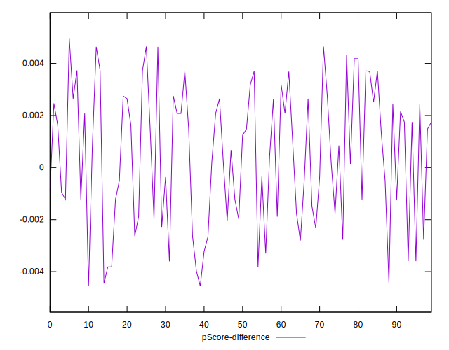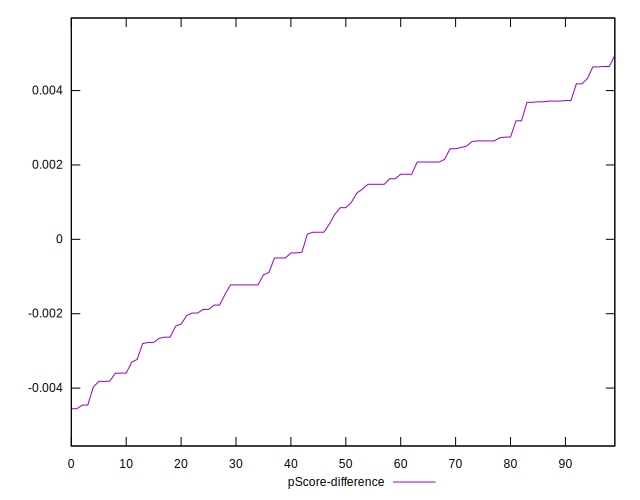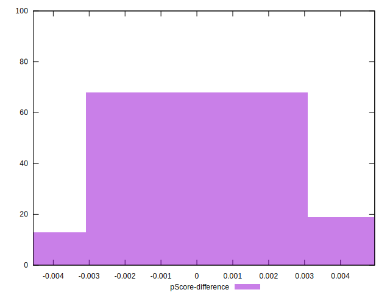