# //max-potential-fid/samples/pages+cached

[→ Parent](../..)


## Raw


```yaml
p90min: 319
p90max: 760.9999999999982
p90range: 441.9999999999982
p90mean: 453.09574468085106
p90median: 422.99999999999955
p90stdev: 101.67972968443978
p90skewness: 1.2195986927132185
p90eccentricity: 1.0000000000000007
p90discretization: 1.0444444444444445
outlandishness: 1.0351045085786073
confidence: 48.09833018973655
p90confidence: 41.11010091443729

```

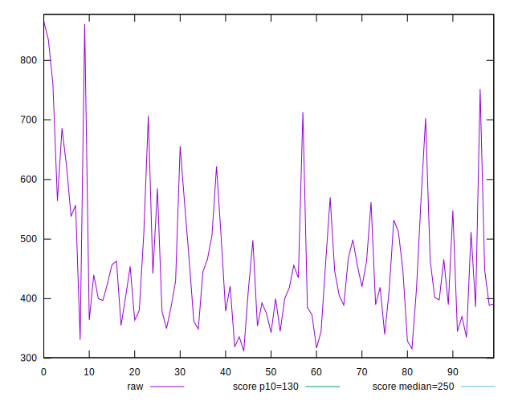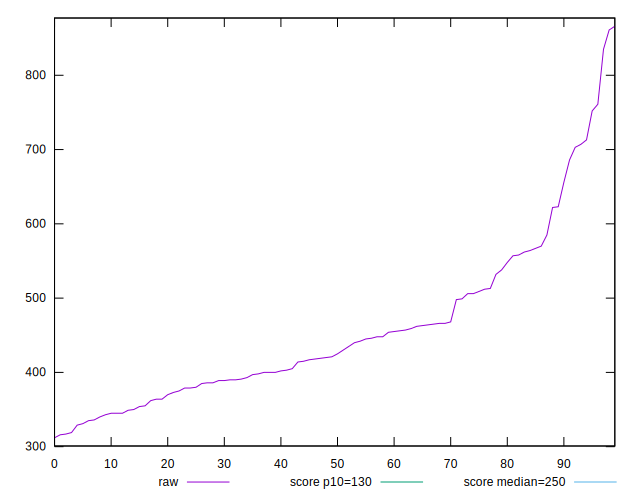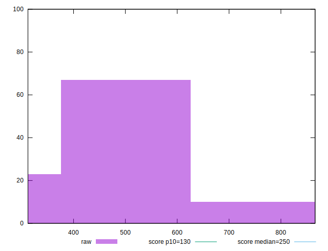
## Score


```yaml
p90min: 0.01
p90max: 0.32
p90range: 0.31
p90mean: 0.14893617021276595
p90median: 0.15
p90stdev: 0.07684563256885325
p90skewness: 0.10403306535123646
p90eccentricity: 0.9999999999999988
p90discretization: 3.2413793103448274
outlandishness: 1.0143367346938774
confidence: 0.03289471265436318
p90confidence: 0.031069434581932936

```

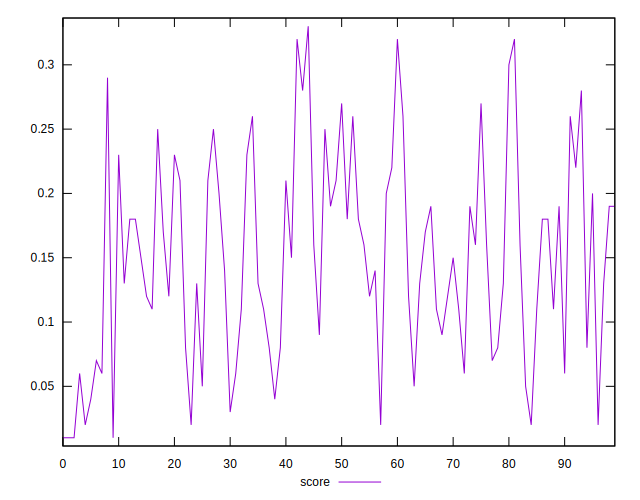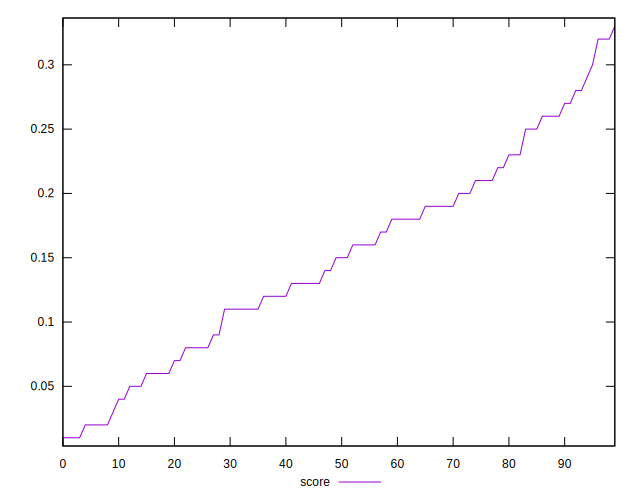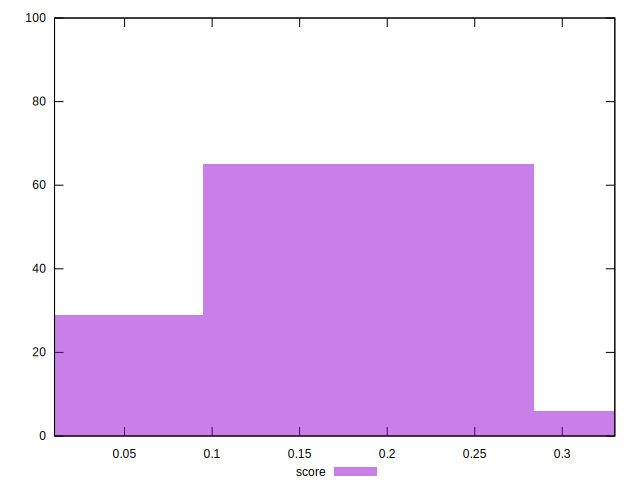
## Raw Estimate

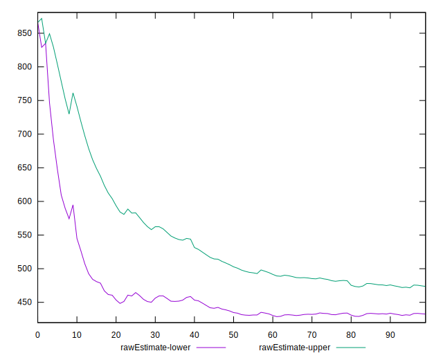
## Score Estimate

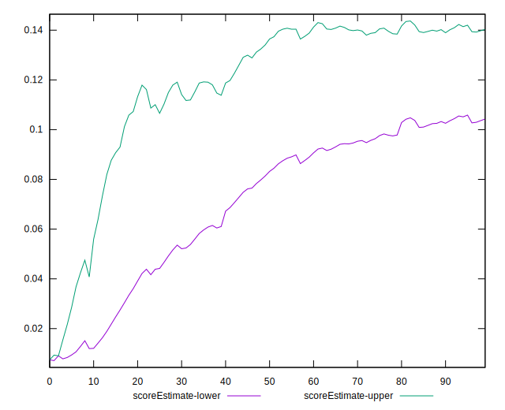
## P Score


```yaml
p90min: 0.01457050446932212
p90max: 0.31644705411046187
p90range: 0.30187654964113975
p90mean: 0.1490436472969509
p90median: 0.15136333375055755
p90stdev: 0.07689871793527446
p90skewness: 0.1003627595263867
p90eccentricity: 0.9999999999999996
p90discretization: 1.0444444444444445
outlandishness: 1.014263792059747
confidence: 0.032999195211643996
p90confidence: 0.031090897510457908

```

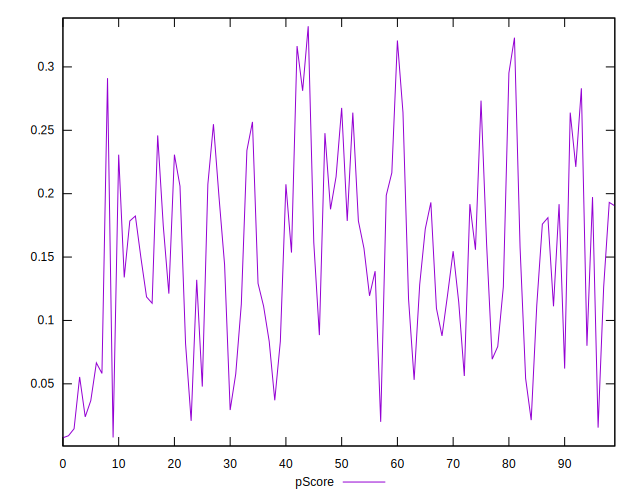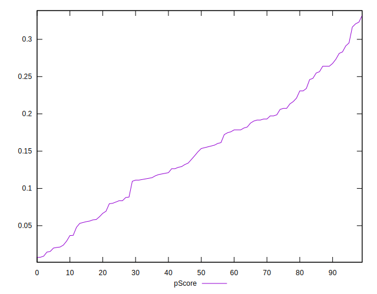
## Score Difference


```yaml
p90min: 0
p90max: 0
p90range: 0
p90mean: 0
p90median: 0
p90stdev: 0
p90skewness: .nan
p90eccentricity: .nan
p90discretization: 94
outlandishness: .nan
confidence: 0
p90confidence: 0

```


## P Score Difference


```yaml
p90min: -0.004242826013934747
p90max: 0.004570504469322121
p90range: 0.008813330483256868
p90mean: 0.00010656568946854597
p90median: 0.00015329174347070845
p90stdev: 0.002609779220403657
p90skewness: 0.05438740513071857
p90eccentricity: 0.9999999999999997
p90discretization: 1.0444444444444445
outlandishness: 0.9314337226538681
confidence: 0.0010887662802332313
p90confidence: 0.001055159051348406

```

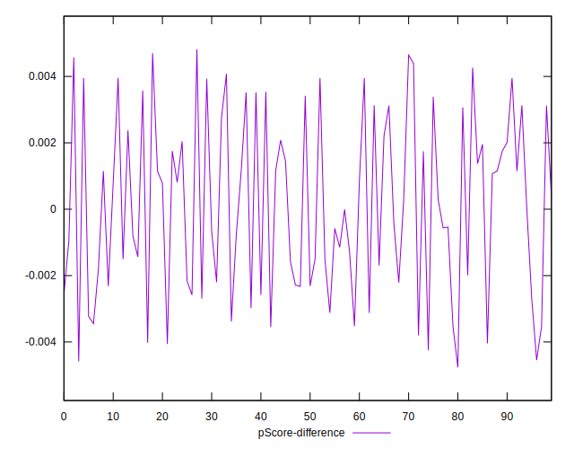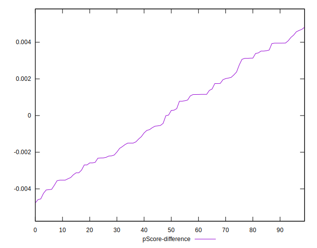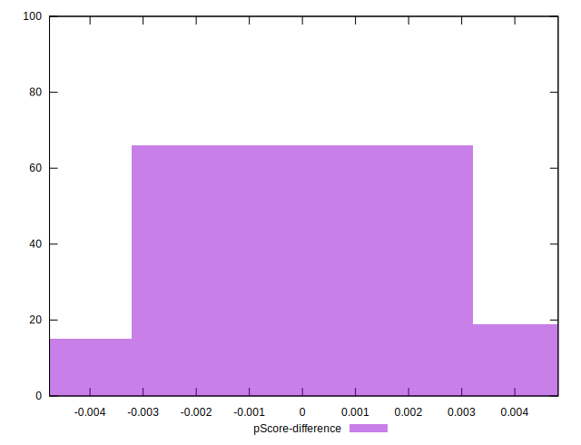