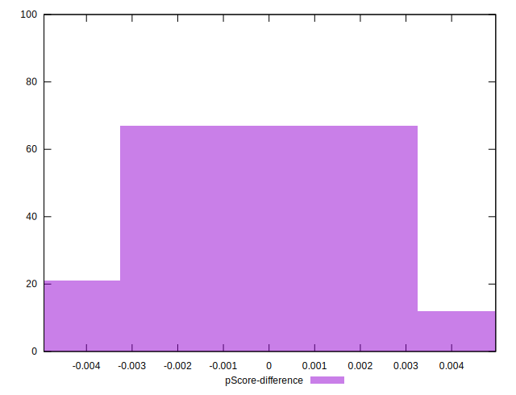

# //max-potential-fid/samples/pages

[→ Parent](../..)


## Raw


```yaml
p90min: 334
p90max: 672.9999999999982
p90range: 338.9999999999982
p90mean: 470.2340425531915
p90median: 457.5
p90stdev: 83.6436750329603
p90skewness: 0.457096297081842
p90eccentricity: 0.9999999999999999
p90discretization: 1.0930232558139534
outlandishness: 1.0203733000547985
confidence: 39.41448100538673
p90confidence: 33.817949085142104

```


## Score


```yaml
p90min: 0.03
p90max: 0.29
p90range: 0.26
p90mean: 0.12712765957446814
p90median: 0.12
p90stdev: 0.06645462922615877
p90skewness: 0.5317865112260992
p90eccentricity: 1.0000000000000007
p90discretization: 3.6153846153846154
outlandishness: 1.0312699928922808
confidence: 0.028933715649613712
p90confidence: 0.026868251146983296

```


## Raw Estimate


## Score Estimate


## P Score


```yaml
p90min: 0.02614490879820336
p90max: 0.28511624788332807
p90range: 0.2589713390851247
p90mean: 0.1268152531767856
p90median: 0.1181428653352273
p90stdev: 0.06701379378177474
p90skewness: 0.5225516545672115
p90eccentricity: 1
p90discretization: 1.0930232558139534
outlandishness: 1.0314590047881986
confidence: 0.029211841877270415
p90confidence: 0.027094326800218112

```


## Score Difference


```yaml
p90min: 0
p90max: 0
p90range: 0
p90mean: 0
p90median: 0
p90stdev: 0
p90skewness: .nan
p90eccentricity: .nan
p90discretization: 94
outlandishness: .nan
confidence: 0
p90confidence: 0

```


## P Score Difference


```yaml
p90min: -0.004843381874879982
p90max: 0.0044784697509384075
p90range: 0.00932185162581839
p90mean: -0.00032166558644160703
p90median: 0.0001537643963179236
p90stdev: 0.002650079653206573
p90skewness: -0.0712648358010413
p90eccentricity: 1.0000000000000007
p90discretization: 1.1058823529411765
outlandishness: 0.9017311563978286
confidence: 0.0011105573354119492
p90confidence: 0.0010714529072090092

```

