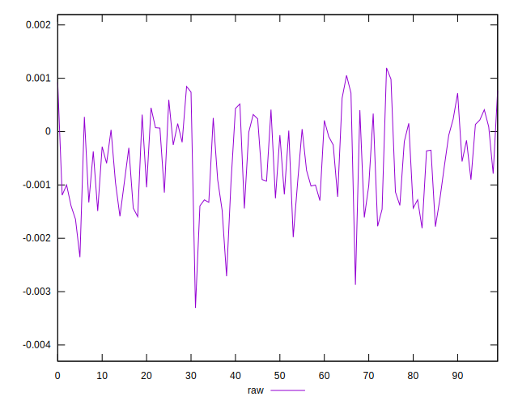
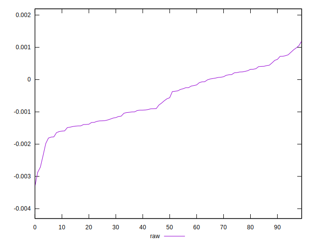
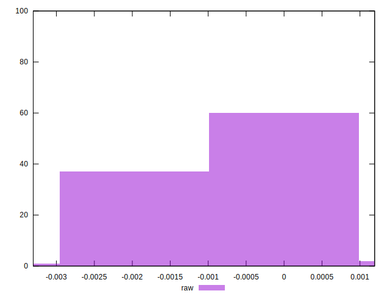

# //meta/pScore-difference/samples/pages+cached+noadtech+nomedia+nocss

[→ Parent](../..)


## Raw


```yaml
p90min: -0.002353867710176127
p90max: 0.0009229280533228745
p90range: 0.0032767957634990017
p90mean: -0.000542028098823248
p90median: -0.000577694010760698
p90stdev: 0.0008010782572952079
p90skewness: -0.009680297897778517
p90eccentricity: 0.9999999999999999
p90discretization: 1
outlandishness: 1.0907584802036725
confidence: 0.00036335383223597514
p90confidence: 0.0003238837091716547

```

