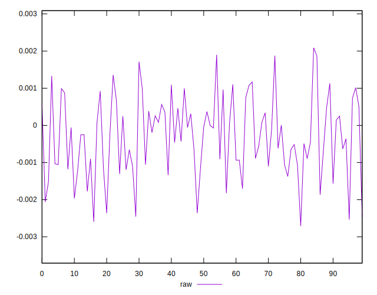
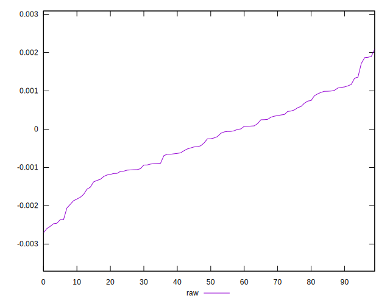
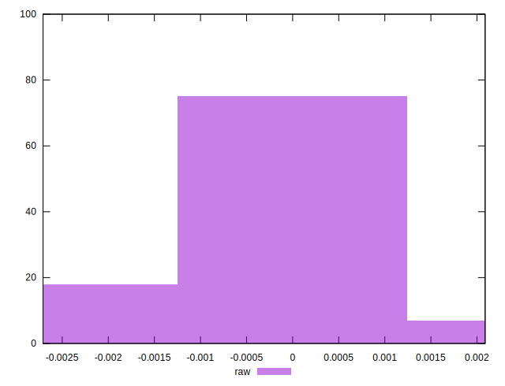

# //meta/pScore-difference/samples/pages+cached+noadtech+nomedia

[→ Parent](../..)


## Raw


```yaml
p90min: -0.0024692246709094776
p90max: 0.0018680092140876375
p90range: 0.004337233884997115
p90mean: -0.00030763416553191954
p90median: -0.00025108180836293703
p90stdev: 0.0010129176492151147
p90skewness: -0.10914610234345504
p90eccentricity: 1.0000000000000002
p90discretization: 1
outlandishness: 1.0086145326523237
confidence: 0.0004431635146309228
p90confidence: 0.0004095324299787195

```

