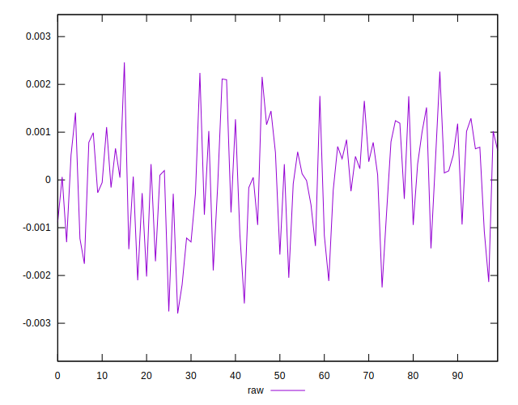
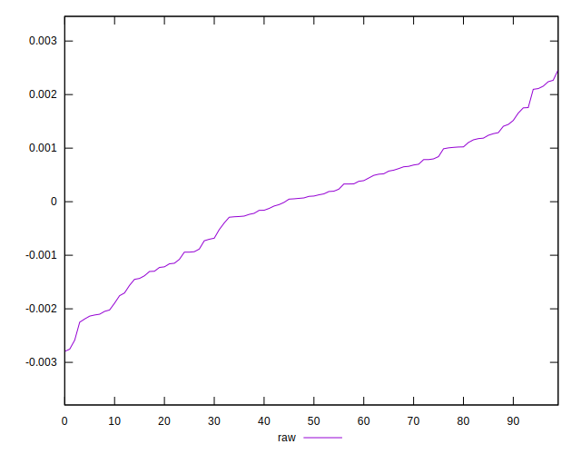
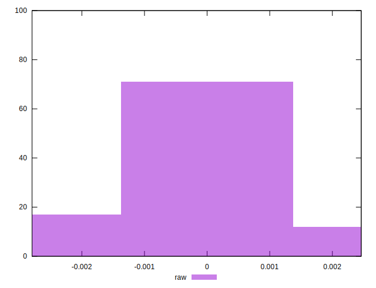

# //meta/pScore-difference/samples/pages+cached+noadtech

[→ Parent](../..)


## Raw


```yaml
p90min: -0.002249946197186915
p90max: 0.002156770329969484
p90range: 0.004406716527156399
p90mean: -0.000013219132317322069
p90median: 0.00010261409444219608
p90stdev: 0.0011155913223957843
p90skewness: -0.2581574166008026
p90eccentricity: 0.9999999999999997
p90discretization: 1
outlandishness: 3.3207684151558534
confidence: 0.000488390059024397
p90confidence: 0.0004510443918890511

```

