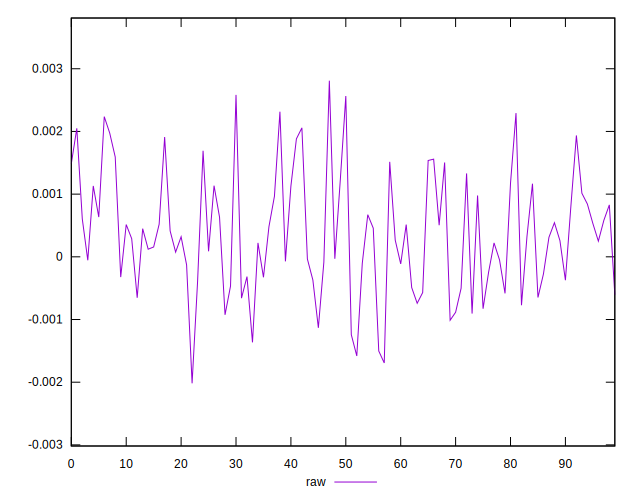
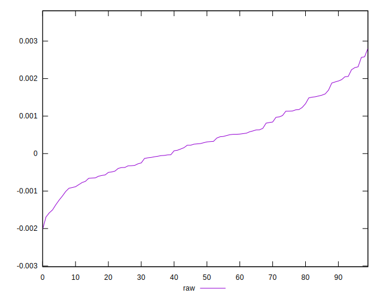
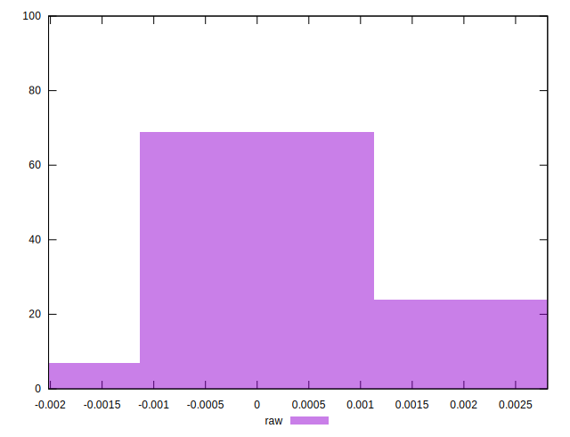

# //meta/pScore-difference/samples/pages+cached

[→ Parent](../..)


## Raw


```yaml
p90min: -0.001502327072333643
p90max: 0.002314580259973006
p90range: 0.003816907332306649
p90mean: 0.00036642307152669017
p90median: 0.00030028563050405
p90stdev: 0.0009191643482314689
p90skewness: 0.25967129502486763
p90eccentricity: 0.9999999999999989
p90discretization: 1
outlandishness: 1.0256056803238198
confidence: 0.00040897368543518504
p90confidence: 0.0003716270610673276

```

