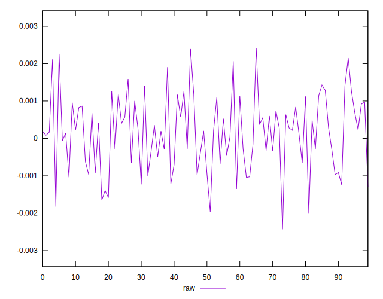
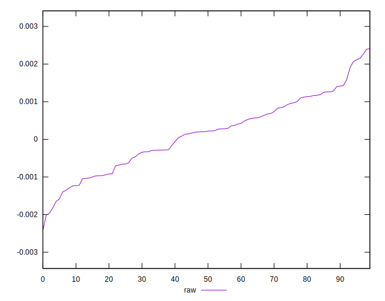
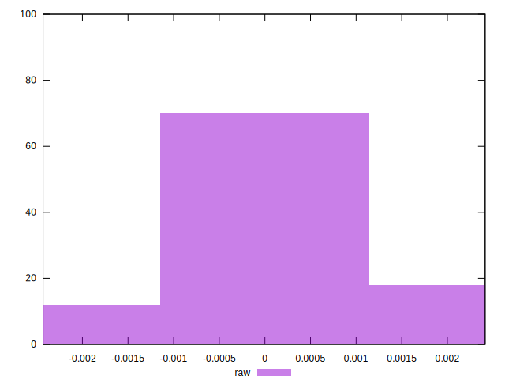

# //meta/pScore-difference/samples/pages

[→ Parent](../..)


## Raw


```yaml
p90min: -0.0018246926577658894
p90max: 0.002151196803153304
p90range: 0.003975889460919193
p90mean: 0.0001498454030220584
p90median: 0.0002104673797484177
p90stdev: 0.0009320425692697266
p90skewness: -0.01993864368350193
p90eccentricity: 0.9999999999999999
p90discretization: 1
outlandishness: 0.9687336190693154
confidence: 0.00041498656558486106
p90confidence: 0.00037683385074039477

```

