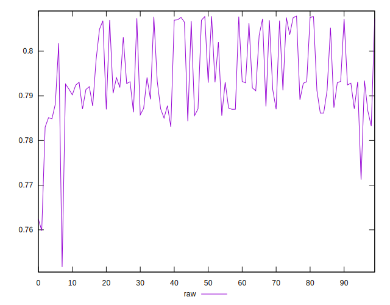
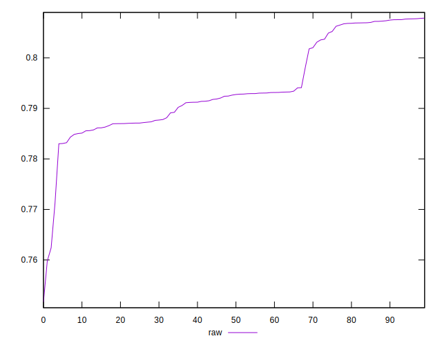
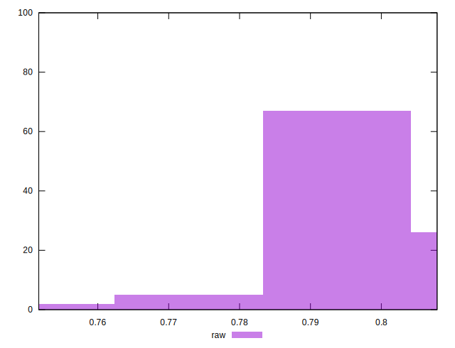

# //meta/pScore/samples/pages+cached+noadtech+nomedia+nocss

[→ Parent](../..)


## Raw


```yaml
p90min: 0.7712182606640141
p90max: 0.8077229713499533
p90range: 0.03650471068593919
p90mean: 0.7943834987109766
p90median: 0.7926900816718763
p90stdev: 0.008488626511227006
p90skewness: 0.328767958458731
p90eccentricity: 1
p90discretization: 1
outlandishness: 0.9982645908270259
confidence: 0.004168439846309944
p90confidence: 0.003432034030622656

```

