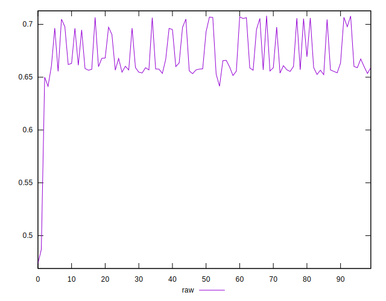
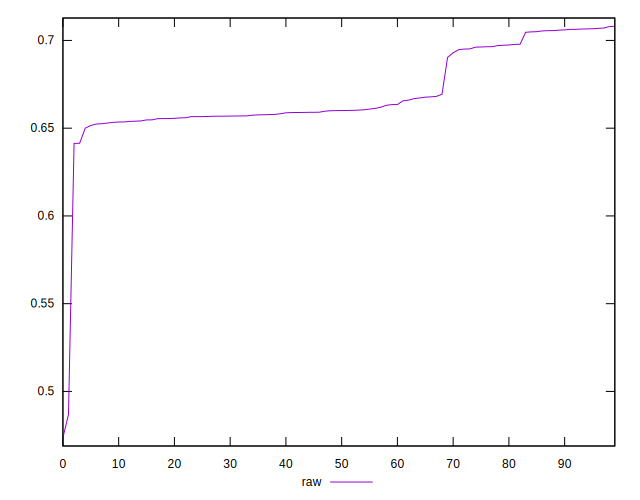
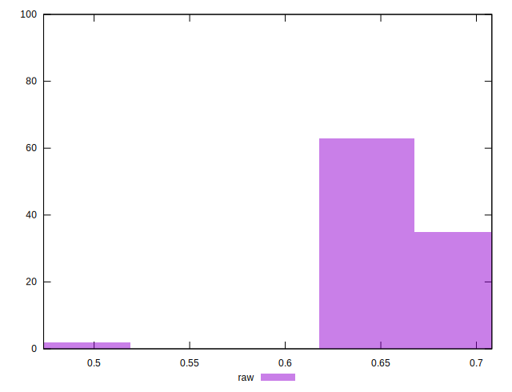

# //meta/pScore/samples/pages+cached+noadtech+nomedia

[→ Parent](../..)


## Raw


```yaml
p90min: 0.6413996586708572
p90max: 0.7068715258338498
p90range: 0.06547186716299258
p90mean: 0.6709225362221802
p90median: 0.6600262286039702
p90stdev: 0.020090944417722464
p90skewness: 0.8194496658647867
p90eccentricity: 0.9999999999999994
p90discretization: 1
outlandishness: 0.9910578160634396
confidence: 0.013278934731265245
p90confidence: 0.008122963692391839

```

