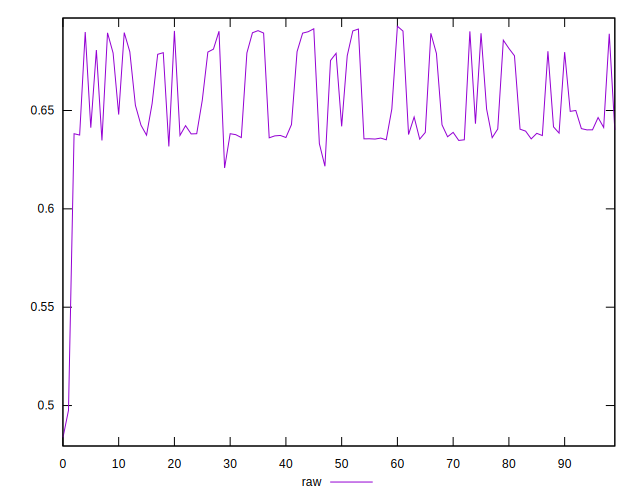
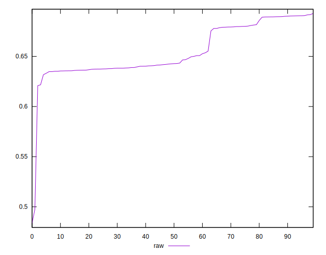
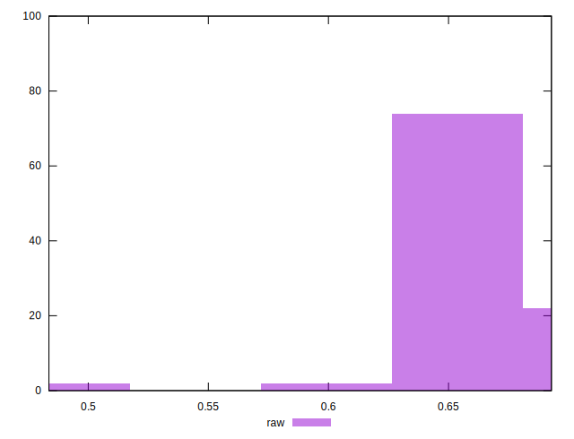

# //meta/pScore/samples/pages+cached+noadtech

[→ Parent](../..)


## Raw


```yaml
p90min: 0.6216554455800328
p90max: 0.6906054955362159
p90range: 0.06895004995618303
p90mean: 0.6560139546525738
p90median: 0.6426412727234028
p90stdev: 0.022134235873943316
p90skewness: 0.5105456854931577
p90eccentricity: 1.0000000000000002
p90discretization: 1
outlandishness: 0.9921405376175064
confidence: 0.012721833019810131
p90confidence: 0.008949086246253245

```

