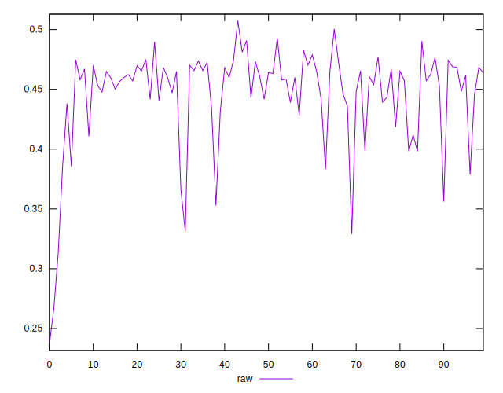
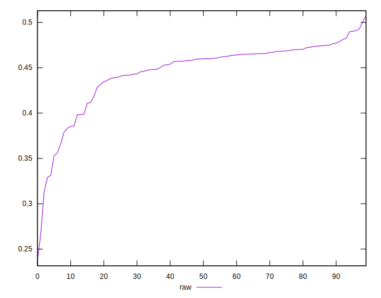
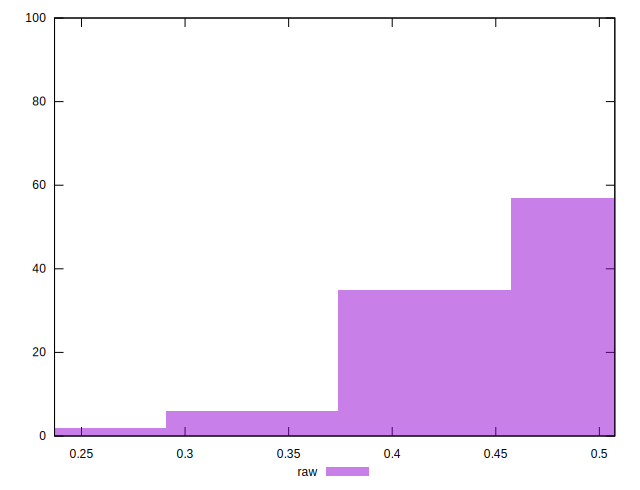

# //meta/pScore/samples/pages+cached

[→ Parent](../..)


## Raw


```yaml
p90min: 0.32898804860146796
p90max: 0.490867092171256
p90range: 0.16187904356978805
p90mean: 0.4478409476132134
p90median: 0.45975660040400435
p90stdev: 0.033779084170550214
p90skewness: -1.7412682389359202
p90eccentricity: 1.0000000000000002
p90discretization: 1
outlandishness: 0.9835672868882389
confidence: 0.017952068602096832
p90confidence: 0.01365721135725147

```

