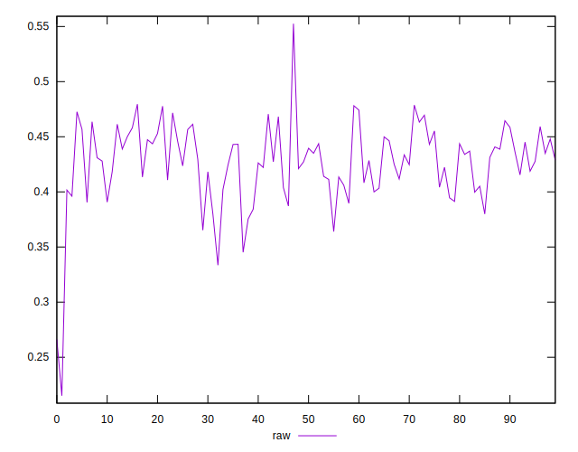
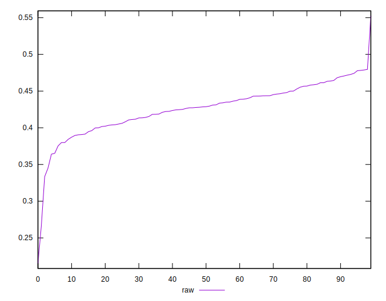
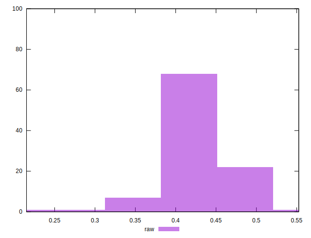

# //meta/pScore/samples/pages

[→ Parent](../..)


## Raw


```yaml
p90min: 0.3452098998889046
p90max: 0.47814808363882777
p90range: 0.13293818374992317
p90mean: 0.42785777683942616
p90median: 0.42858359189122197
p90stdev: 0.028213767730646787
p90skewness: -0.3912266794327757
p90eccentricity: 1.0000000000000002
p90discretization: 1
outlandishness: 0.9887417012478913
confidence: 0.01641521171412304
p90confidence: 0.011407099941974775

```

