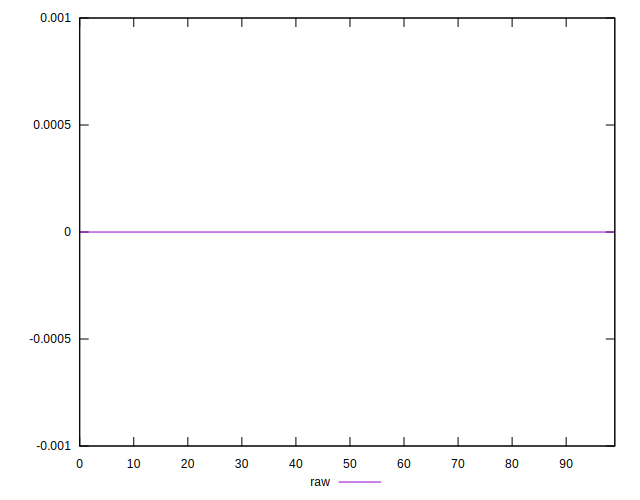

# //meta/score-difference/samples/pages+cached+noadtech+nomedia+nocss

[→ Parent](../..)


## Raw


```yaml
p90min: 0
p90max: 1.3877787807814457e-17
p90range: 1.3877787807814457e-17
p90mean: 1.4763604050866443e-19
p90median: 0
p90stdev: 1.4237504144013688e-18
p90skewness: 9.539955591519908
p90eccentricity: 0.9999999999999996
p90discretization: 47
outlandishness: 15.586704000000003
confidence: 1.1232761977472693e-18
p90confidence: 5.756361016562498e-19

```

