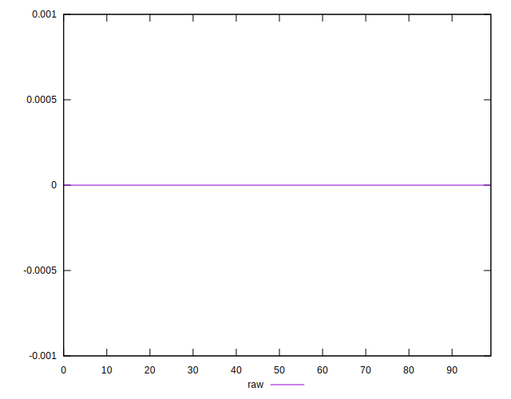

# //meta/score-difference/samples/pages+cached+noadtech+nomedia

[→ Parent](../..)


## Raw


```yaml
p90min: 0
p90max: 1.6653345369377347e-17
p90range: 1.6653345369377347e-17
p90mean: 3.89759146942874e-18
p90median: 0
p90stdev: 7.051008267373695e-18
p90skewness: 1.2562972690740122
p90eccentricity: 0.9999999999999983
p90discretization: 47
outlandishness: 1.1410123966942147
confidence: 2.8267032066946325e-18
p90confidence: 2.850791031013364e-18

```

