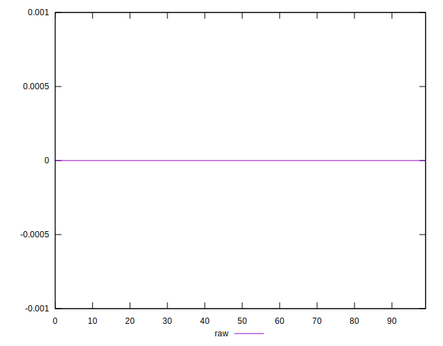
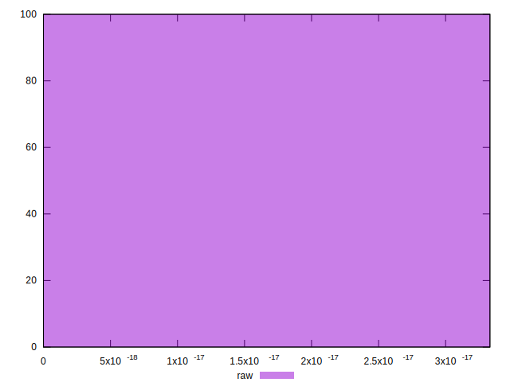

# //meta/score-difference/samples/pages+cached+noadtech

[→ Parent](../..)


## Raw


```yaml
p90min: 0
p90max: 1.6653345369377347e-17
p90range: 1.6653345369377347e-17
p90mean: 5.757805579837913e-18
p90median: 0
p90stdev: 7.873805281062566e-18
p90skewness: 0.6486281574457586
p90eccentricity: 0.9999999999999976
p90discretization: 31.333333333333332
outlandishness: 1.1144862485207105
confidence: 3.2592594845625862e-18
p90confidence: 3.1834558440476128e-18

```

