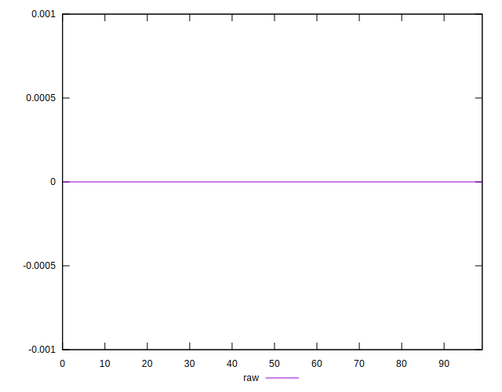
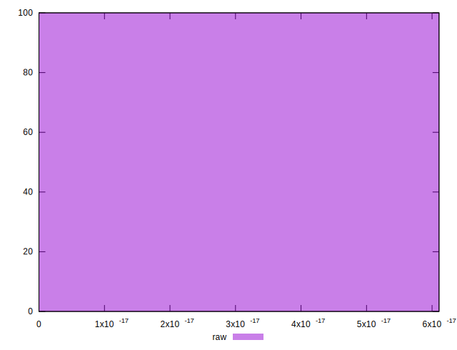

# //meta/score-difference/samples/pages+cached

[→ Parent](../..)


## Raw


```yaml
p90min: 0
p90max: 4.4408920985006264e-17
p90range: 4.4408920985006264e-17
p90mean: 1.898599480941427e-17
p90median: 1.6653345369377347e-17
p90stdev: 1.1200001265290504e-17
p90skewness: 1.0478886693344085
p90eccentricity: 1.0000000000000013
p90discretization: 13.428571428571429
outlandishness: 1.0561957397405715
confidence: 5.115803529056535e-18
p90confidence: 4.528269141616127e-18

```

