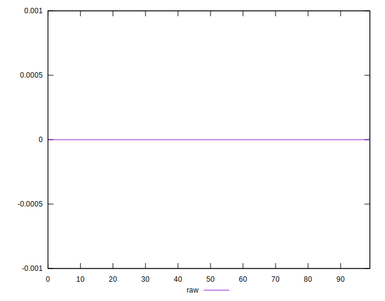

# //meta/score-difference/samples/pages

[→ Parent](../..)


## Raw


```yaml
p90min: 0
p90max: 3.608224830031759e-17
p90range: 3.608224830031759e-17
p90mean: 7.263693193026293e-18
p90median: 0
p90stdev: 1.085670110225573e-17
p90skewness: 1.0956462329946133
p90eccentricity: 1.000000000000001
p90discretization: 18.8
outlandishness: 1.262060440214158
confidence: 4.848178280679651e-18
p90confidence: 4.3894695559946666e-18

```

