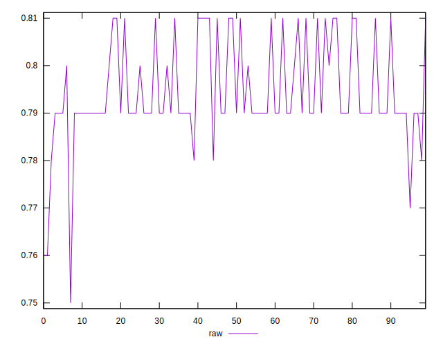
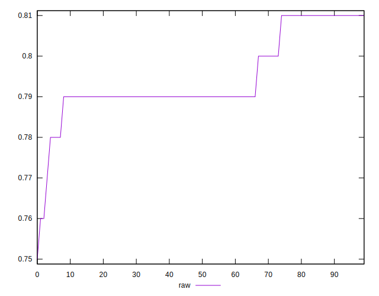
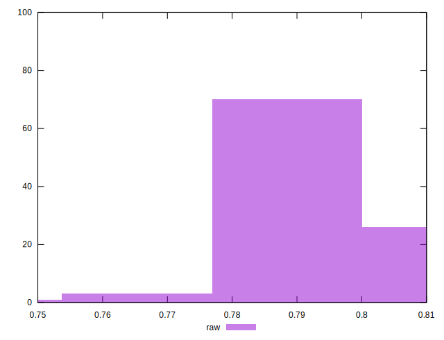

# //meta/score/samples/pages+cached+noadtech+nomedia+nocss

[→ Parent](../..)


## Raw


```yaml
p90min: 0.77
p90max: 0.81
p90range: 0.040000000000000036
p90mean: 0.7950000000000005
p90median: 0.79
p90stdev: 0.009424955556077842
p90skewness: 0.5336831659132354
p90eccentricity: 1.0000000000000016
p90discretization: 18.8
outlandishness: 0.9982397689964804
confidence: 0.00454627155357692
p90confidence: 0.003810600945015497

```

