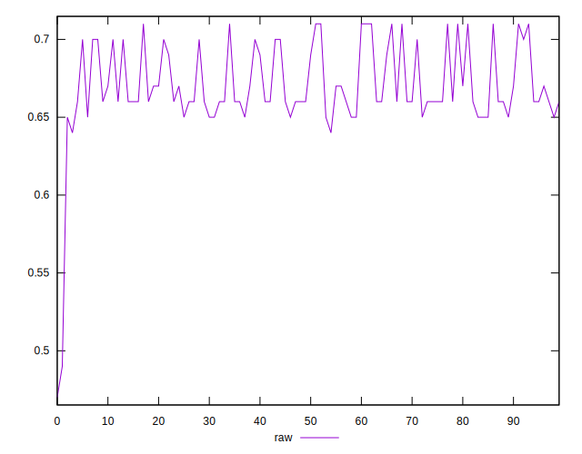

# //meta/score/samples/pages+cached+noadtech+nomedia

[→ Parent](../..)


## Raw


```yaml
p90min: 0.64
p90max: 0.71
p90range: 0.06999999999999995
p90mean: 0.6719148936170206
p90median: 0.66
p90stdev: 0.0212521135742227
p90skewness: 0.7596964451096656
p90eccentricity: 0.9999999999999982
p90discretization: 13.428571428571429
outlandishness: 0.9910460991235905
confidence: 0.01362303277401351
p90confidence: 0.008592435644673808

```

