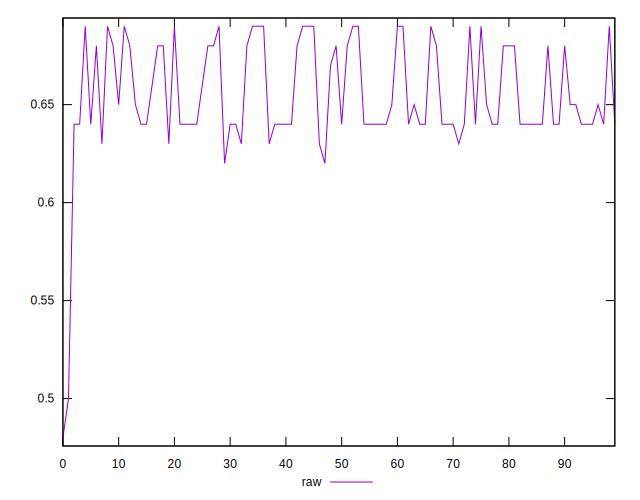
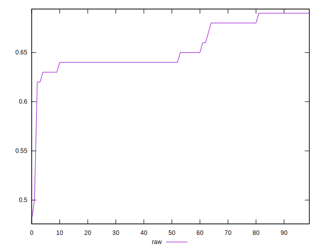
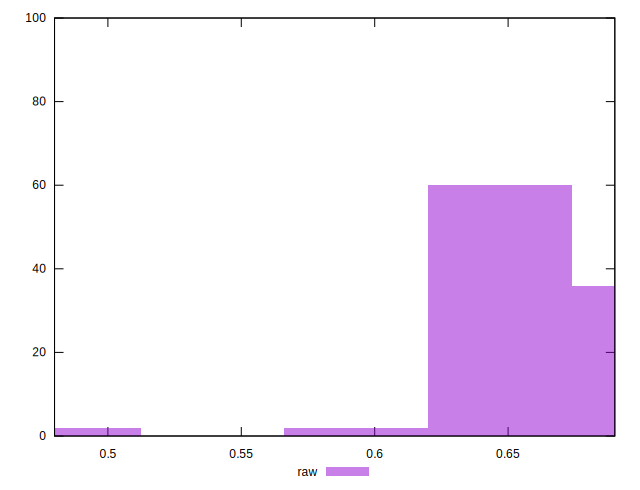

# //meta/score/samples/pages+cached+noadtech

[→ Parent](../..)


## Raw


```yaml
p90min: 0.62
p90max: 0.69
p90range: 0.06999999999999995
p90mean: 0.6564893617021278
p90median: 0.64
p90stdev: 0.021914118969989942
p90skewness: 0.475612948775295
p90eccentricity: 0.9999999999999996
p90discretization: 11.75
outlandishness: 0.9918236204119496
confidence: 0.01268725124241865
p90confidence: 0.008860090847046538

```

