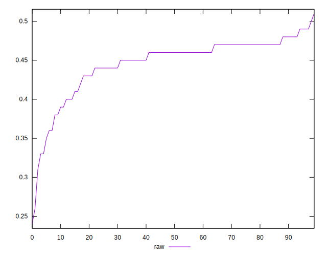

# //meta/score/samples/pages+cached

[→ Parent](../..)


## Raw


```yaml
p90min: 0.33
p90max: 0.49
p90range: 0.15999999999999998
p90mean: 0.447872340425532
p90median: 0.46
p90stdev: 0.033860550712036676
p90skewness: -1.7387355204136339
p90eccentricity: 1
p90discretization: 6.266666666666667
outlandishness: 0.9832253379071433
confidence: 0.018058023695508726
p90confidence: 0.013690149070127503

```

