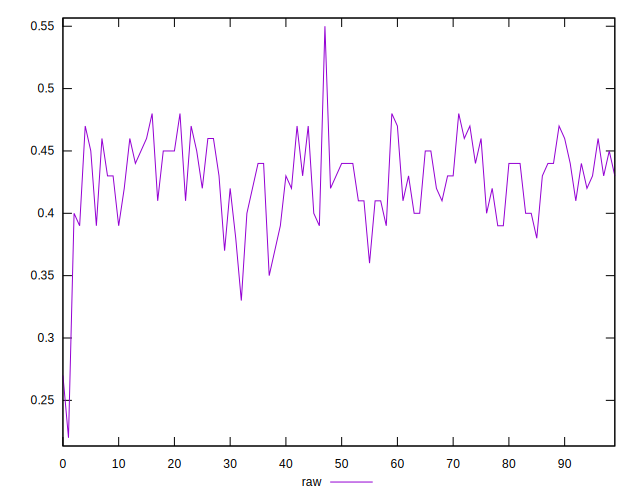
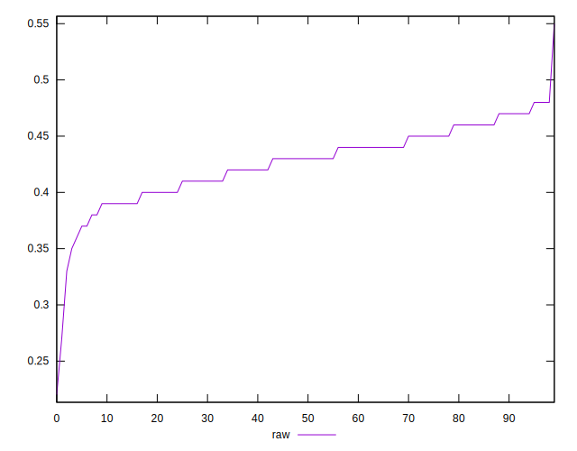
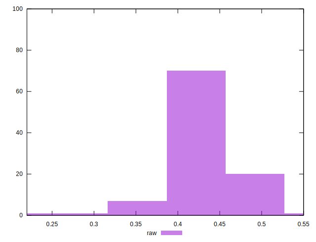

# //meta/score/samples/pages

[→ Parent](../..)


## Raw


```yaml
p90min: 0.35
p90max: 0.48
p90range: 0.13
p90mean: 0.4275531914893616
p90median: 0.43
p90stdev: 0.028571901470573893
p90skewness: -0.3440498046055916
p90eccentricity: 1
p90discretization: 6.714285714285714
outlandishness: 0.9890225790768297
confidence: 0.01635582605492691
p90confidence: 0.011551896886606319

```

