# //offscreen-images/samples/pages+cached+noadtech

[→ Parent](../..)


## Raw


```yaml
p90min: 150
p90max: 310
p90range: 160
p90mean: 282.1276595744681
p90median: 300
p90stdev: 50.92489965783642
p90skewness: -2.112655915579519
p90eccentricity: 0.9999999999999976
p90discretization: 18.8
outlandishness: 0.987790138977043
confidence: 22.367096625864306
p90confidence: 20.589430857934552

```

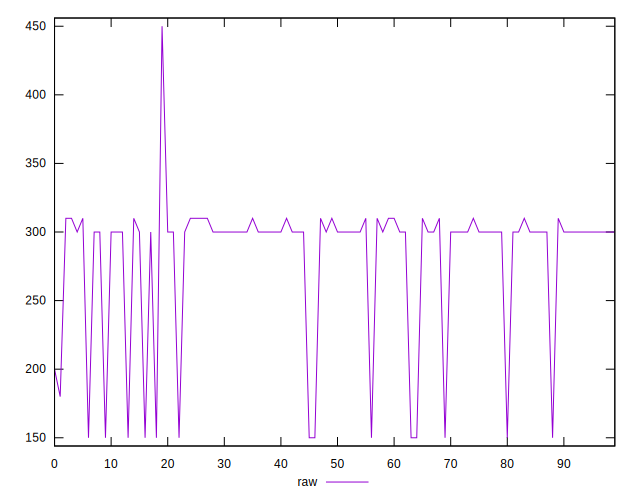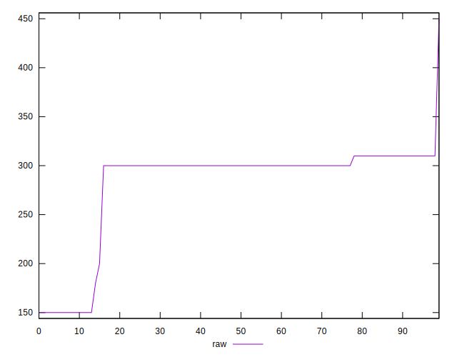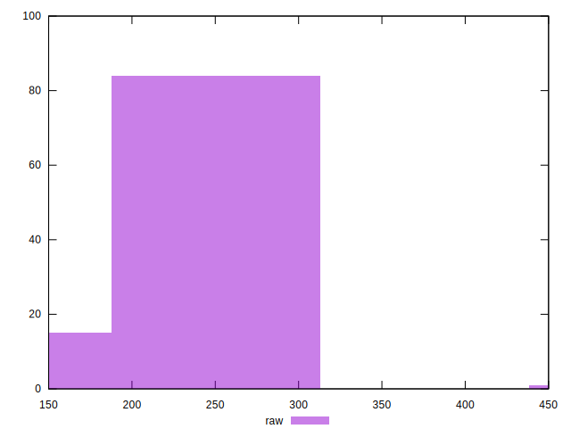
## Score


```yaml
p90min: 0.74
p90max: 0.88
p90range: 0.14
p90mean: 0.7651063829787237
p90median: 0.75
p90stdev: 0.044092375971726126
p90skewness: 2.116440232048802
p90eccentricity: 0.9999999999999989
p90discretization: 18.8
outlandishness: 1.0052181354715597
confidence: 0.01889140952110877
p90confidence: 0.01782697526223226

```

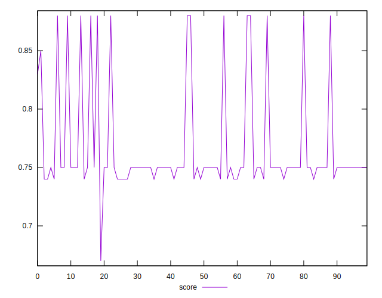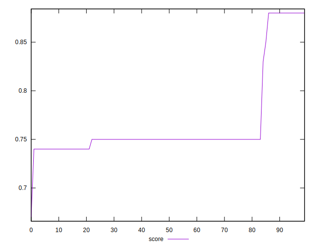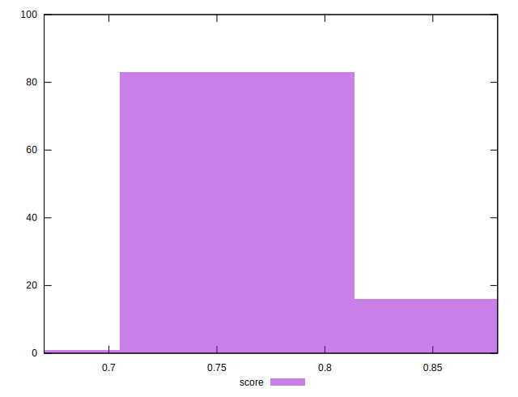
## Raw Estimate

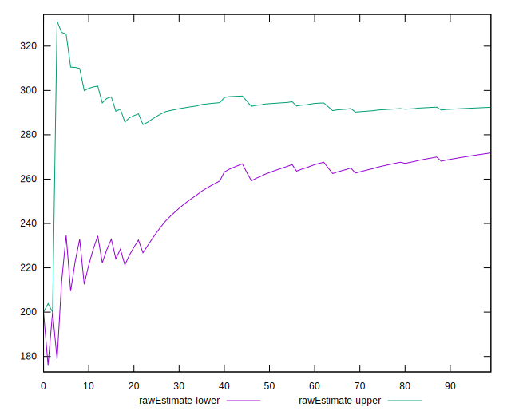
## Score Estimate

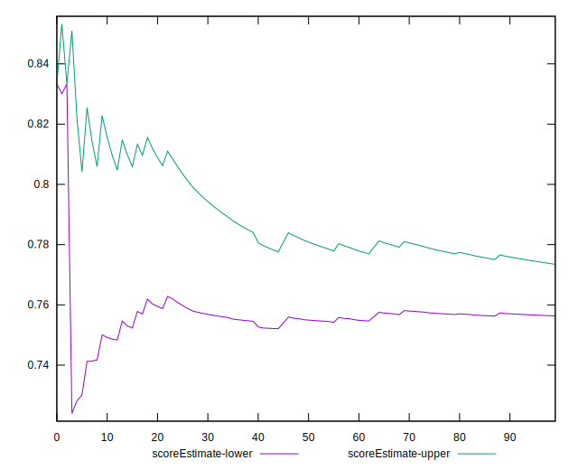
## P Score


```yaml
p90min: 0.7444444444444445
p90max: 0.875
p90range: 0.13055555555555554
p90mean: 0.765455082742317
p90median: 0.75
p90stdev: 0.04214375896297738
p90skewness: 2.1279032934854
p90eccentricity: 0.9999999999999979
p90discretization: 18.8
outlandishness: 1.0049135606536164
confidence: 0.018101520800888515
p90confidence: 0.017039130505741833

```

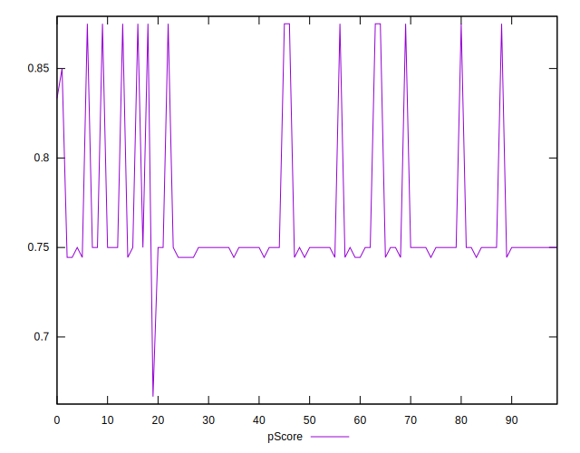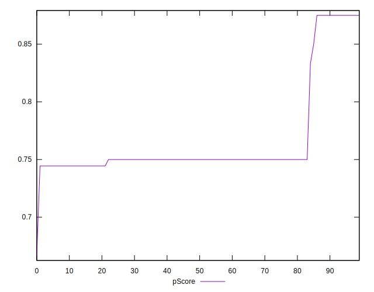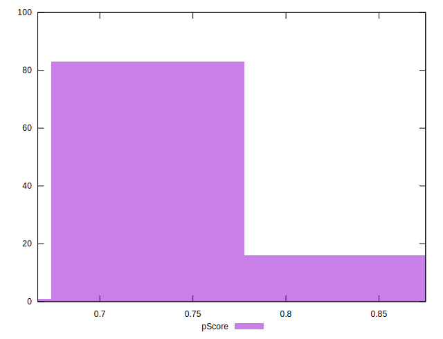
## Score Difference


```yaml
p90min: 0
p90max: 0
p90range: 0
p90mean: 0
p90median: 0
p90stdev: 0
p90skewness: .nan
p90eccentricity: .nan
p90discretization: 94
outlandishness: .inf
confidence: 4.330179641073934e-18
p90confidence: 0

```


## P Score Difference


```yaml
p90min: -0.0050000000000000044
p90max: 0.004444444444444473
p90range: 0.009444444444444478
p90mean: 0.00026595744680851444
p90median: 0
p90stdev: 0.002621776321681848
p90skewness: -0.18420825011842784
p90eccentricity: 0.9999999999999982
p90discretization: 18.8
outlandishness: 0.7697137777777839
confidence: 0.0010958933814936612
p90confidence: 0.0010600095957563993

```

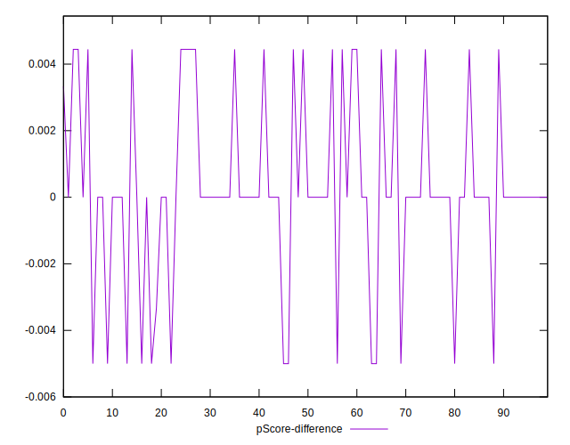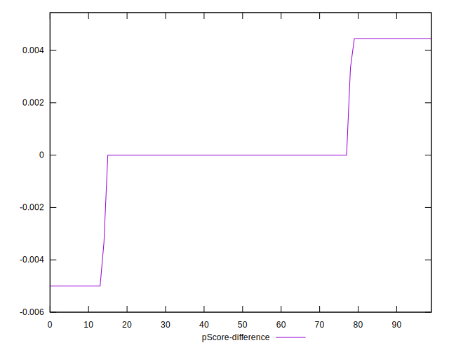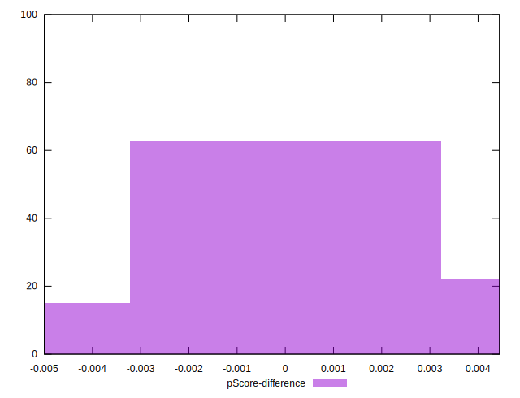