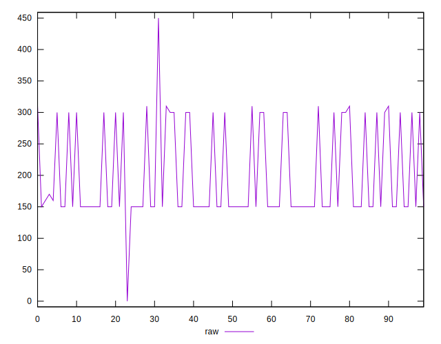
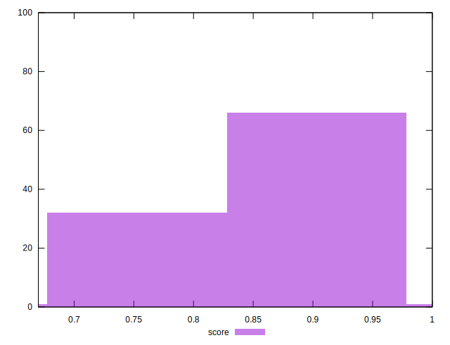
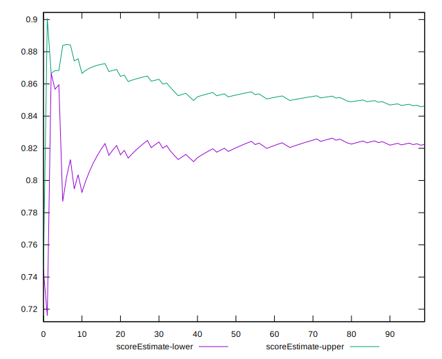

# //offscreen-images/samples/pages+cached

[→ Parent](../..)


## Raw


```yaml
p90min: 150
p90max: 310
p90range: 160
p90mean: 198.82978723404256
p90median: 150
p90stdev: 70.4824768169551
p90skewness: 0.7752040647986362
p90eccentricity: 0.9999999999999984
p90discretization: 18.8
outlandishness: 1.017885579737092
confidence: 30.332340821730817
p90confidence: 28.49674899448446

```


## Score


```yaml
p90min: 0.74
p90max: 0.88
p90range: 0.14
p90mean: 0.8375531914893619
p90median: 0.88
p90stdev: 0.061170952816984925
p90skewness: -0.7750345411914532
p90eccentricity: 1.0000000000000007
p90discretization: 18.8
outlandishness: 0.9972481805076261
confidence: 0.02566592108042769
p90confidence: 0.024732009527788583

```


## Raw Estimate


## Score Estimate


## P Score


```yaml
p90min: 0.7444444444444445
p90max: 0.875
p90range: 0.13055555555555554
p90mean: 0.8344562647754138
p90median: 0.875
p90stdev: 0.0585052054692933
p90skewness: -0.7735334656471446
p90eccentricity: 1.000000000000001
p90discretization: 18.8
outlandishness: 0.9975763693507993
confidence: 0.0246892080597503
p90confidence: 0.023654222019736555

```


## Score Difference


```yaml
p90min: 0
p90max: 0
p90range: 0
p90mean: 0
p90median: 0
p90stdev: 0
p90skewness: .nan
p90eccentricity: .nan
p90discretization: 94
outlandishness: .nan
confidence: 0
p90confidence: 0

```


## P Score Difference


```yaml
p90min: -0.0050000000000000044
p90max: 0.004444444444444473
p90range: 0.009444444444444478
p90mean: -0.003126477541371159
p90median: -0.0050000000000000044
p90stdev: 0.0027216360185078493
p90skewness: 1.1286950554104664
p90eccentricity: 1.000000000000001
p90discretization: 15.666666666666666
outlandishness: 0.8936503457320404
confidence: 0.001160094620609475
p90confidence: 0.0011003838397334687

```

