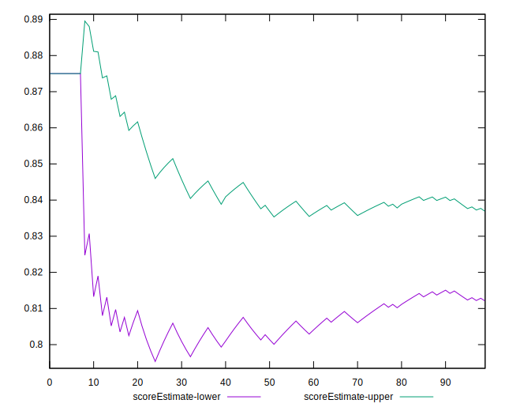

# //offscreen-images/samples/pages

[→ Parent](../..)


## Raw


```yaml
p90min: 150
p90max: 300
p90range: 150
p90mean: 210.63829787234042
p90median: 150
p90stdev: 73.6121016681115
p90skewness: 0.3901994862858542
p90eccentricity: 1.0000000000000002
p90discretization: 47
outlandishness: 0.9939485766758496
confidence: 29.98168380932642
p90confidence: 29.76208667638685

```


## Score


```yaml
p90min: 0.75
p90max: 0.88
p90range: 0.13
p90mean: 0.8274468085106383
p90median: 0.88
p90stdev: 0.06379715477902993
p90skewness: -0.3901994862858566
p90eccentricity: 1.0000000000000009
p90discretization: 47
outlandishness: 1.0010956972481606
confidence: 0.025879214826798124
p90confidence: 0.025793808452868588

```


## Raw Estimate


## Score Estimate


## P Score


```yaml
p90min: 0.75
p90max: 0.875
p90range: 0.125
p90mean: 0.824468085106383
p90median: 0.875
p90stdev: 0.06134341805675953
p90skewness: -0.3901994862858566
p90eccentricity: 1.000000000000002
p90discretization: 47
outlandishness: 1.0012907388137353
confidence: 0.024984736507772012
p90confidence: 0.024801738896989015

```


## Score Difference


```yaml
p90min: 0
p90max: 0
p90range: 0
p90mean: 0
p90median: 0
p90stdev: 0
p90skewness: .nan
p90eccentricity: .nan
p90discretization: 94
outlandishness: .nan
confidence: 0
p90confidence: 0

```


## P Score Difference


```yaml
p90min: -0.0050000000000000044
p90max: 0
p90range: 0.0050000000000000044
p90mean: -0.0029255319148936195
p90median: -0.0050000000000000044
p90stdev: 0.0024635183355126433
p90skewness: 0.34546681367002374
p90eccentricity: 0.9999999999999989
p90discretization: 47
outlandishness: 0.9826216198347109
confidence: 0.0009673568983167963
p90confidence: 0.000996024356986363

```

