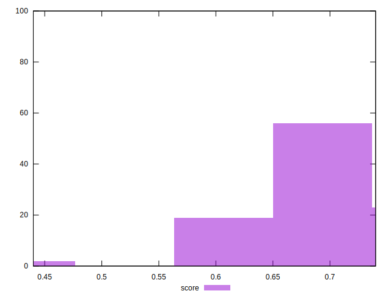

# //render-blocking-resources/samples/pages+cached+noadtech+nomedia

[→ Parent](../..)


## Raw


```yaml
p90min: 320
p90max: 511
p90range: 191
p90mean: 369.531914893617
p90median: 338.5
p90stdev: 63.05008177018331
p90skewness: 1.2345251565951803
p90eccentricity: 0.9999999999999996
p90discretization: 1.7407407407407407
outlandishness: 1.0904936567563726
confidence: 51.59810268561033
p90confidence: 25.491759589447614

```


## Score


```yaml
p90min: 0.63
p90max: 0.74
p90range: 0.10999999999999999
p90mean: 0.7120212765957443
p90median: 0.73
p90stdev: 0.03523718379460194
p90skewness: -1.2224259120637684
p90eccentricity: 0.9999999999999996
p90discretization: 10.444444444444445
outlandishness: 0.9853877043678356
confidence: 0.020009917277801943
p90confidence: 0.014246735177526169

```


## Raw Estimate


## Score Estimate


## P Score


```yaml
p90min: 0.6327777777777778
p90max: 0.7388888888888889
p90range: 0.10611111111111116
p90mean: 0.711371158392435
p90median: 0.7286111111111111
p90stdev: 0.035027823205657393
p90skewness: -1.2345251565951925
p90eccentricity: 0.9999999999999992
p90discretization: 1.7407407407407407
outlandishness: 0.9853138061355253
confidence: 0.020007983514022887
p90confidence: 0.014162088660804229

```


## Score Difference


```yaml
p90min: 0
p90max: 0
p90range: 0
p90mean: 0
p90median: 0
p90stdev: 0
p90skewness: .nan
p90eccentricity: .nan
p90discretization: 94
outlandishness: .inf
confidence: 6.092792000602807e-18
p90confidence: 0

```


## P Score Difference


```yaml
p90min: -0.0050000000000000044
p90max: 0.004444444444444473
p90range: 0.009444444444444478
p90mean: -0.0006969823390348979
p90median: -0.0011111111111110628
p90stdev: 0.0027468868708967562
p90skewness: 0.42645192888833333
p90eccentricity: 0.9999999999999991
p90discretization: 3.2413793103448274
outlandishness: 0.9291275192092835
confidence: 0.0011388411846683997
p90confidence: 0.0011105930042651323

```

