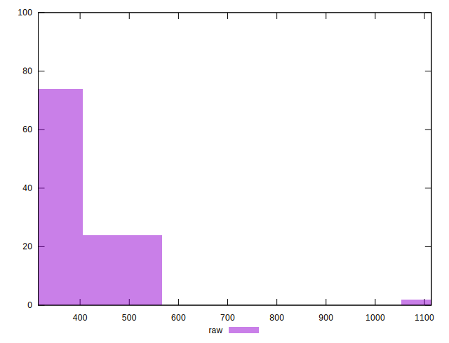

# //render-blocking-resources/samples/pages+cached+noadtech

[→ Parent](../..)


## Raw


```yaml
p90min: 318
p90max: 528
p90range: 210
p90mean: 371.79787234042556
p90median: 338.5
p90stdev: 65.83467038924323
p90skewness: 1.1414275821045705
p90eccentricity: 0.9999999999999997
p90discretization: 1.709090909090909
outlandishness: 1.079979410897024
confidence: 47.88996326166321
p90confidence: 26.617595776168564

```


## Score


```yaml
p90min: 0.62
p90max: 0.74
p90range: 0.12
p90mean: 0.7108510638297869
p90median: 0.73
p90stdev: 0.036660012839897595
p90skewness: -1.1250780963334184
p90eccentricity: 1.0000000000000004
p90discretization: 9.4
outlandishness: 0.9858391763833932
confidence: 0.020004541178705353
p90confidence: 0.014821998760716517

```


## Raw Estimate


## Score Estimate


## P Score


```yaml
p90min: 0.6233333333333333
p90max: 0.74
p90range: 0.1166666666666667
p90mean: 0.7101122931442081
p90median: 0.7286111111111111
p90stdev: 0.036574816882912906
p90skewness: -1.1414275821045585
p90eccentricity: 0.9999999999999994
p90discretization: 1.709090909090909
outlandishness: 0.9859405957302917
confidence: 0.02003623810003385
p90confidence: 0.014787553208982535

```


## Score Difference


```yaml
p90min: 0
p90max: 0
p90range: 0
p90mean: 0
p90median: 0
p90stdev: 0
p90skewness: .nan
p90eccentricity: .nan
p90discretization: 94
outlandishness: .nan
confidence: 0
p90confidence: 0

```


## P Score Difference


```yaml
p90min: -0.0050000000000000044
p90max: 0.004444444444444473
p90range: 0.009444444444444478
p90mean: -0.0007240300375469261
p90median: -0.0005555555555555314
p90stdev: 0.002437391366112102
p90skewness: 0.13552967243395414
p90eccentricity: 0.9999999999999999
p90discretization: 3.6153846153846154
outlandishness: 0.9274061775549648
confidence: 0.0010321862292486633
p90confidence: 0.0009854609698493394

```

