# //render-blocking-resources/samples/pages+cached

[→ Parent](../..)


## Raw


```yaml
p90min: 1172
p90max: 1316
p90range: 144
p90mean: 1215.276595744681
p90median: 1212
p90stdev: 23.197305536542945
p90skewness: 1.4371985645612897
p90eccentricity: 1.0000000000000013
p90discretization: 1.9183673469387754
outlandishness: 1.0220800067487845
confidence: 39.98260350306561
p90confidence: 9.378895621673285

```

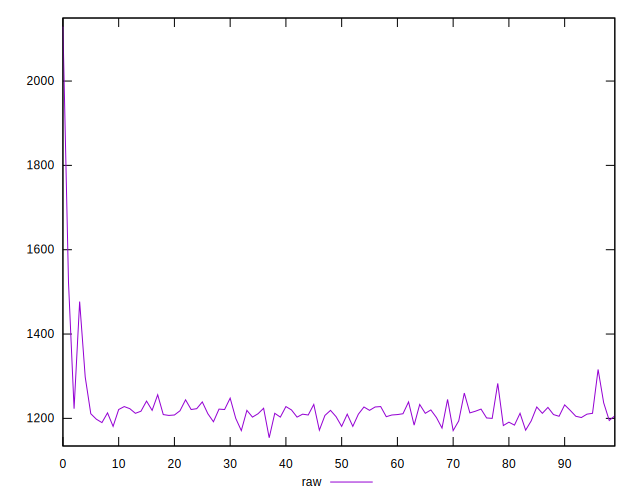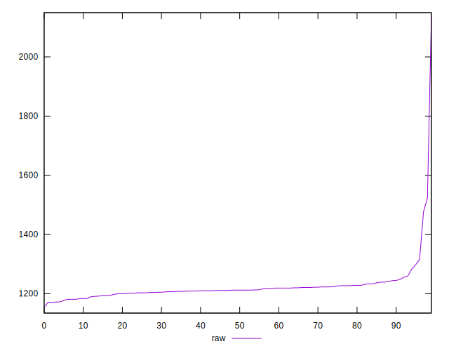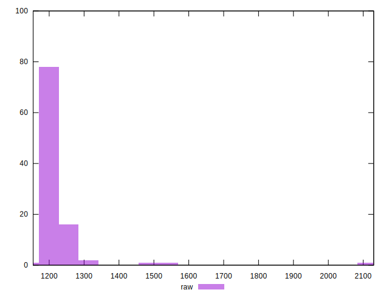
## Score


```yaml
p90min: 0.43
p90max: 0.45
p90range: 0.020000000000000018
p90mean: 0.44574468085106406
p90median: 0.45
p90stdev: 0.005154911250887543
p90skewness: -0.533473599784806
p90eccentricity: 1.000000000000001
p90discretization: 31.333333333333332
outlandishness: 0.992634139222265
confidence: 0.00496130341135066
p90confidence: 0.002084180616791956

```

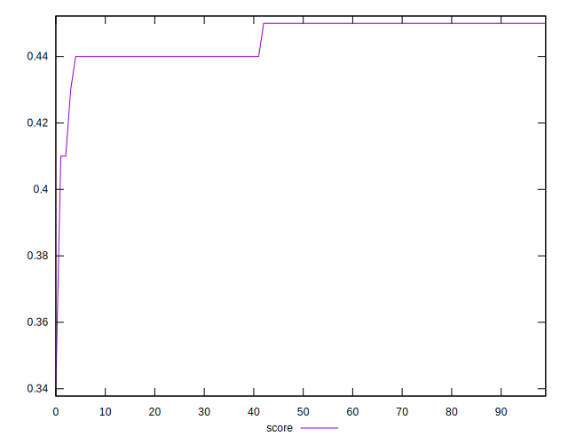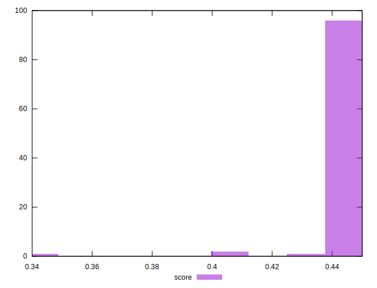
## Raw Estimate

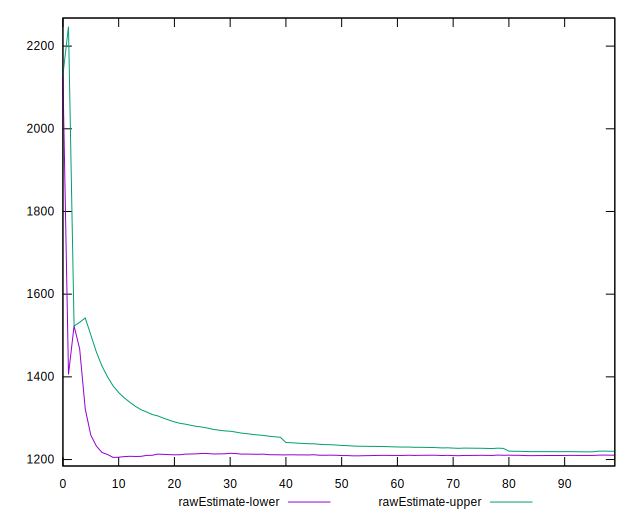
## Score Estimate

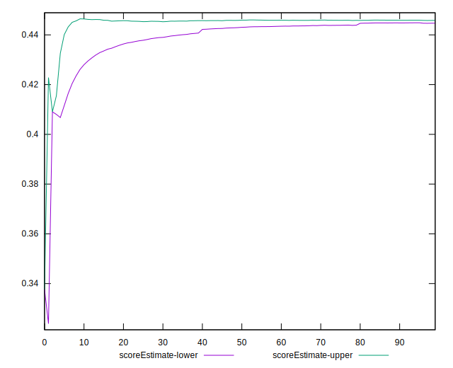
## P Score


```yaml
p90min: 0.4334117647058824
p90max: 0.45035294117647057
p90range: 0.016941176470588182
p90mean: 0.44526157697121393
p90median: 0.4456470588235294
p90stdev: 0.0027290947690050524
p90skewness: -1.4371985645611365
p90eccentricity: 0.9999999999999999
p90discretization: 1.9183673469387754
outlandishness: 0.9929612385853365
confidence: 0.004703835706243013
p90confidence: 0.0011033994849027394

```

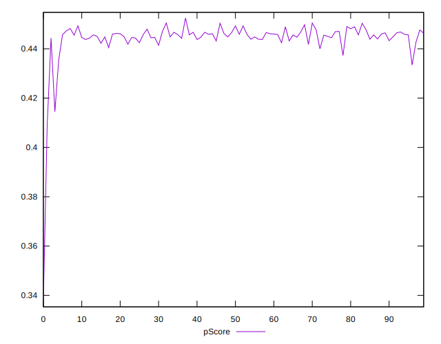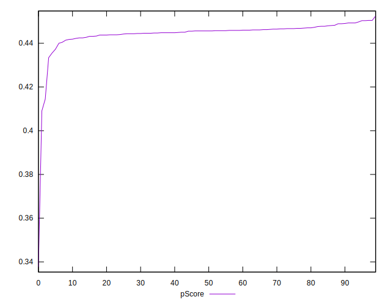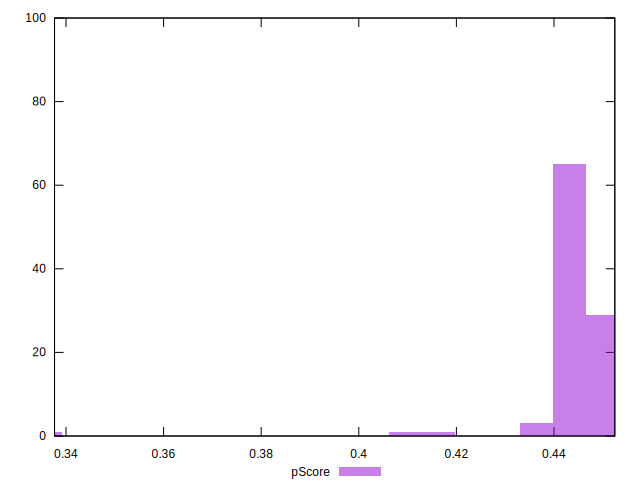
## Score Difference


```yaml
p90min: 0
p90max: 0
p90range: 0
p90mean: 0
p90median: 0
p90stdev: 0
p90skewness: .nan
p90eccentricity: .nan
p90discretization: 94
outlandishness: .inf
confidence: 3.046396000301406e-18
p90confidence: 0

```

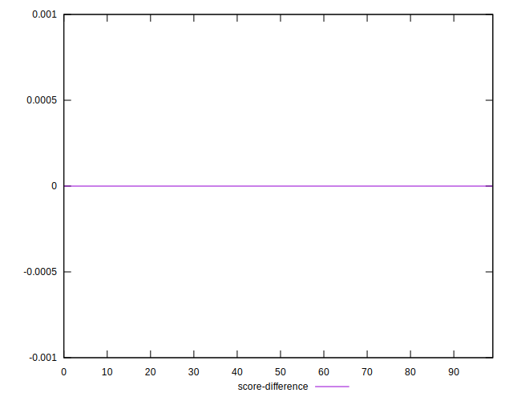
## P Score Difference


```yaml
p90min: -0.004470588235294115
p90max: 0.0048235294117647265
p90range: 0.009294117647058842
p90mean: -0.0004367959949937498
p90median: -0.0010588235294117787
p90stdev: 0.0034025434203378375
p90skewness: 0.318676708084064
p90eccentricity: 0.9999999999999997
p90discretization: 2
outlandishness: 0.8735017971937811
confidence: 0.0013743805194697141
p90confidence: 0.001375681306490029

```

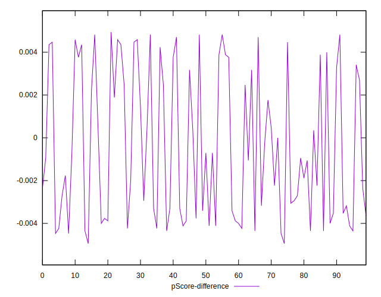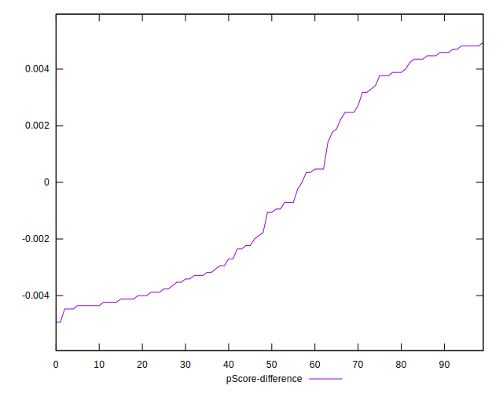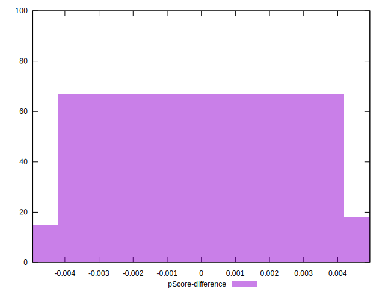