# //render-blocking-resources/samples/pages

[→ Parent](../..)


## Raw


```yaml
p90min: 1345
p90max: 1573
p90range: 228
p90mean: 1458.436170212766
p90median: 1495
p90stdev: 72.50408037096334
p90skewness: -0.18788714161831144
p90eccentricity: 1
p90discretization: 1.4029850746268657
outlandishness: 1.0046182467650229
confidence: 35.473767119521426
p90confidence: 29.314102919127926

```

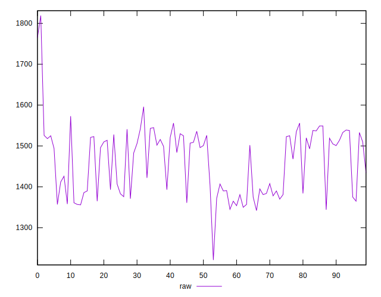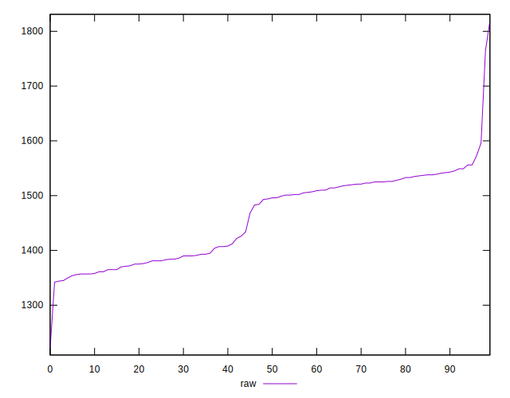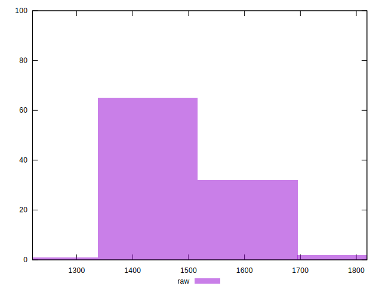
## Score


```yaml
p90min: 0.4
p90max: 0.43
p90range: 0.02999999999999997
p90mean: 0.4173404255319146
p90median: 0.41
p90stdev: 0.008893642471713571
p90skewness: 0.45506102743598886
p90eccentricity: 0.9999999999999994
p90discretization: 23.5
outlandishness: 0.9974118221338116
confidence: 0.004325441138231878
p90confidence: 0.0035957859117422657

```

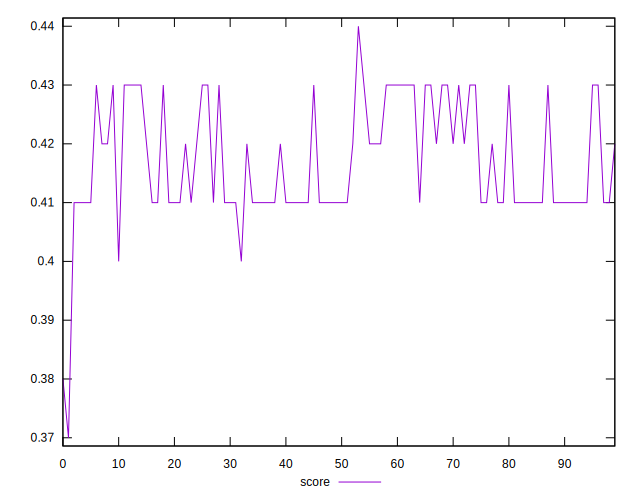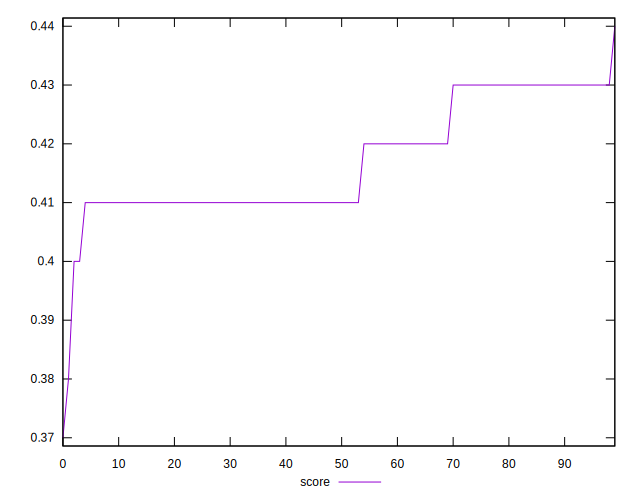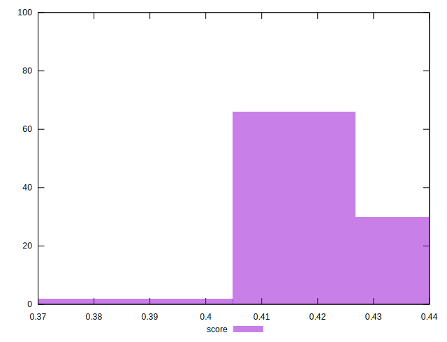
## Raw Estimate

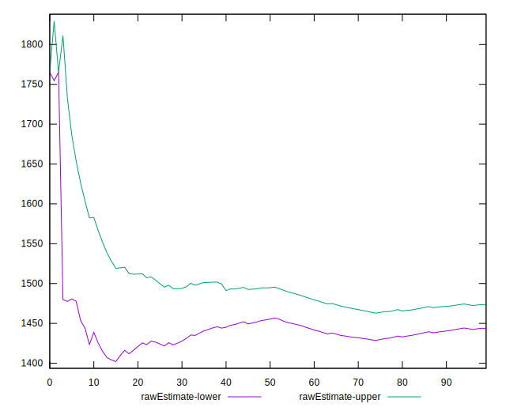
## Score Estimate

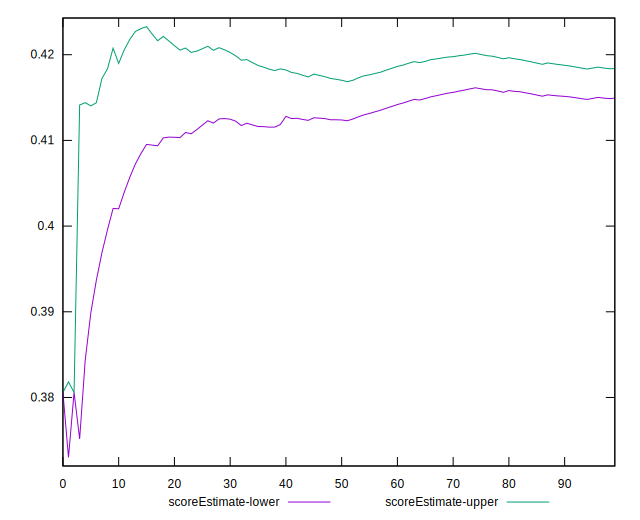
## P Score


```yaml
p90min: 0.4031764705882353
p90max: 0.43
p90range: 0.02682352941176469
p90mean: 0.4166545682102631
p90median: 0.4123529411764706
p90stdev: 0.008529891808348632
p90skewness: 0.18788714161835418
p90eccentricity: 0.9999999999999992
p90discretization: 1.4029850746268657
outlandishness: 0.998101272521887
confidence: 0.004173384367002519
p90confidence: 0.00344871799048564

```

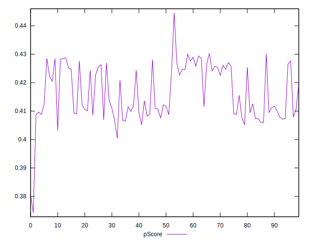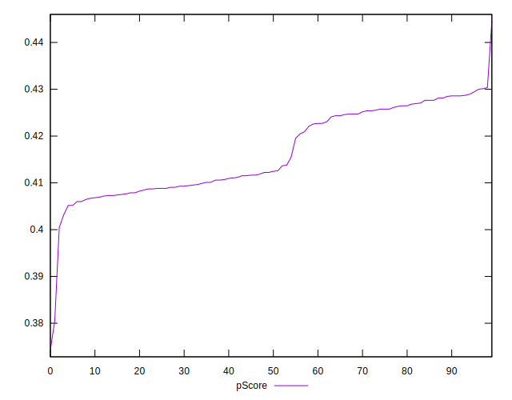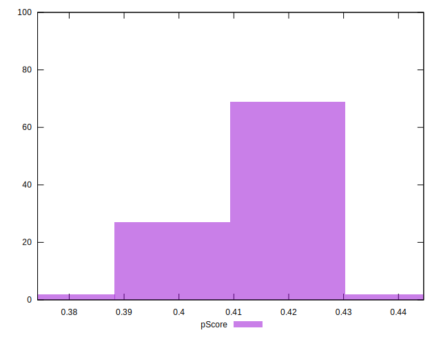
## Score Difference


```yaml
p90min: 0
p90max: 5.551115123125783e-17
p90range: 5.551115123125783e-17
p90mean: 2.7755575615628914e-17
p90median: 2.7755575615628914e-17
p90stdev: 2.7755575615628914e-17
p90skewness: 0
p90eccentricity: 1
p90discretization: 47
outlandishness: 1
confidence: 1.0879985715362166e-17
p90confidence: 1.1221848425816715e-17

```

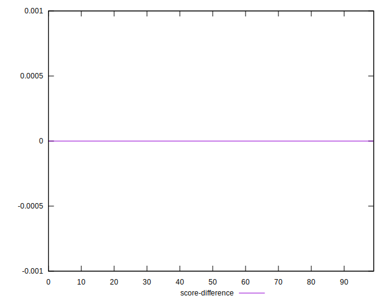
## P Score Difference


```yaml
p90min: -0.004588235294117615
p90max: 0.004588235294117671
p90range: 0.009176470588235286
p90mean: -0.0005719649561952304
p90median: -0.0009411764705882231
p90stdev: 0.0025127577630743463
p90skewness: 0.3266836742010288
p90eccentricity: 1
p90discretization: 1.540983606557377
outlandishness: 0.8952389525446607
confidence: 0.001059984381936964
p90confidence: 0.0010159323351282496

```

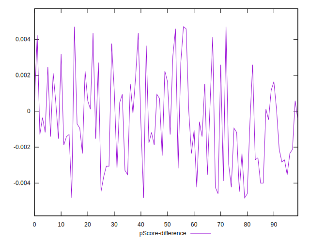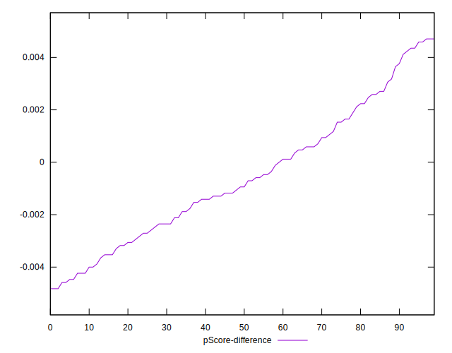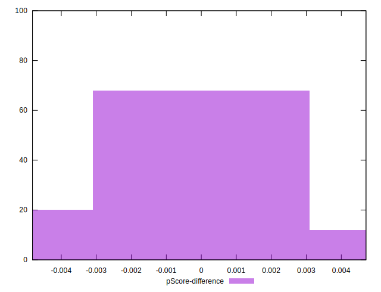