# //speed-index/samples/pages+cached+noadtech+nomedia+nocss

[→ Parent](../..)


## Raw


```yaml
p90min: 1584.911
p90max: 1619.6889999999999
p90range: 34.77799999999979
p90mean: 1590.8393601063829
p90median: 1589.381675
p90stdev: 5.5426894979677215
p90skewness: 2.1039455882885787
p90eccentricity: 1.0000000000000004
p90discretization: 1
outlandishness: 1.0483346736532368
confidence: 144.58632541636214
p90confidence: 2.240963123190862

```

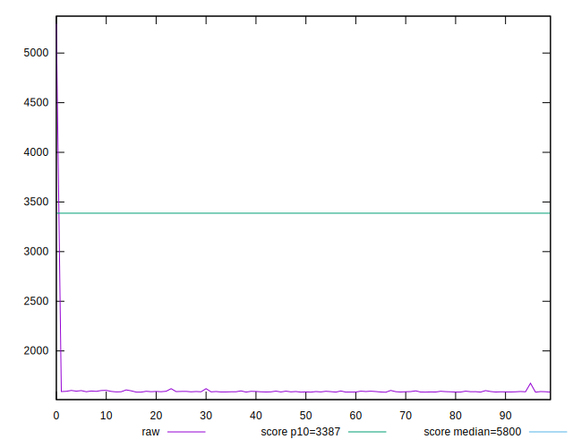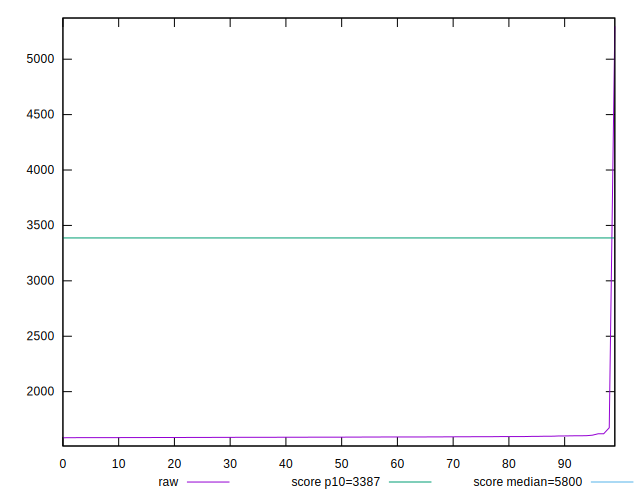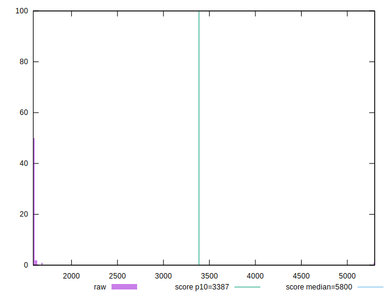
## Score


```yaml
p90min: 1
p90max: 1
p90range: 0
p90mean: 1
p90median: 1
p90stdev: 0
p90skewness: .nan
p90eccentricity: .nan
p90discretization: 94
outlandishness: 0.99181681
confidence: 0.01599114424275006
p90confidence: 0

```

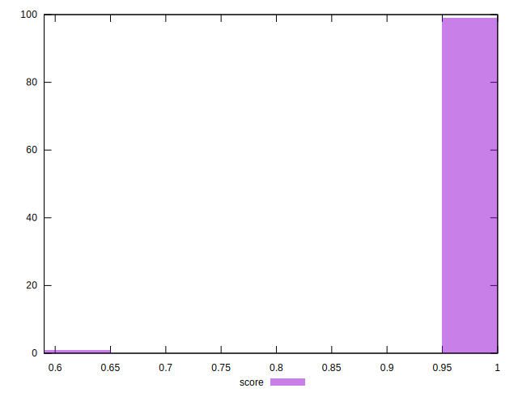
## Raw Estimate

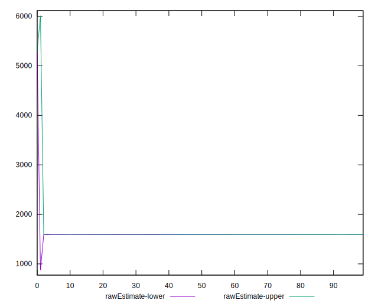
## Score Estimate

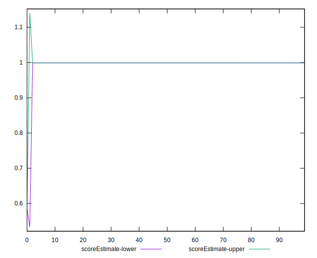
## P Score


```yaml
p90min: 0.9988135384286251
p90max: 0.9990019183449368
p90range: 0.00018837991631170947
p90mean: 0.9989712880906193
p90median: 0.998979127784426
p90stdev: 0.000029365844869291763
p90skewness: -2.2530788160642716
p90eccentricity: 1.0000000000000002
p90discretization: 1
outlandishness: 0.9917276753802439
confidence: 0.016126780223048875
p90confidence: 0.000011872895903253367

```

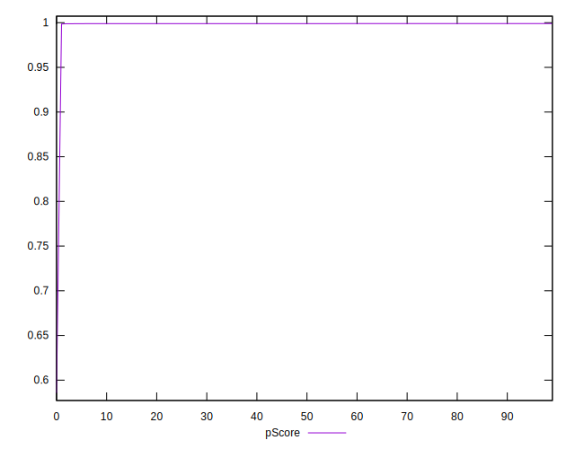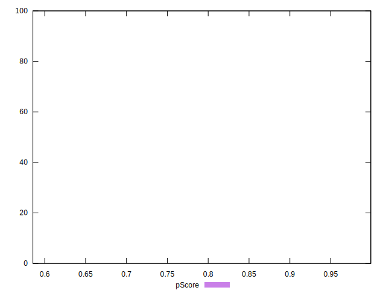
## Score Difference


```yaml
p90min: 0
p90max: 0
p90range: 0
p90mean: 0
p90median: 0
p90stdev: 0
p90skewness: .nan
p90eccentricity: .nan
p90discretization: 94
outlandishness: .nan
confidence: 0
p90confidence: 0

```


## P Score Difference


```yaml
p90min: -0.0011864615713749194
p90max: -0.00099808165506321
p90range: 0.00018837991631170947
p90mean: -0.0010287119093808509
p90median: -0.0010208722155740646
p90stdev: 0.00002936584486929177
p90skewness: -2.2530788160712683
p90eccentricity: 0.9999999999999992
p90discretization: 1
outlandishness: 1.0802650415198245
confidence: 0.00013767509555176322
p90confidence: 0.00001187289590325337

```

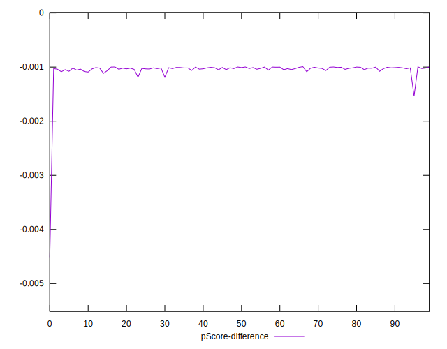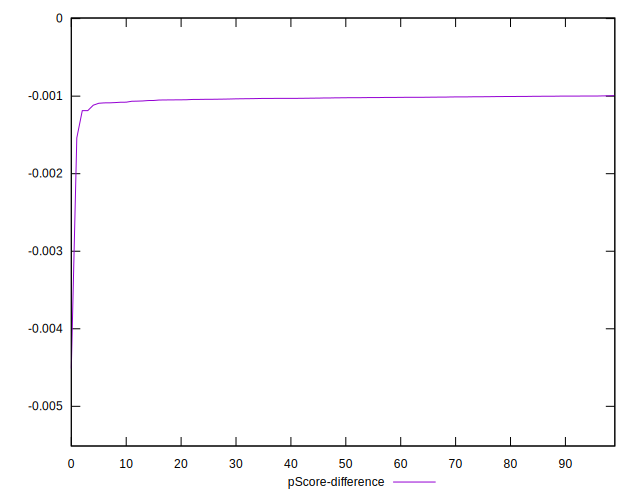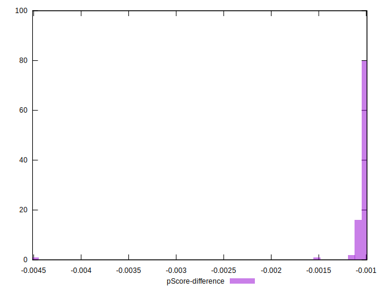