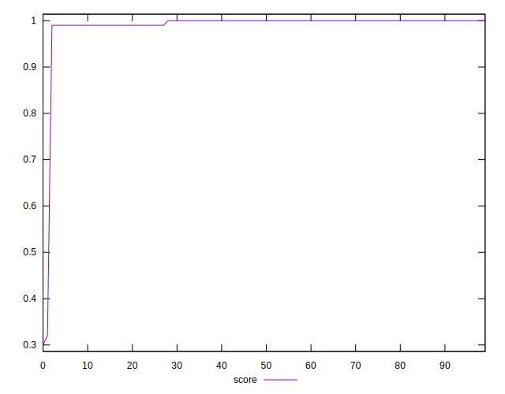

# //speed-index/samples/pages+cached+noadtech+nomedia

[→ Parent](../..)


## Raw


```yaml
p90min: 1906.2454500000003
p90max: 2128.5815000000002
p90range: 222.3360499999999
p90mean: 1966.5754606382982
p90median: 1936.2313749999996
p90stdev: 66.18991999573099
p90skewness: 1.1621804178377444
p90eccentricity: 0.9999999999999992
p90discretization: 1
outlandishness: 1.1086906696073289
confidence: 285.46565126280257
p90confidence: 26.76122663767705

```


## Score


```yaml
p90min: 0.99
p90max: 1
p90range: 0.010000000000000009
p90mean: 0.9973404255319146
p90median: 1
p90stdev: 0.004418416948360685
p90skewness: -1.0593955071546441
p90eccentricity: 0.9999999999999987
p90discretization: 47
outlandishness: 0.9726356742326042
confidence: 0.037763862606049727
p90confidence: 0.0017864088269401125

```


## Raw Estimate


## Score Estimate


## P Score


```yaml
p90min: 0.9915338198684216
p90max: 0.9959873271226511
p90range: 0.0044535072542295495
p90mean: 0.9949096329286816
p90median: 0.9955231508419421
p90stdev: 0.001283609788746378
p90skewness: -1.2506384254778866
p90eccentricity: 0.9999999999999996
p90discretization: 1
outlandishness: 0.9725962934044792
confidence: 0.03760719459280729
p90confidence: 0.0005189758874644068

```


## Score Difference


```yaml
p90min: 0
p90max: 0
p90range: 0
p90mean: 0
p90median: 0
p90stdev: 0
p90skewness: .nan
p90eccentricity: .nan
p90discretization: 94
outlandishness: .nan
confidence: 0
p90confidence: 0

```


## P Score Difference


```yaml
p90min: -0.0047617359092035905
p90max: 0.003602782845174124
p90range: 0.008364518754377714
p90mean: -0.002561995017610171
p90median: -0.004190466913509161
p90stdev: 0.0030276870648750383
p90skewness: 1.1601183560261232
p90eccentricity: 0.9999999999999992
p90discretization: 1
outlandishness: 0.8901371297437938
confidence: 0.001257880511121493
p90confidence: 0.0012241232462028948

```

