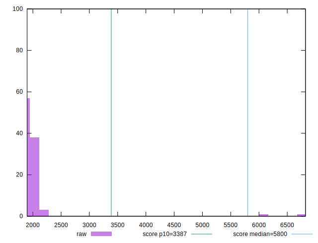
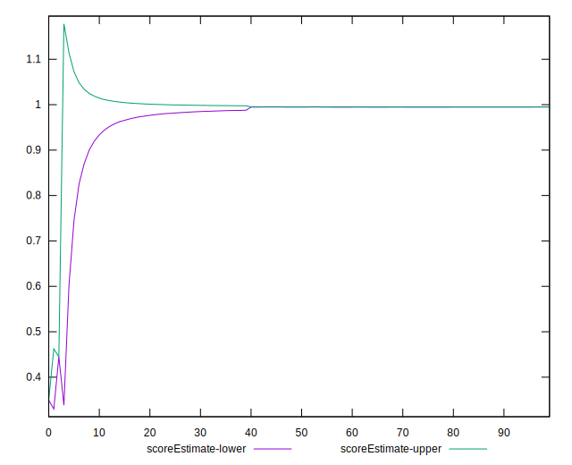

# //speed-index/samples/pages+cached+noadtech

[→ Parent](../..)


## Raw


```yaml
p90min: 1903.0279999999998
p90max: 2152.6495
p90range: 249.6215000000002
p90mean: 1967.930915957447
p90median: 1934.5833749999997
p90stdev: 68.66160118316857
p90skewness: 1.0636965119562098
p90eccentricity: 0.9999999999999994
p90discretization: 1
outlandishness: 1.0938503190047726
confidence: 250.12461079920106
p90confidence: 27.760551314869073

```


## Score


```yaml
p90min: 0.99
p90max: 1
p90range: 0.010000000000000009
p90mean: 0.9970212765957445
p90median: 1
p90stdev: 0.004573230906426529
p90skewness: -0.8839599998784079
p90eccentricity: 1
p90discretization: 47
outlandishness: 0.9760309926008022
confidence: 0.033180748906722055
p90confidence: 0.001849001611743948

```


## Raw Estimate


## Score Estimate


## P Score


```yaml
p90min: 0.990896617142951
p90max: 0.9960348867540341
p90range: 0.005138269611083102
p90mean: 0.9948779888015614
p90median: 0.995549664406338
p90stdev: 0.0013310824686852548
p90skewness: -1.1922436611475205
p90eccentricity: 0.9999999999999994
p90discretization: 1
outlandishness: 0.9760986999616037
confidence: 0.03291187756516235
p90confidence: 0.0005381695524065027

```


## Score Difference


```yaml
p90min: 0
p90max: 0
p90range: 0
p90mean: 0
p90median: 0
p90stdev: 0
p90skewness: .nan
p90eccentricity: .nan
p90discretization: 94
outlandishness: .inf
confidence: 2.165089820536967e-18
p90confidence: 0

```


## P Score Difference


```yaml
p90min: -0.004851967330135265
p90max: 0.004694480138455637
p90range: 0.009546447468590902
p90mean: -0.002214578451142061
p90median: -0.004099986847246051
p90stdev: 0.003245519859088093
p90skewness: 0.9712447236236239
p90eccentricity: 0.9999999999999996
p90discretization: 1
outlandishness: 0.885002362785672
confidence: 0.0013359965541552882
p90confidence: 0.0013121951576877554

```

