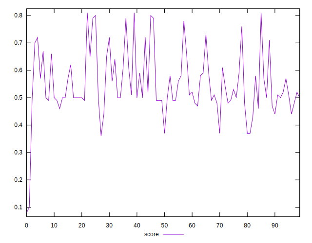

# //speed-index/samples/pages+cached

[→ Parent](../..)


## Raw


```yaml
p90min: 4088.419561695364
p90max: 6673.010794842503
p90range: 2584.591233147139
p90mean: 5506.744508289166
p90median: 5736.673000549885
p90stdev: 601.5272291527692
p90skewness: -0.7428223266766971
p90eccentricity: 0.9999999999999997
p90discretization: 1
outlandishness: 1.0216549366805987
confidence: 360.438237734788
p90confidence: 243.2032930260286

```


## Score


```yaml
p90min: 0.37
p90max: 0.8
p90range: 0.43000000000000005
p90mean: 0.5515957446808508
p90median: 0.51
p90stdev: 0.1024415057950235
p90skewness: 0.8675337431153003
p90eccentricity: 1
p90discretization: 3.1333333333333333
outlandishness: 0.9877254593130352
confidence: 0.050332180412403
p90confidence: 0.041418094384497596

```


## Raw Estimate


## Score Estimate


## P Score


```yaml
p90min: 0.36917060553106607
p90max: 0.7976175502721021
p90range: 0.42844694474103606
p90mean: 0.5520176990237223
p90median: 0.5104346658726083
p90stdev: 0.10253042724002505
p90skewness: 0.8696696842494753
p90eccentricity: 1.0000000000000002
p90discretization: 1
outlandishness: 0.9880868150969327
confidence: 0.05027387890844219
p90confidence: 0.04145404618717071

```


## Score Difference


```yaml
p90min: 0
p90max: 1.1102230246251565e-16
p90range: 1.1102230246251565e-16
p90mean: 3.543264972207946e-18
p90median: 0
p90stdev: 1.775565082476971e-17
p90skewness: 5.24499454660913
p90eccentricity: 1.0000000000000064
p90discretization: 31.333333333333332
outlandishness: 3.5344000000000007
confidence: 9.866653481830458e-18
p90confidence: 7.178781842488493e-18

```


## P Score Difference


```yaml
p90min: -0.004270243816566044
p90max: 0.0048132863323097075
p90range: 0.009083530148875751
p90mean: 0.0005398528954676139
p90median: 0.00023336631023884724
p90stdev: 0.0025269866420805616
p90skewness: -0.07840522073447581
p90eccentricity: 0.9999999999999999
p90discretization: 1
outlandishness: 0.9267425811513093
confidence: 0.00106228143595297
p90confidence: 0.0010216852089179437

```

