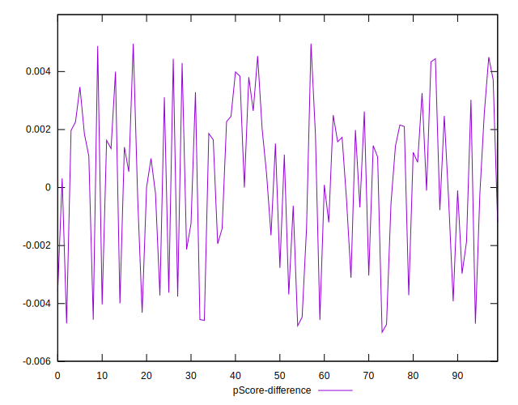

# //speed-index/samples/pages

[→ Parent](../..)


## Raw


```yaml
p90min: 4648.452986534331
p90max: 6961.248082812878
p90range: 2312.795096278547
p90mean: 5877.590135309438
p90median: 5697.190119107612
p90stdev: 686.0391602803621
p90skewness: 0.09972606366903737
p90eccentricity: 0.9999999999999997
p90discretization: 1
outlandishness: 1.0190169672323581
confidence: 418.0176544726748
p90confidence: 277.3722864715432

```


## Score


```yaml
p90min: 0.33
p90max: 0.7
p90range: 0.36999999999999994
p90mean: 0.49382978723404275
p90median: 0.515
p90stdev: 0.10910766089469695
p90skewness: 0.004143368528640768
p90eccentricity: 0.9999999999999997
p90discretization: 3.032258064516129
outlandishness: 0.9958337323959483
confidence: 0.05316694126951464
p90confidence: 0.044113285547076025

```


## Raw Estimate


## Score Estimate


## P Score


```yaml
p90min: 0.33185414281135395
p90max: 0.7010046038055533
p90range: 0.36915046099419935
p90mean: 0.49409170653324525
p90median: 0.5169980236048446
p90stdev: 0.10889919472193019
p90skewness: -0.0027938607352067765
p90eccentricity: 1
p90discretization: 1
outlandishness: 0.9955257384925511
confidence: 0.053179543589993855
p90confidence: 0.044029000651489805

```


## Score Difference


```yaml
p90min: 0
p90max: 1.1102230246251565e-16
p90range: 1.1102230246251565e-16
p90mean: 1.8897413185109047e-17
p90median: 0
p90stdev: 3.9296709526154e-17
p90skewness: 1.7447755414824808
p90eccentricity: 0.9999999999999971
p90discretization: 31.333333333333332
outlandishness: 1.2460140625
confidence: 1.6219573846547128e-17
p90confidence: 1.5888040804584687e-17

```


## P Score Difference


```yaml
p90min: -0.00469615905936388
p90max: 0.004536910948514605
p90range: 0.009233070007878486
p90mean: 0.0001934285779341212
p90median: 0.0007068545844894913
p90stdev: 0.0027396673788337247
p90skewness: -0.30866531133976716
p90eccentricity: 0.9999999999999994
p90discretization: 1
outlandishness: 0.9159326635707081
confidence: 0.0011419036224770756
p90confidence: 0.0011076740936013913

```

