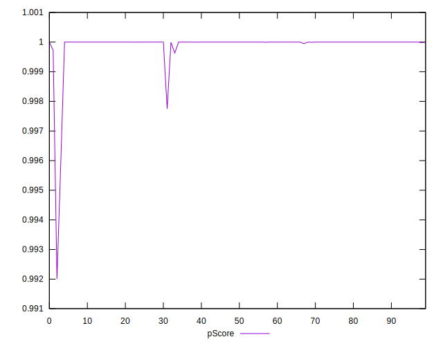

# //total-blocking-time/samples/pages+cached+noadtech+nomedia+nocss

[→ Parent](../..)


## Raw


```yaml
p90min: 10
p90max: 86
p90range: 76
p90mean: 22.095744680851062
p90median: 17
p90stdev: 14.029087676723497
p90skewness: 2.5457449285362057
p90eccentricity: 1.0000000000000007
p90discretization: 2.088888888888889
outlandishness: 1.283229731504622
confidence: 9.22265921062314
p90confidence: 5.672096217382555

```


## Score


```yaml
p90min: 1
p90max: 1
p90range: 0
p90mean: 1
p90median: 1
p90stdev: 0
p90skewness: .nan
p90eccentricity: .nan
p90discretization: 94
outlandishness: 0.9998000100000003
confidence: 0.0003900279083597579
p90confidence: 0

```


## Raw Estimate


## Score Estimate


## P Score


```yaml
p90min: 0.9996320202224948
p90max: 0.9999999999994376
p90range: 0.00036797977694280615
p90mean: 0.9999921017730007
p90median: 0.9999999997038378
p90stdev: 0.00004688927412605707
p90skewness: -6.71375979071402
p90eccentricity: 1.0000000000000004
p90discretization: 2.088888888888889
outlandishness: 0.9997142617337242
confidence: 0.00035853138165701696
p90confidence: 0.00001895778831345484

```


## Score Difference


```yaml
p90min: 0
p90max: 0
p90range: 0
p90mean: 0
p90median: 0
p90stdev: 0
p90skewness: .nan
p90eccentricity: .nan
p90discretization: 94
outlandishness: .nan
confidence: 0
p90confidence: 0

```


## P Score Difference


```yaml
p90min: -0.0002715132047412805
p90max: -2.936539900133539e-13
p90range: 0.0002715132044476265
p90mean: -0.000003983548518156975
p90median: -2.9616220587058706e-10
p90stdev: 0.000028365381037785095
p90skewness: -8.980292926209975
p90eccentricity: 0.9999999999999994
p90discretization: 2.088888888888889
outlandishness: 162.47414353549564
confidence: 0.00019897792096333581
p90confidence: 0.000011468398672565137

```

