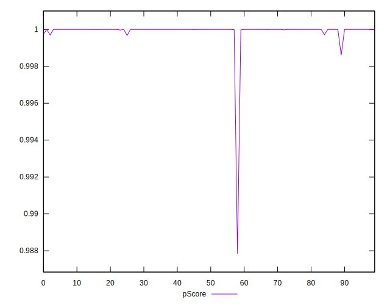

# //total-blocking-time/samples/pages+cached+noadtech+nomedia

[→ Parent](../..)


## Raw


```yaml
p90min: 8
p90max: 83.5
p90range: 75.5
p90mean: 23.44726808510638
p90median: 18.5
p90stdev: 15.210960535096314
p90skewness: 2.3108972829694916
p90eccentricity: 0.9999999999999997
p90discretization: 1.7735849056603774
outlandishness: 1.2144251562774644
confidence: 8.977017295876204
p90confidence: 6.149938877139117

```


## Score


```yaml
p90min: 1
p90max: 1
p90range: 0
p90mean: 1
p90median: 1
p90stdev: 0
p90skewness: .nan
p90eccentricity: .nan
p90discretization: 94
outlandishness: 0.9998000100000003
confidence: 0.0003900279083597586
p90confidence: 0

```


## Raw Estimate


## Score Estimate


## P Score


```yaml
p90min: 0.9996949486131046
p90max: 0.9999999999999686
p90range: 0.0003050513868639859
p90mean: 0.9999899294401925
p90median: 0.9999999992555412
p90stdev: 0.00004971495133726775
p90skewness: -5.312044281942159
p90eccentricity: 1.0000000000000002
p90discretization: 1.8076923076923077
outlandishness: 0.9997237825592633
confidence: 0.00047654119317193714
p90confidence: 0.000020100237016505175

```


## Score Difference


```yaml
p90min: 0
p90max: 0
p90range: 0
p90mean: 0
p90median: 0
p90stdev: 0
p90skewness: .nan
p90eccentricity: .nan
p90discretization: 94
outlandishness: .nan
confidence: 0
p90confidence: 0

```


## P Score Difference


```yaml
p90min: -0.00030505138689540523
p90max: -3.141931159689193e-14
p90range: 0.0003050513868639859
p90mean: -0.000010070559807327293
p90median: -7.444588279170716e-10
p90stdev: 0.00004971495133726776
p90skewness: -5.312044281912785
p90eccentricity: 1.0000000000000007
p90discretization: 1.8076923076923077
outlandishness: 22.896033892599064
confidence: 0.00010142361123191465
p90confidence: 0.000020100237016505178

```

