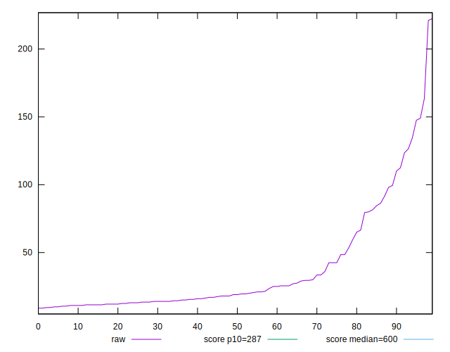
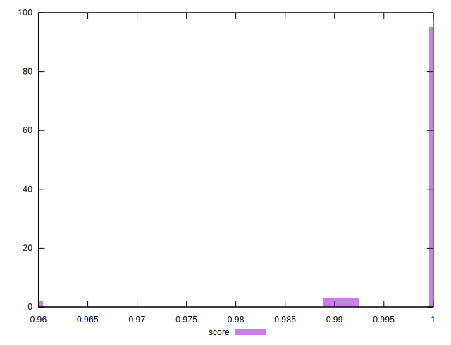
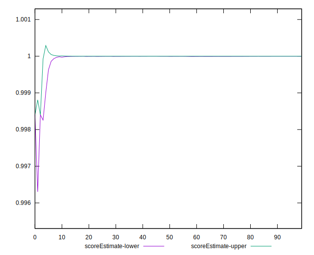

# //total-blocking-time/samples/pages+cached+noadtech

[→ Parent](../..)


## Raw


```yaml
p90min: 9.5
p90max: 149.00000000000023
p90range: 139.50000000000023
p90mean: 35.09064361702129
p90median: 19
p90stdev: 34.80125798797892
p90skewness: 1.7713591737772325
p90eccentricity: 1.000000000000001
p90discretization: 1.6785714285714286
outlandishness: 1.2562317116552706
confidence: 17.54089782845983
p90confidence: 14.070486145815552

```


## Score


```yaml
p90min: 0.99
p90max: 1
p90range: 0.010000000000000009
p90mean: 0.9997872340425531
p90median: 1
p90stdev: 0.0014430489325798462
p90skewness: -6.6348880269704065
p90eccentricity: 0.9999999999999959
p90discretization: 47
outlandishness: 0.998225941807472
confidence: 0.002278621456506146
p90confidence: 0.0005834386797342846

```


## Raw Estimate


## Score Estimate


## P Score


```yaml
p90min: 0.992255858145694
p90max: 0.9999999999997063
p90range: 0.0077441418540123985
p90mean: 0.9996432762613802
p90median: 0.9999999990087218
p90stdev: 0.0012774946533667818
p90skewness: -4.495150400269216
p90eccentricity: 0.9999999999999997
p90discretization: 1.709090909090909
outlandishness: 0.9981309867049534
confidence: 0.002365614136776204
p90confidence: 0.0005165034789190573

```


## Score Difference


```yaml
p90min: 0
p90max: 0
p90range: 0
p90mean: 0
p90median: 0
p90stdev: 0
p90skewness: .nan
p90eccentricity: .nan
p90discretization: 94
outlandishness: .nan
confidence: 0
p90confidence: 0

```


## P Score Difference


```yaml
p90min: -0.002360858302575597
p90max: -1.467714838554457e-13
p90range: 0.0023608583024288254
p90mean: -0.00013697555020948099
p90median: -5.535167879600067e-10
p90stdev: 0.00042890575879265576
p90skewness: -3.620647957301036
p90eccentricity: 1
p90discretization: 1.7407407407407407
outlandishness: 1.9511824186901034
confidence: 0.00032864833340616033
p90confidence: 0.00017341075828457563

```

