# //total-blocking-time/samples/pages+cached

[→ Parent](../..)


## Raw


```yaml
p90min: 198.5
p90max: 679.4999999999991
p90range: 480.9999999999991
p90mean: 337.7070478723404
p90median: 314.75000000000045
p90stdev: 108.85159948282086
p90skewness: 1.1645282867126652
p90eccentricity: 1
p90discretization: 1.010752688172043
outlandishness: 1.043322360799225
confidence: 49.87631738229115
p90confidence: 44.009757434686385

```

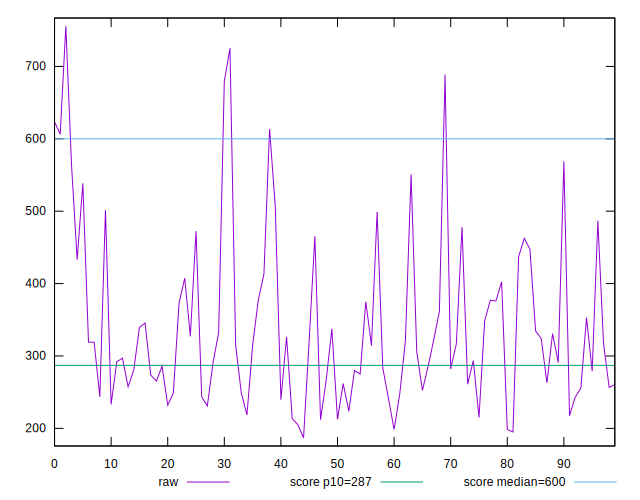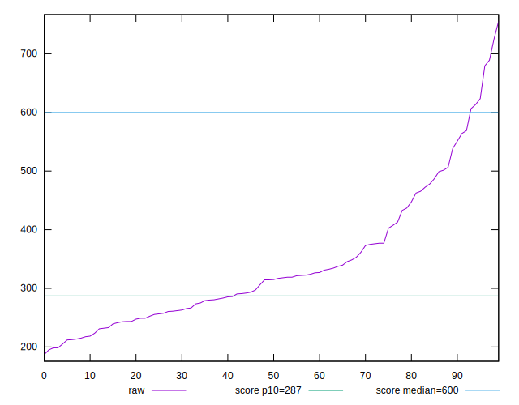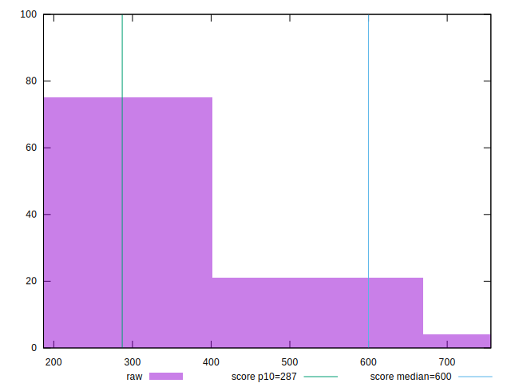
## Score


```yaml
p90min: 0.41
p90max: 0.97
p90range: 0.56
p90mean: 0.8306382978723404
p90median: 0.87
p90stdev: 0.13403562967597338
p90skewness: -1.3280856852950675
p90eccentricity: 1
p90discretization: 2.5405405405405403
outlandishness: 0.9774037012269886
confidence: 0.06035742106417602
p90confidence: 0.05419190510449055

```

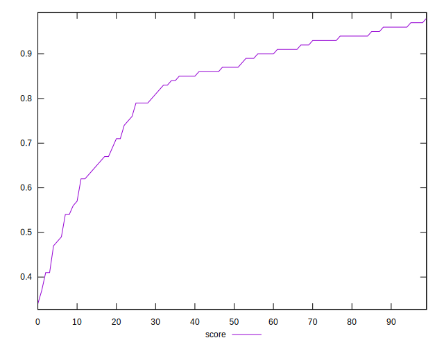
## Raw Estimate

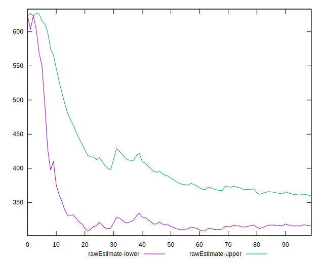
## Score Estimate

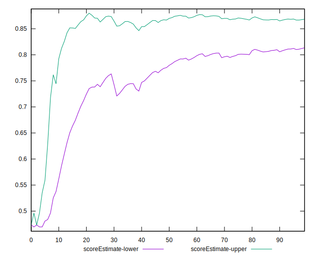
## P Score


```yaml
p90min: 0.41440316255732645
p90max: 0.9727144329387234
p90range: 0.5583112703813969
p90mean: 0.8311147013679454
p90median: 0.8688892886275457
p90stdev: 0.13359279228526436
p90skewness: -1.31524947950559
p90eccentricity: 1.0000000000000002
p90discretization: 1.010752688172043
outlandishness: 0.9775029086664495
confidence: 0.06023448262066129
p90confidence: 0.05401286165229773

```

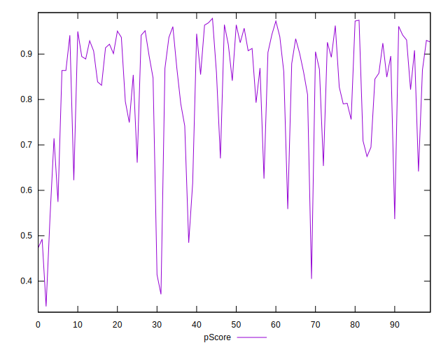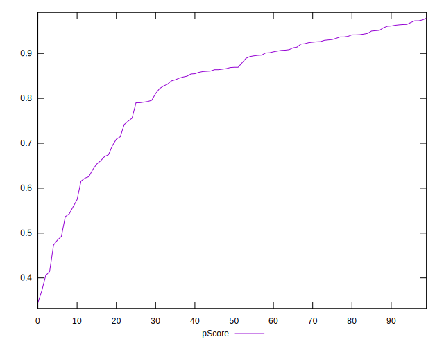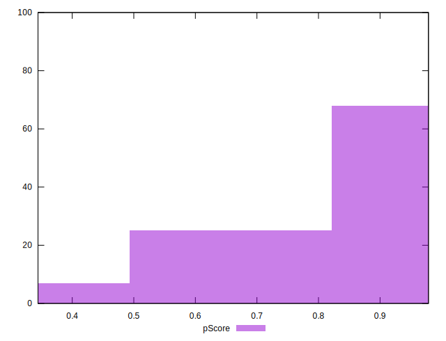
## Score Difference


```yaml
p90min: 0
p90max: 1.1102230246251565e-16
p90range: 1.1102230246251565e-16
p90mean: 1.7125780699005074e-17
p90median: 0
p90stdev: 3.8854933808448465e-17
p90skewness: 1.9114751069436198
p90eccentricity: 1.000000000000001
p90discretization: 31.333333333333332
outlandishness: 1.28705112960761
confidence: 1.610090852326668e-17
p90confidence: 1.570942659708447e-17

```

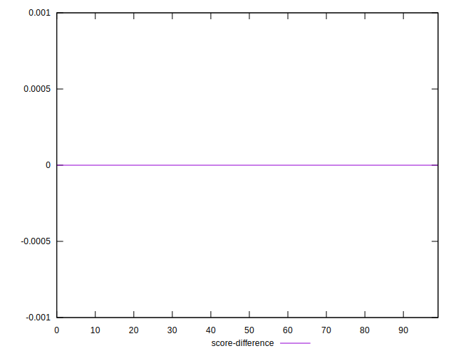
## P Score Difference


```yaml
p90min: -0.004943282166985918
p90max: 0.004691391558089064
p90range: 0.009634673725074983
p90mean: 0.0005500576109513182
p90median: 0.0009322635863244222
p90stdev: 0.002777598361307656
p90skewness: -0.26105148286091007
p90eccentricity: 1.0000000000000004
p90discretization: 1.0217391304347827
outlandishness: 0.8687450485917902
confidence: 0.001156699844276453
p90confidence: 0.0011230099577124236

```

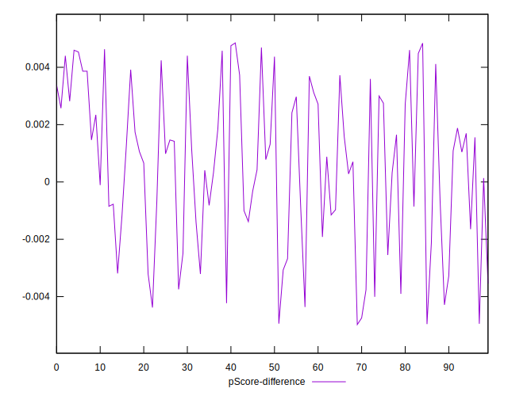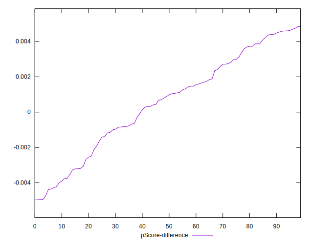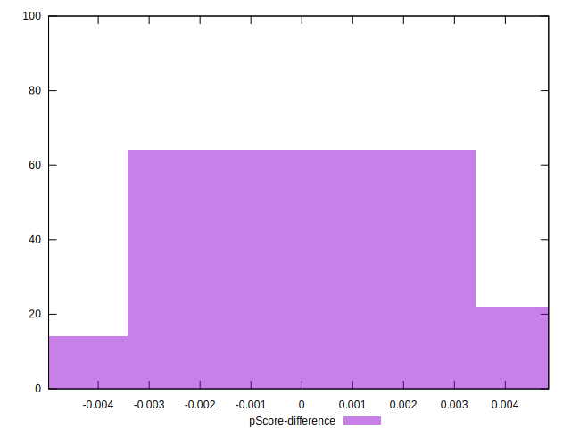