# //total-blocking-time/samples/pages

[→ Parent](../..)


## Raw


```yaml
p90min: 207.5
p90max: 596.4999999999991
p90range: 388.9999999999991
p90mean: 340.22340425531917
p90median: 324.25000000000045
p90stdev: 88.98576317583345
p90skewness: 0.6993030694856123
p90eccentricity: 1.0000000000000004
p90discretization: 1.0444444444444445
outlandishness: 1.030512880087438
confidence: 41.50941248831098
p90confidence: 35.97780713481336

```

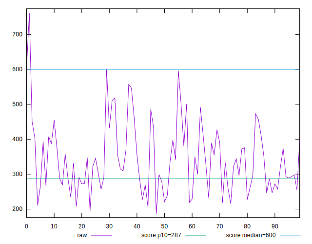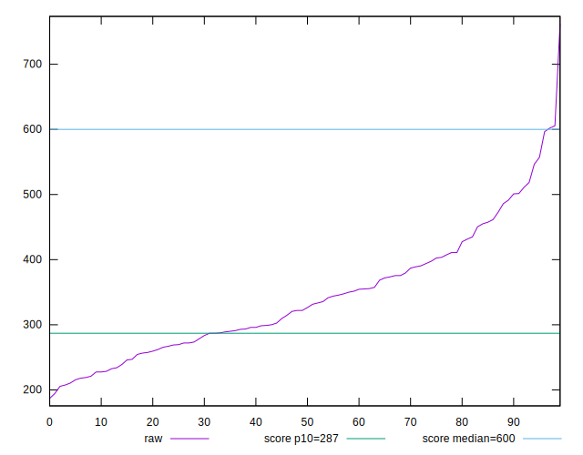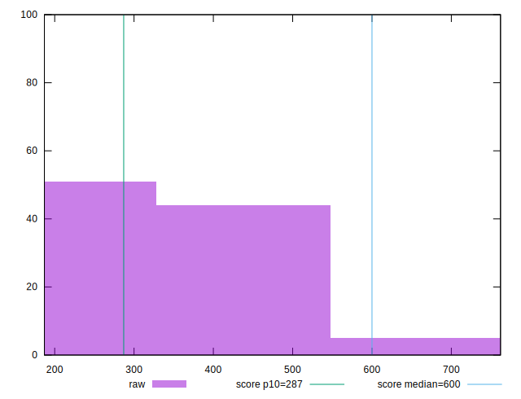
## Score


```yaml
p90min: 0.5
p90max: 0.97
p90range: 0.47
p90mean: 0.8294680851063834
p90median: 0.855
p90stdev: 0.1099455089527825
p90skewness: -0.9221602695200455
p90eccentricity: 0.9999999999999997
p90discretization: 2.6857142857142855
outlandishness: 0.9825520896980455
confidence: 0.05045171156589616
p90confidence: 0.04445203564334161

```

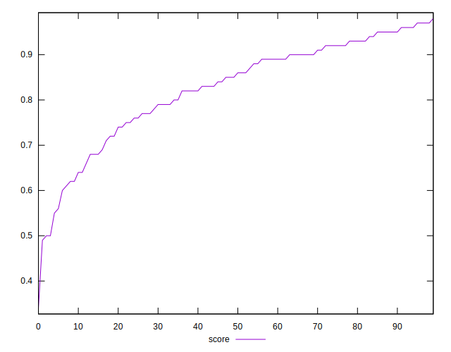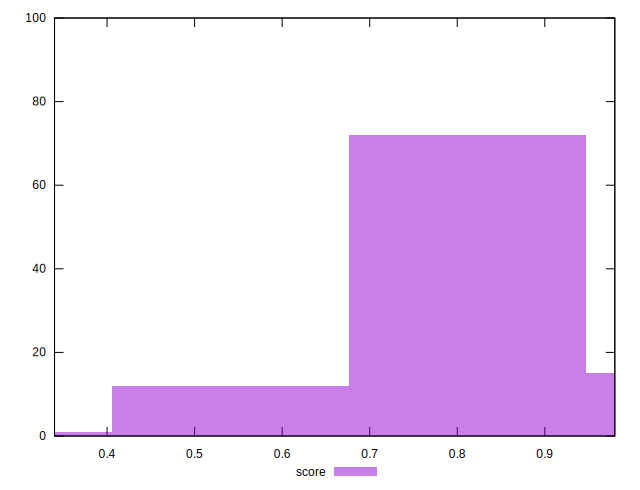
## Raw Estimate

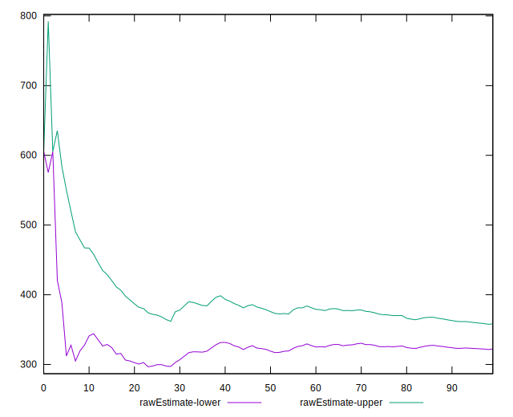
## Score Estimate

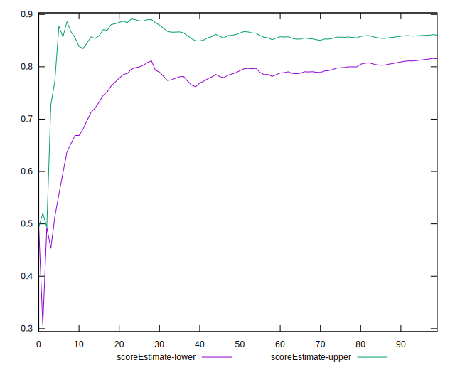
## P Score


```yaml
p90min: 0.504055988177291
p90max: 0.9674969464055583
p90range: 0.46344095822826725
p90mean: 0.8295340377842266
p90median: 0.8575653271758945
p90stdev: 0.10921499070121153
p90skewness: -0.9178877857943704
p90eccentricity: 1
p90discretization: 1.0444444444444445
outlandishness: 0.9826034369928992
confidence: 0.050234653109945925
p90confidence: 0.04415668002885361

```

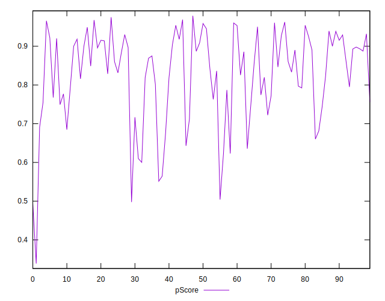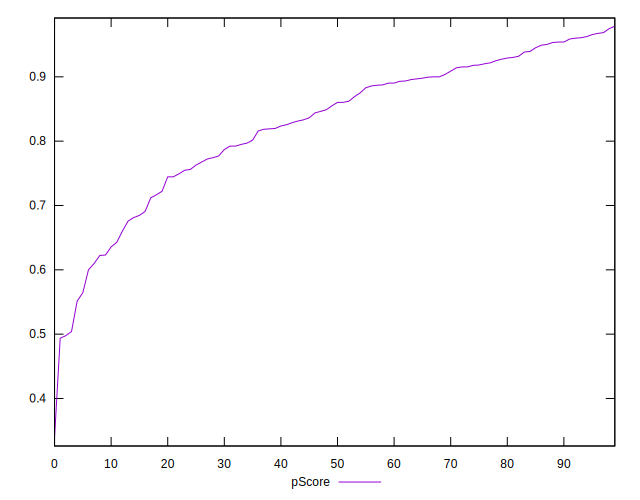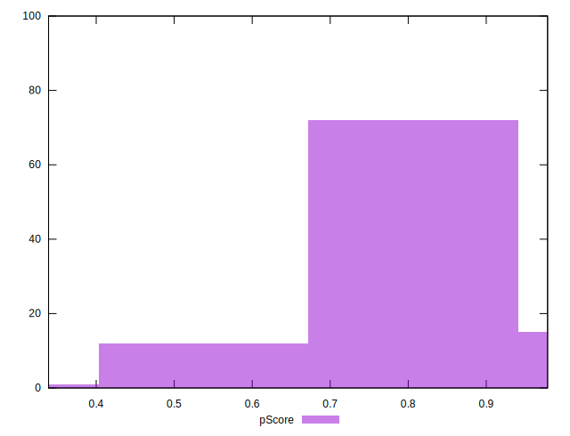
## Score Difference


```yaml
p90min: 0
p90max: 1.1102230246251565e-16
p90range: 1.1102230246251565e-16
p90mean: 1.7716324861039733e-17
p90median: 0
p90stdev: 4.065758244982896e-17
p90skewness: 1.8591772600772123
p90eccentricity: 1.0000000000000022
p90discretization: 47
outlandishness: 1.2723839999999997
confidence: 1.6719816056870096e-17
p90confidence: 1.643825492688447e-17

```

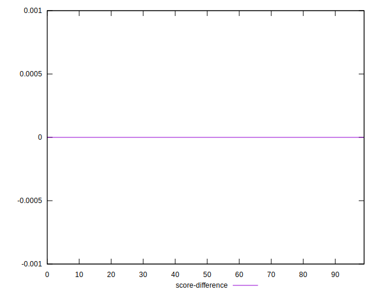
## P Score Difference


```yaml
p90min: -0.004590888503433255
p90max: 0.004741309951109773
p90range: 0.009332198454543028
p90mean: 0.00009352653834640272
p90median: 0.00010185316793215327
p90stdev: 0.0027459051870964814
p90skewness: -0.016991125329027076
p90eccentricity: 0.9999999999999999
p90discretization: 1.0444444444444445
outlandishness: 0.8625199943690871
confidence: 0.0011451373127922217
p90confidence: 0.0011101960999832206

```

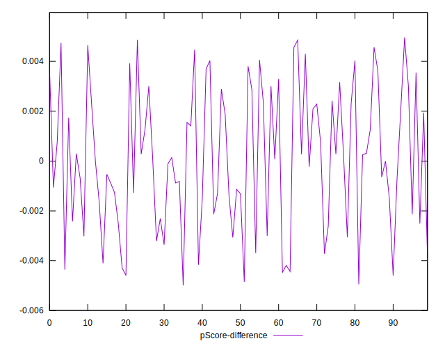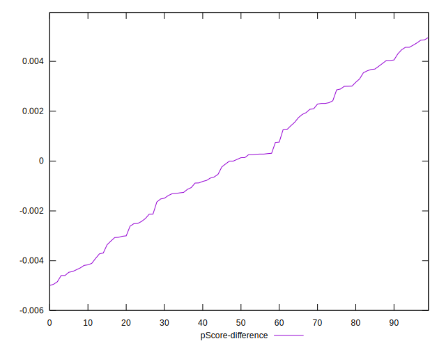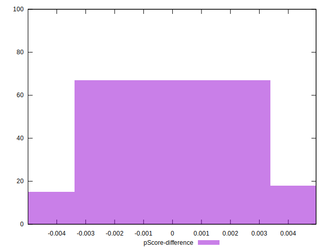