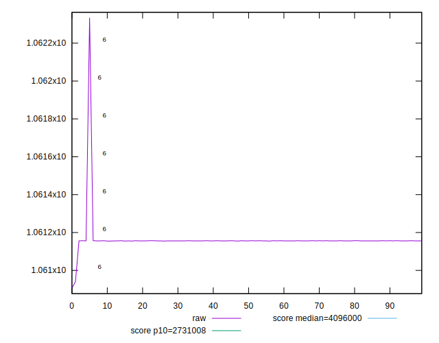
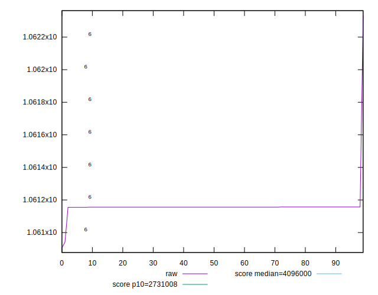
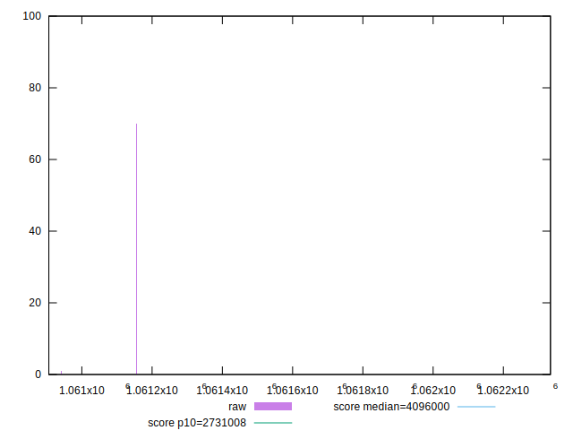
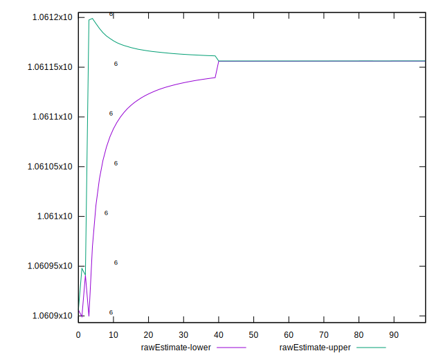
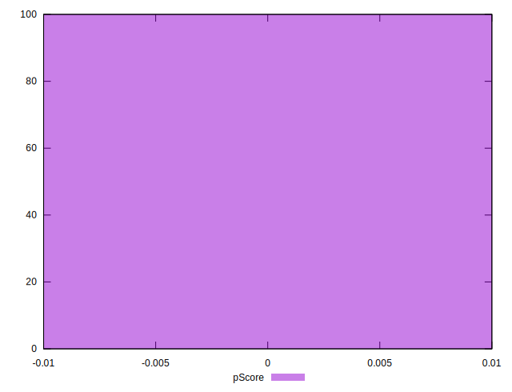

# //total-byte-weight/samples/pages+cached+noadtech

[→ Parent](../..)


## Raw


```yaml
p90min: 1061155
p90max: 1061157
p90range: 2
p90mean: 1061156.2021276595
p90median: 1061156
p90stdev: 0.5375236211344585
p90skewness: 0.12018977988142526
p90eccentricity: 0.9999999999999991
p90discretization: 31.333333333333332
outlandishness: 1.0000134342074534
confidence: 47.86599806264512
p90confidence: 0.21732601352610584

```


## Score


```yaml
p90min: 1
p90max: 1
p90range: 0
p90mean: 1
p90median: 1
p90stdev: 0
p90skewness: .nan
p90eccentricity: .nan
p90discretization: 94
outlandishness: 1
confidence: 0
p90confidence: 0

```


## Raw Estimate


## Score Estimate


## P Score


```yaml
p90min: 0
p90max: 0
p90range: 0
p90mean: 0
p90median: 0
p90stdev: 0
p90skewness: .nan
p90eccentricity: .nan
p90discretization: 94
outlandishness: .nan
confidence: 0
p90confidence: 0

```


## Score Difference


```yaml
p90min: -1
p90max: -1
p90range: 0
p90mean: -1
p90median: -1
p90stdev: 0
p90skewness: .nan
p90eccentricity: .nan
p90discretization: 94
outlandishness: 1
confidence: 0
p90confidence: 0

```


## P Score Difference


```yaml
p90min: -1
p90max: -1
p90range: 0
p90mean: -1
p90median: -1
p90stdev: 0
p90skewness: .nan
p90eccentricity: .nan
p90discretization: 94
outlandishness: 1
confidence: 0
p90confidence: 0

```

