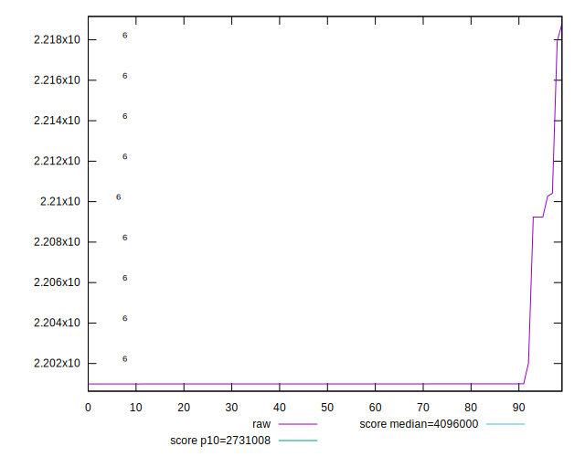

# //total-byte-weight/samples/pages+cached

[→ Parent](../..)


## Raw


```yaml
p90min: 2200990
p90max: 2210267
p90range: 9277
p90mean: 2201365.4680851065
p90median: 2200993
p90stdev: 1719.71130495374
p90skewness: 4.528841977082193
p90eccentricity: 1.000000000000001
p90discretization: 7.230769230769231
outlandishness: 1.0003807289617452
confidence: 1189.3095986774058
p90confidence: 695.2959602642005

```


## Score


```yaml
p90min: 0.97
p90max: 0.98
p90range: 0.010000000000000009
p90mean: 0.9795744680851066
p90median: 0.98
p90stdev: 0.0020184751022351375
p90skewness: -4.532597979574716
p90eccentricity: 1.000000000000003
p90discretization: 47
outlandishness: 0.9994396962307927
confidence: 0.001000157925984068
p90confidence: 0.000816089061248401

```


## Raw Estimate


## Score Estimate


## P Score


```yaml
p90min: 0
p90max: 0
p90range: 0
p90mean: 0
p90median: 0
p90stdev: 0
p90skewness: .nan
p90eccentricity: .nan
p90discretization: 94
outlandishness: .nan
confidence: 0
p90confidence: 0

```


## Score Difference


```yaml
p90min: -0.98
p90max: -0.97
p90range: 0.010000000000000009
p90mean: -0.9795744680851065
p90median: -0.98
p90stdev: 0.002018475102235137
p90skewness: 4.532597979574722
p90eccentricity: 0.9999999999999957
p90discretization: 47
outlandishness: 0.9994396962307929
confidence: 0.001000157925984068
p90confidence: 0.0008160890612484009

```


## P Score Difference


```yaml
p90min: -0.98
p90max: -0.97
p90range: 0.010000000000000009
p90mean: -0.9795744680851065
p90median: -0.98
p90stdev: 0.002018475102235137
p90skewness: 4.532597979574722
p90eccentricity: 0.9999999999999957
p90discretization: 47
outlandishness: 0.9994396962307929
confidence: 0.001000157925984068
p90confidence: 0.0008160890612484009

```

